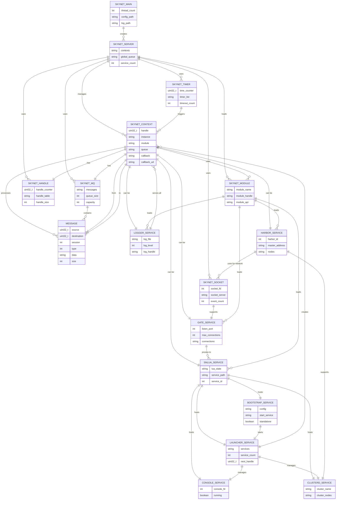

# Skynet Component Relationship Diagram

## Component Relationships Explained

### Core System Components
- **skynet_main**: Entry point that initializes and manages the entire system
- **skynet_server**: Central service management and message dispatch
- **skynet_mq**: Message queue implementation for inter-service communication
- **skynet_handle**: Service handle management and lookup
- **skynet_socket**: Network socket handling and I/O operations
- **skynet_timer**: Timer system for scheduled operations
- **skynet_module**: Dynamic module loading system

### Service Context
- **skynet_context**: Represents a running service instance
- **message**: Data structure for inter-service communication
- Each context has its own message queue, handle, and callback functions

### C Services
- **snlua**: Lua container service that hosts Lua services
- **gate**: Network gateway for client connections
- **logger**: Centralized logging service
- **harbor**: Multi-node coordination service

### Lua Services
- **bootstrap**: Initial service launcher
- **launcher**: Service creation and management hub
- **console**: Debug console service
- **clusterd**: Cluster management service

### Key Relationships

#### Management Relationships
- skynet_main creates and manages skynet_server
- skynet_server manages all service contexts
- launcher creates and manages other services
- bootstrap starts the launcher service

#### Communication Relationships
- Services communicate through message queues
- Each service has its own dedicated message queue
- Messages are routed through the global queue system

#### Dependencies
- C services depend on core C components
- Lua services run within snlua containers
- All services can use the logger service
- Harbor service enables cluster communication

#### Resource Management
- Timer system triggers timed events for services
- Socket system handles network I/O
- Handle system provides unique service identifiers
- Module system loads service implementations

## Architecture Benefits

### Isolation
- Each service runs in its own context
- No shared memory between services
- Communication only through message passing

### Scalability
- Lightweight service creation
- Thousands of services can run simultaneously
- Efficient message routing

### Fault Tolerance
- Service isolation prevents cascading failures
- Error handling at service level
- Graceful service shutdown

### Extensibility
- Dynamic module loading
- Hot-reload capability
- Easy to add new service types