# Skynet Service Communication Flow (Actor Model)

```mermaid
graph TB
    %% Main Services
    subgraph "Core Services"
        BS["Bootstrap Service<br/>Initial service launcher"]
        LS["Launcher Service<br/>Service management hub"]
        CS["Console Service<br/>Debug interface"]
        GS["Gate Service<br/>Network gateway"]
        HS["Harbor Service<br/>Cluster coordination"]
        DS["Datacenter Service<br/>Data management"]
    end
    
    %% User Services
    subgraph "User Services"
        US1["Game Service A<br/>Game logic"]
        US2["Game Service B<br/>Player management"]
        US3["Game Service C<br/>Chat system"]
        US4["Game Service D<br/>Database access"]
        US5["Game Service E<br/>Authentication"]
    end
    
    %% Client Connections
    subgraph "Client Layer"
        C1[Client 1]
        C2[Client 2]
        C3[Client 3]
        CN[Client N]
    end
    
    %% Message Flow Patterns
    subgraph "Message Flow Patterns"
        M1["skynet.send()<br/>Async message"]
        M2["skynet.call()<br/>Sync call"]
        M3["skynet.multicast()<br/>Broadcast"]
        M4["skynet.redirect()<br/>Message forwarding"]
        M5["skynet.timeout()<br/>Timer message"]
    end
    
    %% Service Communication
    subgraph "Service Communication"
        MQ1[Message Queue 1]
        MQ2[Message Queue 2]
        MQ3[Message Queue 3]
        MQ4[Message Queue 4]
        MQ5[Message Queue 5]
    end
    
    %% Core System
    subgraph "Core System"
        CORE["Skynet Core<br/>Message dispatcher"]
        TIMER["Timer System<br/>Scheduled events"]
        SOCKET["Socket System<br/>Network I/O"]
        HANDLE["Handle System<br/>Service IDs"]
    end
    
    %% Bootstrap Flow
    BS -->|starts| LS
    LS -->|creates| CS
    LS -->|creates| GS
    LS -->|creates| HS
    LS -->|creates| DS
    LS -->|creates| US1
    LS -->|creates| US2
    LS -->|creates| US3
    LS -->|creates| US4
    LS -->|creates| US5
    
    %% Client Connections
    C1 -->|connects| GS
    C2 -->|connects| GS
    C3 -->|connects| GS
    CN -->|connects| GS
    
    %% Gate Service Communication
    GS -->|routes client data| US1
    GS -->|routes client data| US2
    GS -->|routes client data| US3
    GS -->|routes client data| US5
    
    %% User Service Interactions
    US1 -->|sends game state| US2
    US2 -->|sends player data| US1
    US3 -->|sends chat messages| US1
    US3 -->|sends chat messages| US2
    US5 -->|authenticates| US1
    US5 -->|authenticates| US2
    US1 -->|requests data| US4
    US2 -->|requests data| US4
    US3 -->|requests data| US4
    
    %% Message Queue Association
    US1 -->|has| MQ1
    US2 -->|has| MQ2
    US3 -->|has| MQ3
    US4 -->|has| MQ4
    US5 -->|has| MQ5
    
    %% Core System Interaction
    MQ1 -->|dispatched by| CORE
    MQ2 -->|dispatched by| CORE
    MQ3 -->|dispatched by| CORE
    MQ4 -->|dispatched by| CORE
    MQ5 -->|dispatched by| CORE
    
    CORE -->|uses| HANDLE
    CORE -->|uses| TIMER
    CORE -->|uses| SOCKET
    
    %% Timer Messages
    US1 -->|schedules| TIMER
    US2 -->|schedules| TIMER
    US3 -->|schedules| TIMER
    TIMER -->|sends timeout| US1
    TIMER -->|sends timeout| US2
    TIMER -->|sends timeout| US3
    
    %% Harbor Cluster Communication
    US1 -->|remote call| HS
    US2 -->|remote call| HS
    HS -->|forwards to remote| SOCKET
    SOCKET -->|receives from remote| HS
    HS -->|delivers to| US1
    HS -->|delivers to| US2
    
    %% Console Debugging
    CS -->|sends commands| US1
    CS -->|sends commands| US2
    CS -->|sends commands| US3
    US1 -->|sends debug info| CS
    US2 -->|sends debug info| CS
    US3 -->|sends debug info| CS
    
    %% Datacenter Service
    US1 -->|stores/retrieves| DS
    US2 -->|stores/retrieves| DS
    US3 -->|stores/retrieves| DS
    US4 -->|stores/retrieves| DS
    US5 -->|stores/retrieves| DS
    
    %% Message Flow Examples
    subgraph "Message Flow Examples"
        subgraph "Async Flow"
            US1 -->|"skynet.send()"| MQ2
            MQ2 -->|async delivery| US2
            US2 -->|processes| US2
        end
        
        subgraph "Sync Flow"
            US1 -->|"skynet.call()"| MQ4
            MQ4 -->|blocks US1| US1
            US4 -->|processes| US4
            US4 -->|"skynet.ret()"| MQ1
            MQ1 -->|resumes US1| US1
        end
        
        subgraph "Multicast Flow"
            US3 -->|"skynet.multicast()"| CORE
            CORE -->|broadcasts| MQ1
            CORE -->|broadcasts| MQ2
            CORE -->|broadcasts| MQ3
            US1 -->|receives multicast| US1
            US2 -->|receives multicast| US2
        end
    end
    
    %% Styling
    classDef coreService fill:#e3f2fd,stroke:#1565c0,stroke-width:2px
    classDef userService fill:#f3e5f5,stroke:#7b1fa2,stroke-width:2px
    classDef client fill:#e8f5e8,stroke:#2e7d32,stroke-width:2px
    classDef messageFlow fill:#fff3e0,stroke:#e65100,stroke-width:2px
    classDef messageQueue fill:#fce4ec,stroke:#c2185b,stroke-width:2px
    classDef coreSystem fill:#efebe9,stroke:#5d4037,stroke-width:2px
    
    class BS,LS,CS,GS,HS,DS coreService
    class US1,US2,US3,US4,US5 userService
    class C1,C2,C3,CN client
    class M1,M2,M3,M4,M5 messageFlow
    class MQ1,MQ2,MQ3,MQ4,MQ5 messageQueue
    class CORE,TIMER,SOCKET,HANDLE coreSystem
```

## Actor Model Communication Patterns

### Service Isolation
- Each service is an independent actor with its own state
- No shared memory between services
- Communication only through message passing
- Each service has its own message queue

### Message Types
- **skynet.send()**: Asynchronous message sending
- **skynet.call()**: Synchronous call with response
- **skynet.multicast()**: Broadcast to multiple services
- **skynet.redirect()**: Forward messages to other services
- **skynet.timeout()**: Schedule timed events

### Communication Flows

#### 1. Client Communication
- Clients connect through Gate service
- Gate routes client messages to appropriate services
- Services send responses back through Gate

#### 2. Service-to-Service Communication
- Direct message passing between services
- No shared state, only message exchange
- Both synchronous and asynchronous patterns

#### 3. Cluster Communication
- Harbor service handles remote communication
- Transparent remote service calls
- Multi-node service discovery

#### 4. Debug Communication
- Console service can send commands to any service
- Services can send debug information back
- Non-intrusive debugging

#### 5. Data Management
- Datacenter service provides shared data storage
- Services can store and retrieve data
- Centralized data management

## Key Benefits of Actor Model

### Concurrency
- Each service runs in its own coroutine
- Non-blocking message processing
- Cooperative multitasking

### Scalability
- Lightweight service creation
- Thousands of services can run simultaneously
- Efficient resource usage

### Fault Tolerance
- Service isolation prevents cascading failures
- Error handling at service level
- Graceful degradation

### Maintainability
- Clear service boundaries
- Message-based contracts
- Easy to test individual services

### Distribution
- Services can run on different nodes
- Transparent remote communication
- Load balancing capabilities

## Communication Patterns

### Request-Response
- Service A sends request to Service B
- Service B processes and sends response
- Service A receives and handles response

### Event Publishing
- Service publishes event to multiple subscribers
- Subscribers receive and process events
- Decoupled communication

### Work Distribution
- Master service distributes work to workers
- Workers process and return results
- Load balancing across services

### State Synchronization
- Services share state through messages
- Periodic state updates
- Consistency maintenance