# Skynet Message Passing Sequence Diagram

```mermaid
sequenceDiagram
    participant Client as Client Application
    participant ServiceA as Service A (Sender)
    participant MQ as Message Queue System
    participant ServiceB as Service B (Receiver)
    participant Core as Skynet Core
    participant Timer as Timer System
    participant Socket as Socket System

    %% Local Message Sending
    Note over Client,ServiceB: Local Message Passing
    Client->>ServiceA: Request Operation
    ServiceA->>Core: skynet.send(target_handle, msg_type, msg)
    Core->>MQ: Push message to ServiceB queue
    MQ->>Core: Message queued successfully
    Core-->>ServiceA: Return (async)
    
    %% Message Receiving and Processing
    Note over ServiceB,Timer: Message Processing
    Core->>ServiceB: Dispatch message (in coroutine)
    activate ServiceB
    ServiceB->>ServiceB: Process message in callback
    ServiceB->>Timer: Set timeout if needed
    Timer-->>ServiceB: Timeout reference
    ServiceB->>ServiceB: Execute business logic
    ServiceB->>Core: skynet.send(response_handle, PTYPE_RESPONSE, result)
    Core->>MQ: Push response to sender queue
    deactivate ServiceB
    
    %% Response Handling
    Note over ServiceA,Core: Response Handling
    Core->>ServiceA: Dispatch response message
    activate ServiceA
    ServiceA->>ServiceA: Process response in callback
    ServiceA->>ServiceA: Handle result/continue flow
    deactivate ServiceA
    
    %% Remote Message Passing (Cluster)
    Note over Client,Socket: Remote Message Passing (Cluster)
    ServiceA->>Core: skynet.send(remote_handle, msg_type, msg)
    Core->>Core: Detect remote service
    Core->>Socket: Send to remote node via harbor
    Socket->>Socket: Network transmission
    Socket->>Core: Remote message received
    Core->>MQ: Push to local service queue
    MQ->>Core: Message queued
    Core-->>ServiceA: Return (async)
    
    %% Socket Message Flow
    Note over Client,Socket: Socket Message Flow
    Socket->>Core: New client connection
    Core->>MQ: Push PTYPE_CLIENT to gate service
    MQ->>Core: Message queued
    Core->>Gate: Dispatch client message
    activate Gate
    Gate->>Gate: Process client data
    Gate->>ServiceA: skynet.send(handle, PTYPE_LUA, processed_data)
    deactivate Gate
    
    %% Timer Message Flow
    Note over ServiceB,Timer: Timer Message Flow
    ServiceB->>Timer: skynet.timeout(delay, callback)
    Timer->>Timer: Schedule timer
    Timer->>Core: Send timeout message
    Core->>MQ: Push timer message to service queue
    MQ->>Core: Message queued
    Core->>ServiceB: Dispatch timer message
    activate ServiceB
    ServiceB->>ServiceB: Execute timeout callback
    ServiceB->>ServiceB: Handle timeout logic
    deactivate ServiceB
    
    %% System Message Flow
    Note over Core,ServiceA: System Message Flow
    Core->>Core: Generate system message (PTYPE_SYSTEM)
    Core->>MQ: Push to service queue
    MQ->>Core: Message queued
    Core->>ServiceA: Dispatch system message
    activate ServiceA
    ServiceA->>ServiceA: Handle system event
    ServiceA->>ServiceA: Update internal state
    deactivate ServiceA
    
    %% Error Handling
    Note over ServiceA,Core: Error Handling
    ServiceA->>Core: skynet.send(invalid_handle, msg)
    Core->>Core: Handle not found
    Core->>MQ: Push PTYPE_ERROR to ServiceA
    MQ->>Core: Error message queued
    Core->>ServiceA: Dispatch error message
    activate ServiceA
    ServiceA->>ServiceA: Handle error in callback
    ServiceA->>ServiceA: Log error/recover
    deactivate ServiceA
    
    %% Multicast Message Flow
    Note over ServiceA,ServiceB: Multicast Message Flow
    ServiceA->>Core: skynet.multicast(channel, msg)
    Core->>Core: Find all subscribers
    loop For each subscriber
        Core->>MQ: Push multicast message
        MQ->>Core: Message queued
        Core->>ServiceB: Dispatch multicast
        activate ServiceB
        ServiceB->>ServiceB: Process multicast
        deactivate ServiceB
    end
    
    %% Call with Response
    Note over ServiceA,ServiceB: Call with Response
    ServiceA->>Core: skynet.call(target_handle, msg_type, msg)
    Core->>MQ: Push message to ServiceB
    MQ->>Core: Message queued
    Core->>ServiceA: Block coroutine (wait response)
    Core->>ServiceB: Dispatch message
    activate ServiceB
    ServiceB->>ServiceB: Process message
    ServiceB->>Core: skynet.ret(response)
    Core->>MQ: Push response to ServiceA
    deactivate ServiceB
    Core->>ServiceA: Dispatch response
    activate ServiceA
    ServiceA->>ServiceA: Resume coroutine with response
    ServiceA->>ServiceA: Continue execution
    deactivate ServiceA

```

## Message Types and Flows

### Local Message Passing
- **skynet.send()**: Asynchronous message sending
- **skynet.call()**: Synchronous call with response
- **Message Queue**: Each service has its own message queue
- **Coroutine Dispatch**: Messages processed in service coroutines

### Remote Message Passing
- **Harbor System**: Handles inter-node communication
- **Socket Layer**: Network transmission of messages
- **Remote Handles**: Transparent remote service addressing
- **Cluster Management**: Node discovery and service routing

### Special Message Types
- **PTYPE_LUA**: Lua service messages
- **PTYPE_RESPONSE**: Response messages
- **PTYPE_SOCKET**: Socket-related messages
- **PTYPE_TIMER**: Timer-triggered messages
- **PTYPE_SYSTEM**: System internal messages
- **PTYPE_ERROR**: Error notification messages
- **PTYPE_CLIENT**: Client connection messages
- **PTYPE_HARBOR**: Harbor cluster messages
- **PTYPE_MULTICAST**: Multicast messages

## Key Patterns

### Asynchronous Communication
- Messages are sent asynchronously
- Sender doesn't wait for receiver
- Responses handled via callbacks

### Actor Model
- Each service is an independent actor
- No shared memory between services
- Communication only via message passing

### Coroutine-based Processing
- Each message processed in its own coroutine
- Non-blocking operations
- Cooperative multitasking within services

### Message Queue System
- Each service has dedicated message queue
- Core handles message routing
- FIFO processing with priorities