# Skynet Service Lifecycle Flowchart

```mermaid
flowchart TD
    %% Start
    Start([System Start]) --> ConfigLoad
    
    %% Configuration Loading
    ConfigLoad["Load config.lua<br/>Parse thread count, logger, harbor settings"] --> InitCore
    
    %% Core Initialization
    InitCore["Initialize Core Components<br/>skynet_main.c"] --> InitTimer
    InitTimer["Initialize Timer System<br/>skynet_timer.c"] --> InitSocket
    InitSocket["Initialize Socket Server<br/>socket_server.c"] --> InitMQ
    InitMQ["Initialize Message Queue<br/>skynet_mq.c"] --> InitHandle
    InitHandle["Initialize Handle System<br/>skynet_handle.c"] --> StartBootstrap
    
    %% Bootstrap Service
    StartBootstrap["Start snlua bootstrap<br/>Lua container with bootstrap.lua"] --> LaunchLauncher
    
    %% Launcher Service
    LaunchLauncher["Create launcher service<br/>Service management hub"] --> CheckStandalone
    
    %% Standalone vs Cluster Mode
    CheckStandalone{Standalone Mode?} -->|Yes| StartDataCenter
    CheckStandalone -->|No| StartHarbor
    
    StartDataCenter["Start datacenterd<br/>Data center service"] --> StartMaster
    StartHarbor["Start harbor services<br/>cmaster/cslave"] --> StartCluster
    
    StartMaster["Start cmaster<br/>Cluster master"] --> StartSlave
    StartSlave["Start cslave<br/>Cluster slave"] --> StartCluster
    
    StartCluster["Start clusterd<br/>Cluster management"] --> StartServiceMgr
    
    %% Service Management
    StartServiceMgr["Start service_mgr<br/>Service lifecycle management"] --> StartUserServices
    
    %% User Services
    StartUserServices["Start main service<br/>From config 'start' parameter"] --> ServiceRunning
    
    %% Service Runtime
    ServiceRunning[Service Running State] --> MessageLoop
    MessageLoop["Message Processing Loop"] --> ReceiveMessage
    ReceiveMessage["Receive Message from Queue"] --> ProcessMessage
    ProcessMessage["Process Message with Callback"] --> SendResponse
    SendResponse["Send Response if needed"] --> MessageLoop
    
    %% Service Creation
    ServiceRunning --> CreateService
    CreateService["Create New Service<br/>via launcher"] --> ServiceInit
    ServiceInit["Service Initialization<br/>skynet.start()"] --> ServiceRegistered
    ServiceRegistered["Service Registered<br/>Handle assigned"] --> ServiceRunning
    
    %% Service Shutdown
    ServiceRunning --> CheckShutdown
    CheckShutdown{Shutdown Request?} -->|Yes| CleanupResources
    CheckShutdown -->|No| MessageLoop
    
    CleanupResources["Cleanup Resources<br/>Close connections, free memory"] --> UnregisterService
    UnregisterService["Unregister Service<br/>Remove from handle system"] --> ServiceExit
    ServiceExit["Service Exit<br/>skynet.exit()"] --> ServiceTerminated
    
    %% System Shutdown
    ServiceTerminated --> CheckSystemExit
    CheckSystemExit{"All Services<br/>Terminated?"} -->|No| WaitForServices
    CheckSystemExit -->|Yes| FinalCleanup
    WaitForServices["Wait for remaining<br/>services to exit"] --> CheckSystemExit
    
    FinalCleanup["Final System Cleanup<br/>Free resources, close sockets"] --> SystemExit([System Exit])
    
    %% Error Handling
    ServiceRunning --> ServiceError
    ServiceError["Service Error/Exception"] --> ErrorHandler
    ErrorHandler["Error Handler<br/>Log error, attempt recovery"] --> Recoverable
    Recoverable{Recoverable?} -->|Yes| ServiceRunning
    Recoverable -->|No| ServiceExit
    
    %% Styling
    classDef startEnd fill:#4caf50,stroke:#2e7d32,stroke-width:2px
    classDef process fill:#2196f3,stroke:#0d47a1,stroke-width:2px
    classDef decision fill:#ff9800,stroke:#e65100,stroke-width:2px
    classDef service fill:#9c27b0,stroke:#4a148c,stroke-width:2px
    classDef error fill:#f44336,stroke:#b71c1c,stroke-width:2px
    
    class Start,SystemExit startEnd
    class ConfigLoad,InitCore,InitTimer,InitSocket,InitMQ,InitHandle,StartBootstrap,LaunchLauncher,StartDataCenter,StartMaster,StartSlave,StartCluster,StartServiceMgr,StartUserServices,MessageLoop,ReceiveMessage,ProcessMessage,SendResponse,CreateService,ServiceInit,ServiceRegistered,CleanupResources,UnregisterService,ServiceExit,FinalCleanup,WaitForServices process
    class CheckStandalone,CheckShutdown,CheckSystemExit,Recoverable decision
    class ServiceRunning,ServiceTerminated service
    class ServiceError,ErrorHandler error
```

## Service Lifecycle Stages

### 1. System Initialization
- **Configuration Loading**: Parse config.lua for system settings
- **Core Component Init**: Initialize timer, socket, message queue, and handle systems
- **Bootstrap Service**: Start the initial bootstrap service via snlua

### 2. Service Bootstrap
- **Launcher Service**: Create the central service management hub
- **Mode Detection**: Determine if running in standalone or cluster mode
- **Cluster Services**: Start harbor, datacenter, and cluster management services

### 3. Service Runtime
- **Message Loop**: Continuous message processing cycle
- **Service Creation**: Dynamic service creation through launcher
- **Service Registration**: Assign handles and register services

### 4. Service Management
- **Message Processing**: Handle incoming messages with registered callbacks
- **Response Generation**: Send responses to message senders
- **Error Handling**: Graceful error recovery and logging

### 5. Service Shutdown
- **Cleanup**: Release resources and close connections
- **Unregistration**: Remove service from handle system
- **System Exit**: Final cleanup when all services terminate

## Key Flow Patterns

### Initialization Flow
1. Load configuration
2. Initialize core C components
3. Start bootstrap service
4. Launch system services
5. Start user services

### Message Processing Flow
1. Receive message from queue
2. Process with callback function
3. Send response if needed
4. Return to message loop

### Service Creation Flow
1. Request service creation
2. Initialize service instance
3. Register service handle
4. Add to active services

### Shutdown Flow
1. Request shutdown
2. Cleanup resources
3. Unregister service
4. System-wide cleanup