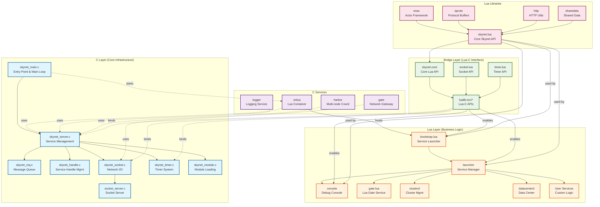

# Skynet Architecture Overview Diagram

## Key Components

### C Layer (Core Infrastructure)
- **skynet_main.c**: Entry point and main event loop
- **skynet_server.c**: Service management and message dispatch
- **skynet_mq.c**: Message queue implementation
- **skynet_handle.c**: Service handle management
- **skynet_socket.c**: Network socket handling
- **skynet_timer.c**: Timer and scheduling system

### C Services
- **snlua**: Lua container service that hosts Lua services
- **gate**: Network gateway for client connections
- **logger**: Centralized logging service
- **harbor**: Multi-node coordination for clustering

### Bridge Layer
- **lualib-src**: C-Lua interface implementations
- **skynet.core**: Core Lua API binding to C functions
- **socket.lua**: Lua socket API
- **timer.lua**: Lua timer API

### Lua Layer
- **bootstrap**: Initial service launcher
- **launcher**: Service creation and management
- **console**: Debug console service
- **gate.lua**: Lua-level gate service
- **clusterd**: Cluster management service
- **datacenterd**: Data center service

### Lua Libraries
- **skynet.lua**: Core skynet API for Lua services
- **snax**: Actor model framework
- **sproto**: Protocol buffer implementation
- **http**: HTTP client and server utilities
- **sharedata**: Shared data management