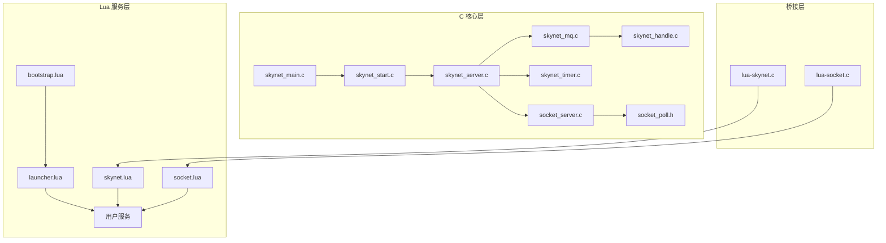

# Skynet 游戏服务器框架完整学习路径指南

## 目录
1. [学习前准备](#学习前准备)
2. [框架架构概览](#框架架构概览)
3. [模块依赖关系图](#模块依赖关系图)
4. [学习路径规划](#学习路径规划)
5. [各阶段详细学习方案](#各阶段详细学习方案)
6. [实践项目建议](#实践项目建议)
7. [常见问题与调试技巧](#常见问题与调试技巧)

## 学习前准备

### 必备知识
- **C 语言基础**：指针、内存管理、数据结构
- **Lua 语言基础**：表、元表、协程基本概念
- **Linux 系统编程**：进程、线程、信号、socket 编程
- **网络编程基础**：TCP/IP 协议、epoll/kqueue 机制

### 开发环境准备
```bash
# 克隆项目
git clone https://github.com/cloudwu/skynet.git
cd skynet

# 编译项目
make linux  # Linux 系统
make macosx # macOS 系统

# 运行测试
./skynet examples/config
```

## 框架架构概览

### 三层架构模型

```
┌─────────────────────────────────────────┐
│         业务逻辑层 (Lua Services)         │
│   • 游戏逻辑 • 状态管理 • 业务规则        │
├─────────────────────────────────────────┤
│         框架服务层 (Core Services)        │
│   • bootstrap • launcher • gate          │
├─────────────────────────────────────────┤
│          C 核心层 (Runtime Engine)        │
│   • 消息队列 • 定时器 • 网络 IO            │
└─────────────────────────────────────────┘
```

## 模块依赖关系图



## 学习路径规划

### 总体学习时间：8-12 周

| 阶段 | 内容 | 时间 | 难度 |
|-----|------|-----|------|
| 第一阶段 | 基础概念与环境搭建 | 1 周 | ★☆☆☆☆ |
| 第二阶段 | 消息系统与 Actor 模型 | 2 周 | ★★★☆☆ |
| 第三阶段 | 网络层架构 | 2 周 | ★★★★☆ |
| 第四阶段 | Lua 服务层开发 | 2 周 | ★★★☆☆ |
| 第五阶段 | 协程与并发机制 | 1 周 | ★★★★☆ |
| 第六阶段 | 分布式特性 | 2 周 | ★★★★★ |
| 第七阶段 | 项目实战 | 2 周 | ★★★★☆ |

## 各阶段详细学习方案

### 第一阶段：基础概念与环境搭建（1周）

#### 学习目标
- 理解 Skynet 的设计理念和应用场景
- 掌握项目编译和运行
- 了解基本配置和目录结构

#### 核心知识点
1. **Actor 模型概念**
   - 独立状态
   - 消息传递
   - 无共享内存

2. **项目结构**
   ```
   skynet/
   ├── skynet-src/     # C 核心源码
   ├── service-src/    # C 服务源码
   ├── lualib-src/     # Lua C 扩展
   ├── service/        # Lua 系统服务
   ├── lualib/         # Lua 库
   └── examples/       # 示例代码
   ```

#### 实践任务
```lua
-- 1. 创建第一个服务 examples/hello.lua
local skynet = require "skynet"

skynet.start(function()
    skynet.error("Hello Skynet!")
    skynet.sleep(100)  -- 睡眠 1 秒
    skynet.error("Service exit")
    skynet.exit()
end)
```

```lua
-- 2. 修改 examples/main.lua 启动服务
local skynet = require "skynet"

skynet.start(function()
    skynet.newservice("hello")
    skynet.exit()
end)
```

### 第二阶段：消息系统与 Actor 模型（2周）

#### 学习目标
- 深入理解消息队列机制
- 掌握服务间通信方式
- 理解服务生命周期

#### 核心模块分析

##### 1. 消息队列系统（skynet_mq.c）
```c
// 核心数据结构
struct message_queue {
    struct spinlock lock;      // 自旋锁
    uint32_t handle;          // 服务句柄
    int cap;                  // 队列容量
    int head;                 // 队头
    int tail;                 // 队尾
    struct skynet_message *queue;  // 消息数组
    struct message_queue *next;    // 链表指针
};
```

##### 2. 服务上下文（skynet_server.c）
```c
struct skynet_context {
    void * instance;               // 服务实例
    struct skynet_module * mod;    // 服务模块
    skynet_cb cb;                  // 消息回调
    struct message_queue *queue;   // 消息队列
    uint32_t handle;              // 服务ID
};
```

#### 实践任务

```lua
-- 服务间通信示例
-- pingpong/ping.lua
local skynet = require "skynet"

local CMD = {}

function CMD.start(pong_service)
    for i = 1, 5 do
        skynet.error("Ping " .. i)
        skynet.call(pong_service, "lua", "ping", i)
        skynet.sleep(100)
    end
end

skynet.start(function()
    skynet.dispatch("lua", function(session, source, cmd, ...)
        local f = CMD[cmd]
        if f then
            skynet.ret(skynet.pack(f(...)))
        end
    end)
end)
```

```lua
-- pingpong/pong.lua
local skynet = require "skynet"

local CMD = {}

function CMD.ping(count)
    skynet.error("Pong " .. count)
    return "pong " .. count
end

skynet.start(function()
    skynet.dispatch("lua", function(session, source, cmd, ...)
        local f = CMD[cmd]
        if f then
            skynet.ret(skynet.pack(f(...)))
        end
    end)
end)
```

### 第三阶段：网络层架构（2周）

#### 学习目标
- 理解 socket_server 架构
- 掌握网络事件处理机制
- 学习 gate 服务的实现

#### 核心组件

##### 1. Socket Server（socket_server.c）
- **事件驱动模型**：epoll/kqueue
- **缓冲区管理**：读写缓冲区
- **连接管理**：socket 池

##### 2. 网络事件处理流程
```
客户端连接 → epoll 事件 → socket_server 处理 
→ 生成消息 → 投递到服务消息队列 → Lua 服务处理
```

#### 实践任务：实现 Echo 服务器

```lua
-- echo_server.lua
local skynet = require "skynet"
local socket = require "skynet.socket"

local function echo(id, addr)
    socket.start(id)
    while true do
        local str = socket.read(id)
        if str then
            socket.write(id, "ECHO: " .. str .. "\n")
        else
            socket.close(id)
            break
        end
    end
end

skynet.start(function()
    local id = socket.listen("127.0.0.1", 8888)
    skynet.error("Listen on :8888")
    
    socket.start(id, function(id, addr)
        skynet.error("Accept connection from " .. addr)
        skynet.fork(function()
            echo(id, addr)
        end)
    end)
end)
```

### 第四阶段：Lua 服务层开发（2周）

#### 学习目标
- 掌握 skynet.lua API
- 理解服务消息分发机制
- 学习 snax 框架使用

#### 核心 API 详解

##### 1. 服务管理 API
```lua
skynet.newservice(name, ...)    -- 创建服务
skynet.uniqueservice(name, ...) -- 创建唯一服务
skynet.queryservice(name)       -- 查询服务
skynet.exit()                   -- 退出服务
```

##### 2. 消息通信 API
```lua
skynet.send(addr, type, ...)    -- 发送消息（无返回）
skynet.call(addr, type, ...)    -- 发送消息（等待返回）
skynet.ret(...)                 -- 返回消息
skynet.dispatch(type, func)     -- 注册消息处理函数
```

#### 实践任务：实现游戏登录服务

```lua
-- loginserver.lua
local skynet = require "skynet"
require "skynet.manager"

local users = {}  -- 用户数据

local CMD = {}

function CMD.login(username, password)
    -- 验证逻辑
    if users[username] == password then
        return {ok = true, uid = username}
    else
        return {ok = false, error = "Invalid credentials"}
    end
end

function CMD.register(username, password)
    if users[username] then
        return {ok = false, error = "User exists"}
    end
    users[username] = password
    return {ok = true}
end

skynet.start(function()
    skynet.dispatch("lua", function(session, source, cmd, ...)
        local f = CMD[cmd]
        if f then
            skynet.ret(skynet.pack(f(...)))
        else
            error("Unknown command: " .. cmd)
        end
    end)
    
    skynet.register(".login")
end)
```

### 第五阶段：协程与并发机制（1周）

#### 学习目标
- 理解 Lua 协程在 Skynet 中的应用
- 掌握异步编程模式
- 学习并发控制技巧

#### 核心概念

##### 1. 协程调度机制
```lua
-- Skynet 对协程的封装
skynet.fork(func)        -- 创建协程
skynet.wait()           -- 等待唤醒
skynet.wakeup(co)       -- 唤醒协程
skynet.sleep(ti)        -- 协程睡眠
skynet.yield()          -- 让出执行权
```

##### 2. 并发控制
```lua
-- 使用 skynet.queue 实现串行化
local skynet = require "skynet"
local queue = require "skynet.queue"

local cs = queue()  -- 创建临界区

local function critical_section()
    cs(function()
        -- 临界区代码，保证串行执行
        skynet.sleep(100)
        skynet.error("Critical operation")
    end)
end
```

#### 实践任务：实现并发任务调度器

```lua
-- task_scheduler.lua
local skynet = require "skynet"

local tasks = {}
local running = {}

local function run_task(id, func)
    running[id] = true
    local ok, err = pcall(func)
    running[id] = nil
    if not ok then
        skynet.error("Task " .. id .. " failed: " .. err)
    end
end

local CMD = {}

function CMD.submit(id, func_str)
    if running[id] then
        return false, "Task already running"
    end
    
    local func, err = load(func_str)
    if not func then
        return false, err
    end
    
    skynet.fork(function()
        run_task(id, func)
    end)
    
    return true
end

function CMD.status(id)
    return running[id] and "running" or "idle"
end

skynet.start(function()
    skynet.dispatch("lua", function(_, _, cmd, ...)
        local f = CMD[cmd]
        if f then
            skynet.ret(skynet.pack(f(...)))
        end
    end)
end)
```

### 第六阶段：分布式特性（2周）

#### 学习目标
- 理解 harbor 机制
- 掌握 cluster 集群方案
- 学习分布式服务设计

#### 核心组件

##### 1. Harbor 系统
- 节点间透明通信
- 全局服务名称
- 消息路由机制

##### 2. Cluster 集群
```lua
-- 集群配置 clustername.lua
__nowaiting = true  -- 不等待节点连接

node1 = "127.0.0.1:2528"
node2 = "127.0.0.1:2529"
```

#### 实践任务：实现分布式聊天服务

```lua
-- chat_server.lua (节点1)
local skynet = require "skynet"
local cluster = require "skynet.cluster"

local rooms = {}  -- 聊天室

local CMD = {}

function CMD.join(room, user)
    rooms[room] = rooms[room] or {}
    rooms[room][user] = true
    -- 通知其他节点
    cluster.call("node2", ".chat", "sync_join", room, user)
    return true
end

function CMD.send(room, user, message)
    if rooms[room] and rooms[room][user] then
        -- 广播消息
        for u, _ in pairs(rooms[room]) do
            skynet.error(string.format("[%s] %s: %s", room, user, message))
        end
        -- 同步到其他节点
        cluster.call("node2", ".chat", "sync_message", room, user, message)
        return true
    end
    return false
end

skynet.start(function()
    cluster.register("node1")
    cluster.open("node1")
    
    skynet.dispatch("lua", function(_, _, cmd, ...)
        local f = CMD[cmd]
        if f then
            skynet.ret(skynet.pack(f(...)))
        end
    end)
    
    skynet.register(".chat")
end)
```

### 第七阶段：项目实战（2周）

#### 项目一：简单游戏服务器（初级）

##### 需求
- 用户登录/注册
- 房间管理
- 实时战斗
- 排行榜

##### 架构设计
```
┌─────────────────────────────────┐
│         Gateway Service          │
├─────────────────────────────────┤
│    Login    │   Game    │  Rank  │
│   Service   │  Service  │Service │
├─────────────────────────────────┤
│         Database Service         │
└─────────────────────────────────┘
```

##### 核心代码示例

```lua
-- game_mgr.lua 游戏管理服务
local skynet = require "skynet"
require "skynet.manager"

local rooms = {}
local players = {}

local CMD = {}

function CMD.create_room(room_id, config)
    if rooms[room_id] then
        return false, "Room exists"
    end
    
    local room = skynet.newservice("room", room_id, config)
    rooms[room_id] = {
        service = room,
        config = config,
        players = {}
    }
    return true
end

function CMD.join_room(room_id, player_id)
    local room = rooms[room_id]
    if not room then
        return false, "Room not found"
    end
    
    if #room.players >= room.config.max_players then
        return false, "Room full"
    end
    
    table.insert(room.players, player_id)
    skynet.call(room.service, "lua", "add_player", player_id)
    return true
end

function CMD.leave_room(room_id, player_id)
    local room = rooms[room_id]
    if not room then
        return false
    end
    
    for i, pid in ipairs(room.players) do
        if pid == player_id then
            table.remove(room.players, i)
            skynet.call(room.service, "lua", "remove_player", player_id)
            break
        end
    end
    
    -- 房间空了就销毁
    if #room.players == 0 then
        skynet.call(room.service, "lua", "shutdown")
        rooms[room_id] = nil
    end
    
    return true
end

skynet.start(function()
    skynet.dispatch("lua", function(session, source, cmd, ...)
        local f = CMD[cmd]
        if f then
            skynet.ret(skynet.pack(f(...)))
        end
    end)
    
    skynet.register(".game_mgr")
end)
```

#### 项目二：分布式游戏服务器（高级）

##### 架构设计
```
┌──────────────┐    ┌──────────────┐
│   Gate Node  │───▶│  Game Node 1  │
│  (负载均衡)  │    └──────────────┘
└──────────────┘    ┌──────────────┐
        │──────────▶│  Game Node 2  │
                    └──────────────┘
                    ┌──────────────┐
        └──────────▶│  Battle Node  │
                    └──────────────┘
```

## 实践项目建议

### 初级项目
1. **Echo 服务器**：基础网络通信
2. **聊天室**：多用户消息广播
3. **HTTP 服务器**：协议解析与处理

### 中级项目
1. **游戏匹配系统**：玩家匹配与房间管理
2. **定时任务系统**：任务调度与执行
3. **数据库服务**：连接池与异步查询

### 高级项目
1. **MMORPG 服务器**：完整游戏服务器
2. **分布式存储系统**：数据分片与副本
3. **实时战斗系统**：帧同步/状态同步

## 常见问题与调试技巧

### 问题1：服务启动失败
```lua
-- 检查方法
skynet.error("Service start: " .. SERVICE_NAME)
-- 查看错误日志
./skynet examples/config | grep ERROR
```

### 问题2：消息丢失
```lua
-- 添加消息追踪
local function dispatch_trace(session, source, cmd, ...)
    skynet.error(string.format("Recv msg: session=%s, source=%x, cmd=%s", 
        session, source, cmd))
    -- 处理逻辑
end
```

### 问题3：内存泄漏
```bash
# 使用 debug console 查看内存
> memory
# 查看服务列表
> list
# 查看特定服务信息
> info :01000001
```

### 调试工具使用

#### 1. Debug Console
```lua
-- 启动 debug console
skynet.newservice("debug_console", 8000)
-- telnet 连接
telnet 127.0.0.1 8000
```

#### 2. 性能分析
```lua
-- 启用性能分析
local profile = require "skynet.profile"
profile.start()
-- 执行代码
profile.stop(function(ti, total)
    skynet.error(string.format("Cost time: %.3f", ti))
end)
```

#### 3. 消息追踪
```lua
-- 开启消息追踪
skynet.trace()
-- 查看消息流
skynet.trace_log()
```

### 最佳实践建议

1. **服务设计原则**
   - 单一职责：每个服务只做一件事
   - 无状态设计：便于水平扩展
   - 消息幂等性：处理重复消息

2. **性能优化技巧**
   - 批量处理：减少消息往返
   - 缓存机制：减少重复计算
   - 异步处理：避免阻塞操作

3. **错误处理规范**
   ```lua
   -- 统一错误处理
   local ok, err = pcall(function()
       -- 业务逻辑
   end)
   if not ok then
       skynet.error("Error: " .. tostring(err))
       -- 错误恢复逻辑
   end
   ```

4. **代码组织建议**
   ```
   project/
   ├── service/      # 服务代码
   ├── lualib/       # 公共库
   ├── proto/        # 协议定义
   ├── config/       # 配置文件
   └── test/         # 测试代码
   ```

## 进阶学习资源

### 官方资源
- [Skynet Wiki](https://github.com/cloudwu/skynet/wiki)
- [Skynet 设计综述](https://blog.codingnow.com/2012/09/the_design_of_skynet.html)

### 源码阅读顺序
1. skynet_main.c - 入口与初始化
2. skynet_start.c - 启动流程
3. skynet_server.c - 服务管理
4. skynet_mq.c - 消息队列
5. skynet_timer.c - 定时器实现
6. socket_server.c - 网络层
7. skynet.lua - Lua API 层

### 关键概念深入
- Actor 模型论文
- CSP 并发模型
- 时间轮算法
- 协程调度原理

## 学习检查清单

- [ ] 能独立编译运行 Skynet
- [ ] 理解 Actor 模型和消息传递
- [ ] 能编写基础 Lua 服务
- [ ] 掌握服务间通信方式
- [ ] 能实现简单的网络服务
- [ ] 理解协程和异步编程
- [ ] 能设计分布式服务架构
- [ ] 完成至少一个完整项目

## 总结

Skynet 学习是一个循序渐进的过程，需要理论与实践相结合。建议按照本指南的学习路径，逐步深入每个模块，通过实际项目来巩固所学知识。记住，理解设计思想比记住 API 更重要，掌握原理比使用框架更有价值。

祝学习顺利！