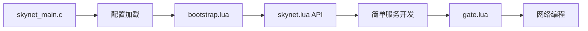
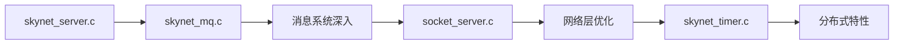

# Skynet 核心模块详解与学习重点

## 一、C 层核心模块分析

### 1. 启动与初始化模块

#### skynet_main.c（入口点）
**文件位置**: `skynet-src/skynet_main.c`
**学习重点**:
- 配置文件加载机制
- 环境变量设置
- 系统初始化顺序

**关键函数**:
```c
main() -> 
  skynet_globalinit() -> 
  skynet_env_init() ->
  skynet_start()
```

**学习难度**: ★★☆☆☆
**预计时间**: 2-3 小时

---

#### skynet_start.c（启动流程）
**文件位置**: `skynet-src/skynet_start.c`
**学习重点**:
- 工作线程创建
- 模块初始化
- 网络初始化
- 定时器启动

**核心流程**:
1. 初始化全局消息队列
2. 初始化服务句柄管理器
3. 创建 socket 服务器
4. 启动定时器线程
5. 创建工作线程池
6. 加载 bootstrap 服务

**学习难度**: ★★★☆☆
**预计时间**: 4-5 小时

---

### 2. 服务管理模块

#### skynet_server.c（服务上下文）
**文件位置**: `skynet-src/skynet_server.c`
**学习重点**:
- `struct skynet_context` 结构
- 服务生命周期管理
- 消息回调机制
- 服务创建与销毁

**核心数据结构**:
```c
struct skynet_context {
    void * instance;              // 服务实例数据
    struct skynet_module * mod;   // 服务模块
    skynet_cb cb;                 // 消息回调函数
    struct message_queue *queue;  // 消息队列
    uint32_t handle;             // 服务句柄
    int session_id;              // 会话ID
    ATOM_INT ref;                // 引用计数
};
```

**学习难度**: ★★★★☆
**预计时间**: 6-8 小时

---

#### skynet_handle.c（句柄管理）
**文件位置**: `skynet-src/skynet_handle.c`
**学习重点**:
- 句柄分配算法
- 服务名称注册
- 句柄到服务的映射
- Harbor 节点管理

**关键概念**:
- 句柄格式：harbor(8bit) + handle(24bit)
- 名称服务：字符串到句柄映射
- 句柄池管理

**学习难度**: ★★★☆☆
**预计时间**: 3-4 小时

---

### 3. 消息系统模块

#### skynet_mq.c（消息队列）
**文件位置**: `skynet-src/skynet_mq.c`
**学习重点**:
- 两级消息队列设计
- 全局队列与次级队列
- 消息过载保护
- 队列调度策略

**核心结构**:
```c
struct message_queue {
    struct spinlock lock;        // 自旋锁
    uint32_t handle;            // 所属服务
    int cap;                    // 队列容量
    int head, tail;             // 队列头尾
    struct skynet_message *queue; // 消息数组
    struct message_queue *next;   // 链表指针
};
```

**学习难度**: ★★★★☆
**预计时间**: 5-6 小时

---

### 4. 网络层模块

#### socket_server.c（网络核心）
**文件位置**: `skynet-src/socket_server.c`
**学习重点**:
- Socket 池管理
- 事件驱动模型
- 读写缓冲区管理
- TCP/UDP 处理

**关键组件**:
- Socket 状态机
- 写缓冲区链表
- 事件循环处理
- 协议处理（TCP/UDP）

**学习难度**: ★★★★★
**预计时间**: 8-10 小时

---

#### socket_epoll.h / socket_kqueue.h（IO 多路复用）
**文件位置**: `skynet-src/socket_epoll.h`, `skynet-src/socket_kqueue.h`
**学习重点**:
- epoll/kqueue API 封装
- 事件注册与触发
- 跨平台兼容性

**学习难度**: ★★★★☆
**预计时间**: 4-5 小时

---

### 5. 定时器模块

#### skynet_timer.c（定时器系统）
**文件位置**: `skynet-src/skynet_timer.c`
**学习重点**:
- 分层时间轮算法
- 定时器精度（10ms）
- 定时消息投递
- 系统时间管理

**时间轮结构**:
```c
struct timer {
    struct link_list near[256];     // 近期时间轮
    struct link_list t[4][64];      // 4层分级时间轮
    uint32_t time;                  // 当前时间刻度
};
```

**学习难度**: ★★★★☆
**预计时间**: 5-6 小时

---

## 二、Lua 服务层模块分析

### 1. 核心服务模块

#### bootstrap.lua（引导服务）
**文件位置**: `service/bootstrap.lua`
**学习重点**:
- 系统启动流程
- 核心服务初始化
- 服务依赖关系

**启动顺序**:
1. 启动 launcher 服务
2. 初始化 harbor（如果需要）
3. 启动 datacenterd
4. 启动 service_mgr
5. 加载用户主服务

**学习难度**: ★★☆☆☆
**预计时间**: 2-3 小时

---

#### launcher.lua（服务启动器）
**文件位置**: `service/launcher.lua`
**学习重点**:
- Lua 服务加载机制
- 服务实例管理
- 错误处理

**学习难度**: ★★★☆☆
**预计时间**: 3-4 小时

---

### 2. 网关服务模块

#### gate.lua（网关服务）
**文件位置**: `service/gate.lua`
**学习重点**:
- 连接管理
- 消息转发
- 协议处理
- 客户端管理

**核心功能**:
- accept 新连接
- 消息解包/打包
- 连接池管理
- 心跳检测

**学习难度**: ★★★★☆
**预计时间**: 5-6 小时

---

### 3. Lua 核心库模块

#### skynet.lua（核心 API）
**文件位置**: `lualib/skynet.lua`
**学习重点**:
- 消息收发 API
- 服务管理 API
- 协程封装
- 错误处理

**核心 API 分类**:
```lua
-- 服务管理
skynet.newservice()
skynet.uniqueservice()
skynet.queryservice()

-- 消息通信
skynet.send()
skynet.call()
skynet.ret()

-- 协程控制
skynet.fork()
skynet.wait()
skynet.wakeup()
```

**学习难度**: ★★★★☆
**预计时间**: 6-8 小时

---

## 三、模块学习路线图

### 基础学习路径（适合初学者）



**总时长**: 3-4 周

### 进阶学习路径（适合有经验者）



**总时长**: 4-5 周

### 深度学习路径（源码级理解）


**总时长**: 6-8 周

---

## 四、各模块实践项目

### C 层实践项目

#### 项目1：自定义 C 服务
**目标**: 创建一个高性能计算服务
**涉及模块**: 
- service-src/
- skynet_module.h
- Makefile

**示例代码**:
```c
// service-src/calc.c
#include "skynet.h"
#include <stdio.h>

struct calc {
    int result;
};

static int
calc_init(struct calc *c, struct skynet_context *ctx, const char *args) {
    c->result = 0;
    skynet_callback(ctx, c, calc_cb);
    return 0;
}

static int
calc_cb(struct skynet_context *ctx, void *ud, int type, 
        int session, uint32_t source, const void *msg, size_t sz) {
    struct calc *c = ud;
    // 处理计算请求
    return 0;
}

struct calc *
calc_create() {
    return skynet_malloc(sizeof(struct calc));
}

void
calc_release(struct calc *c) {
    skynet_free(c);
}
```

---

#### 项目2：网络协议扩展
**目标**: 添加 WebSocket 支持
**涉及模块**:
- socket_server.c
- 协议解析
- 握手处理

---

### Lua 层实践项目

#### 项目3：游戏大厅服务
**目标**: 实现游戏匹配系统
**涉及模块**:
- 房间管理
- 玩家匹配
- 状态同步

**核心代码结构**:
```lua
-- hall_service.lua
local skynet = require "skynet"

local rooms = {}      -- 房间列表
local players = {}    -- 玩家列表
local matching = {}   -- 匹配队列

local CMD = {}

function CMD.enter_hall(player_id, player_info)
    players[player_id] = player_info
    return true
end

function CMD.start_match(player_id, mode)
    -- 加入匹配队列
    table.insert(matching[mode], player_id)
    -- 尝试匹配
    try_match(mode)
end

function try_match(mode)
    local queue = matching[mode]
    if #queue >= 2 then
        -- 创建房间
        local room_id = create_room()
        local p1 = table.remove(queue, 1)
        local p2 = table.remove(queue, 1)
        -- 通知玩家
        notify_match_success(p1, p2, room_id)
    end
end
```

---

## 五、学习资源与工具

### 调试工具

#### 1. Skynet Debug Console
```bash
# 启动时开启
./skynet examples/config

# 连接调试控制台
telnet 127.0.0.1 8000

# 常用命令
help        # 查看帮助
list        # 列出所有服务
info :01000010  # 查看服务信息
mem         # 内存统计
stat        # 消息统计
```

#### 2. 日志系统
```lua
-- 日志级别设置
skynet.error("ERROR: " .. msg)    -- 错误日志
skynet.warning("WARN: " .. msg)   -- 警告日志
skynet.notice("INFO: " .. msg)    -- 信息日志
```

#### 3. 性能分析
```lua
local profile = require "skynet.profile"

profile.start()
-- 需要分析的代码
local function process()
    -- 业务逻辑
end
profile.stop(function(time)
    print("Cost:", time)
end)
```

### 测试框架

#### 单元测试模板
```lua
-- test/test_service.lua
local skynet = require "skynet"

local test_cases = {}

function test_cases.test_basic()
    local service = skynet.newservice("myservice")
    local ret = skynet.call(service, "lua", "ping")
    assert(ret == "pong")
end

function test_cases.test_concurrent()
    local services = {}
    for i = 1, 10 do
        services[i] = skynet.newservice("myservice")
    end
    
    -- 并发测试
    for i = 1, 10 do
        skynet.fork(function()
            skynet.call(services[i], "lua", "process", i)
        end)
    end
end

-- 运行测试
skynet.start(function()
    for name, test in pairs(test_cases) do
        local ok, err = pcall(test)
        if ok then
            skynet.error("✓ " .. name)
        else
            skynet.error("✗ " .. name .. ": " .. err)
        end
    end
    skynet.exit()
end)
```

---

## 六、常见设计模式

### 1. 服务池模式
```lua
-- service_pool.lua
local skynet = require "skynet"

local pool = {}
local free = {}

local function get_service()
    local s = table.remove(free)
    if not s then
        s = skynet.newservice("worker")
        pool[s] = true
    end
    return s
end

local function free_service(s)
    table.insert(free, s)
end
```

### 2. 消息路由模式
```lua
-- router.lua
local handlers = {}

function register_handler(cmd, handler)
    handlers[cmd] = handler
end

skynet.dispatch("lua", function(session, source, cmd, ...)
    local handler = handlers[cmd]
    if handler then
        skynet.ret(skynet.pack(handler(...)))
    else
        error("Unknown command: " .. cmd)
    end
end)
```

### 3. 状态机模式
```lua
-- state_machine.lua
local states = {
    idle = {
        enter = function() end,
        update = function() end,
        exit = function() end,
    },
    running = {
        enter = function() end,
        update = function() end,
        exit = function() end,
    }
}

local current_state = "idle"

function change_state(new_state)
    states[current_state].exit()
    current_state = new_state
    states[current_state].enter()
end
```

---

## 总结

本文档详细分析了 Skynet 的核心模块，提供了每个模块的学习重点、难度评估和时间规划。建议根据自己的基础和目标选择合适的学习路径，通过实践项目来巩固理论知识。记住，深入理解架构设计比单纯使用 API 更重要。