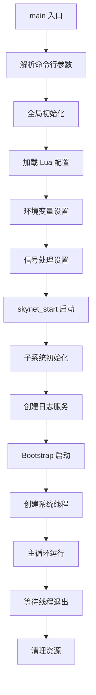
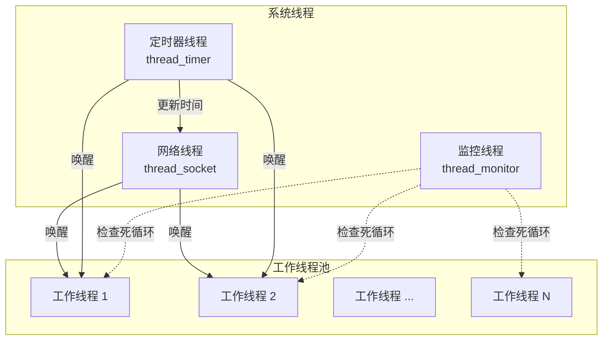
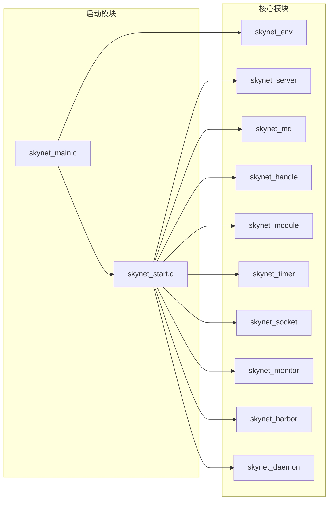
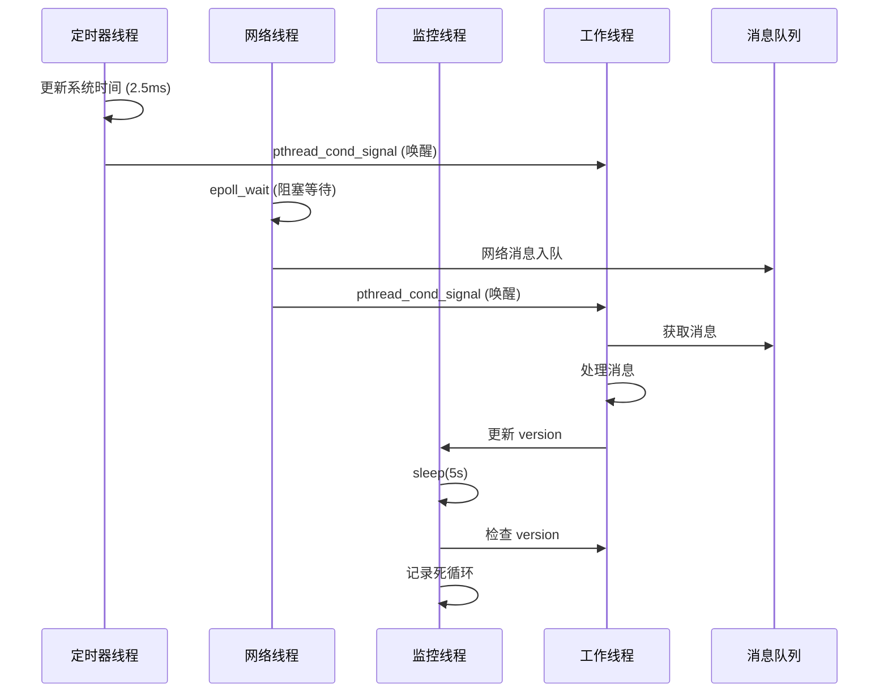

# Skynet 启动与调度模块技术文档

## 目录
1. [模块概述](#1-模块概述)
2. [设计架构](#2-设计架构)
3. [依赖关系](#3-依赖关系)
4. [实现细节](#4-实现细节)
5. [关键数据结构](#5-关键数据结构)
6. [核心函数分析](#6-核心函数分析)
7. [并发与同步](#7-并发与同步)
8. [配置项说明](#8-配置项说明)
9. [错误处理](#9-错误处理)
10. [性能考虑](#10-性能考虑)

---

## 1. 模块概述

### 1.1 模块定位

启动与调度模块是 Skynet 框架的入口点和核心调度器，位于 C 核心层的最底层，负责整个系统的生命周期管理。该模块由两个核心文件组成：

- **skynet_main.c**: 系统主入口，负责配置解析和环境初始化
- **skynet_start.c**: 线程管理器，负责创建和管理所有系统线程

### 1.2 核心职责

1. **配置管理**: 解析 Lua 配置文件，初始化运行环境
2. **线程创建**: 创建四类系统线程（监控、定时器、网络、工作线程）
3. **调度管理**: 实现工作线程的负载均衡和消息调度
4. **生命周期**: 管理系统启动、运行和优雅退出
5. **监控保护**: 检测并处理死循环等异常情况

### 1.3 设计目标

- **高并发**: 支持多线程并发处理，充分利用多核 CPU
- **低延迟**: 通过条件变量实现高效的线程唤醒机制
- **可靠性**: 内置监控机制，防止服务陷入死循环
- **灵活性**: 通过配置文件灵活调整系统参数
- **可扩展**: 模块化设计，易于扩展和维护

---

## 2. 设计架构

### 2.1 启动流程架构



### 2.2 线程模型设计

Skynet 采用多线程架构，将不同职责分配给专门的线程：



### 2.3 线程职责分工

| 线程类型 | 数量 | 主要职责 | 关键特性 |
|---------|------|---------|----------|
| **监控线程** | 1 | 检测服务死循环，记录服务运行状态 | 每5秒检查一次，独立运行 |
| **定时器线程** | 1 | 管理系统时间，触发定时事件，协调线程唤醒 | 2.5ms 精度，驱动整个系统节奏 |
| **网络线程** | 1 | 处理所有网络 I/O 事件，管理 socket 连接 | epoll/kqueue 事件驱动 |
| **工作线程** | N（可配置） | 执行服务消息处理，运行业务逻辑 | 支持权重调度，负载均衡 |

---

## 3. 依赖关系

### 3.1 模块依赖图



### 3.2 头文件依赖

```c
// skynet_main.c 的依赖
#include "skynet.h"           // 核心 API 定义
#include "skynet_imp.h"        // 内部实现接口
#include "skynet_env.h"        // 环境变量管理
#include "skynet_server.h"     // 服务管理接口
#include <lua.h>              // Lua 虚拟机
#include <signal.h>           // 信号处理

// skynet_start.c 的依赖
#include "skynet_server.h"     // 服务上下文管理
#include "skynet_mq.h"         // 消息队列
#include "skynet_handle.h"     // 句柄管理
#include "skynet_module.h"     // 模块加载
#include "skynet_timer.h"      // 定时器系统
#include "skynet_monitor.h"    // 监控器
#include "skynet_socket.h"     // 网络系统
#include "skynet_harbor.h"     // 集群支持
#include "skynet_daemon.h"     // 守护进程
#include <pthread.h>          // POSIX 线程
```

### 3.3 模块初始化顺序

初始化顺序至关重要，必须严格遵循依赖关系：

```c
// skynet_start() 中的初始化顺序
1. skynet_harbor_init()    // 集群配置（必须最先）
2. skynet_handle_init()     // 句柄池（依赖 harbor）
3. skynet_mq_init()        // 消息队列系统
4. skynet_module_init()    // C 服务模块加载器
5. skynet_timer_init()     // 定时器系统
6. skynet_socket_init()    // 网络子系统
7. skynet_profile_enable() // 性能分析（可选）
```

---

## 4. 实现细节

### 4.1 配置加载机制

配置加载使用嵌入式 Lua 脚本，实现灵活的配置文件解析：

```c
static const char * load_config = "\
    local result = {}\n\
    local function getenv(name) \
        return assert(os.getenv(name), [[os.getenv() failed: ]] .. name) \
    end\n\
    local sep = package.config:sub(1,1)\n\
    local current_path = [[.]]..sep\n\
    local function include(filename)\n\
        -- 支持配置文件嵌套包含
        -- 支持环境变量替换 $VAR_NAME
        -- 支持相对路径和绝对路径
    end\n\
    setmetatable(result, { __index = { include = include } })\n\
    local config_name = ...\n\
    include(config_name)\n\
    return result\n\
";
```

#### 配置加载流程：

1. **创建 Lua 虚拟机**: 用于解析配置文件
2. **执行配置脚本**: 支持 include 指令和环境变量
3. **遍历配置表**: 将 Lua table 转换为环境变量
4. **类型处理**: 支持字符串和布尔值类型
5. **关闭虚拟机**: 配置加载完成后立即释放

### 4.2 环境变量初始化

```c
static void _init_env(lua_State *L) {
    lua_pushnil(L);  // 第一个键
    while (lua_next(L, -2) != 0) {
        // 验证键类型必须是字符串
        int keyt = lua_type(L, -2);
        if (keyt != LUA_TSTRING) {
            fprintf(stderr, "Invalid config table\n");
            exit(1);
        }
        
        const char * key = lua_tostring(L,-2);
        
        // 处理布尔值
        if (lua_type(L,-1) == LUA_TBOOLEAN) {
            int b = lua_toboolean(L,-1);
            skynet_setenv(key, b ? "true" : "false");
        } 
        // 处理字符串值
        else {
            const char * value = lua_tostring(L,-1);
            if (value == NULL) {
                fprintf(stderr, "Invalid config table key = %s\n", key);
                exit(1);
            }
            skynet_setenv(key, value);
        }
        lua_pop(L,1);
    }
}
```

### 4.3 线程创建机制

#### 4.3.1 监控线程 (thread_monitor)

```c
static void * thread_monitor(void *p) {
    struct monitor * m = p;
    int i;
    int n = m->count;
    skynet_initthread(THREAD_MONITOR);
    
    for (;;) {
        CHECK_ABORT  // 检查是否应该退出
        
        // 检查所有工作线程
        for (i=0; i<n; i++) {
            skynet_monitor_check(m->m[i]);
        }
        
        // 休眠5秒（分5次，每次1秒，以便更快响应退出）
        for (i=0; i<5; i++) {
            CHECK_ABORT
            sleep(1);
        }
    }
    return NULL;
}
```

**监控机制实现**：
- 每个工作线程有独立的 `skynet_monitor` 实例
- 监控器记录当前处理的消息源和目标
- 通过版本号机制检测是否有进展
- 发现死循环时记录错误日志

#### 4.3.2 定时器线程 (thread_timer)

```c
static void * thread_timer(void *p) {
    struct monitor * m = p;
    skynet_initthread(THREAD_TIMER);
    
    for (;;) {
        skynet_updatetime();        // 更新系统时间
        skynet_socket_updatetime(); // 更新网络时间
        CHECK_ABORT
        
        wakeup(m, m->count-1);      // 唤醒休眠的工作线程
        usleep(2500);               // 休眠 2.5 毫秒
        
        if (SIG) {                  // 处理 SIGHUP 信号
            signal_hup();
            SIG = 0;
        }
    }
    
    // 退出时的清理工作
    skynet_socket_exit();
    pthread_mutex_lock(&m->mutex);
    m->quit = 1;
    pthread_cond_broadcast(&m->cond);  // 唤醒所有工作线程
    pthread_mutex_unlock(&m->mutex);
    return NULL;
}
```

**定时器职责**：
- 维护全局时间戳（2.5ms 精度）
- 定期唤醒工作线程处理超时事件
- 处理日志文件重新打开信号 (SIGHUP)
- 协调系统优雅退出

#### 4.3.3 网络线程 (thread_socket)

```c
static void * thread_socket(void *p) {
    struct monitor * m = p;
    skynet_initthread(THREAD_SOCKET);
    
    for (;;) {
        int r = skynet_socket_poll();  // 轮询网络事件
        
        if (r == 0)
            break;  // socket 系统退出
            
        if (r < 0) {
            CHECK_ABORT
            continue;  // 没有事件，继续轮询
        }
        
        wakeup(m, 0);  // 有网络事件，唤醒工作线程
    }
    return NULL;
}
```

**网络线程特性**：
- 独占处理所有网络 I/O
- 使用 epoll/kqueue 高效事件机制
- 事件到达时唤醒工作线程
- 避免惊群效应

#### 4.3.4 工作线程 (thread_worker)

```c
static void * thread_worker(void *p) {
    struct worker_parm *wp = p;
    int id = wp->id;
    int weight = wp->weight;  // 调度权重
    struct monitor *m = wp->m;
    struct skynet_monitor *sm = m->m[id];
    skynet_initthread(THREAD_WORKER);
    
    struct message_queue * q = NULL;
    
    while (!m->quit) {
        // 分发消息，weight 决定每次处理的消息数量
        q = skynet_context_message_dispatch(sm, q, weight);
        
        if (q == NULL) {  // 没有消息可处理
            if (pthread_mutex_lock(&m->mutex) == 0) {
                ++m->sleep;  // 增加休眠计数
                
                if (!m->quit)
                    pthread_cond_wait(&m->cond, &m->mutex);  // 等待唤醒
                    
                --m->sleep;  // 减少休眠计数
                
                if (pthread_mutex_unlock(&m->mutex)) {
                    fprintf(stderr, "unlock mutex error");
                    exit(1);
                }
            }
        }
    }
    return NULL;
}
```

### 4.4 工作线程调度策略

#### 权重系统

```c
static int weight[] = { 
    -1, -1, -1, -1,  // 前4个线程：每次处理1条消息
     0,  0,  0,  0,  // 5-8线程：每次处理直到队列空
     1,  1,  1,  1,  1,  1,  1,  1,  // 9-16线程：加权处理
     2,  2,  2,  2,  2,  2,  2,  2,  // 17-24线程：更高权重
     3,  3,  3,  3,  3,  3,  3,  3   // 25-32线程：最高权重
};
```

**权重含义**：
- **-1**: 每次只处理一条消息，保证公平性
- **0**: 处理消息直到队列为空
- **1-3**: 根据权重决定连续处理的消息批次

这种设计在公平性和吞吐量之间取得平衡：
- 少量线程时注重公平性
- 大量线程时注重吞吐量

---

## 5. 关键数据结构

### 5.1 struct skynet_config

```c
struct skynet_config {
    int thread;              // 工作线程数量
    int harbor;              // 集群节点 ID (1-255)
    int profile;             // 是否开启性能分析
    const char * daemon;     // 守护进程 PID 文件路径
    const char * module_path; // C 服务模块搜索路径
    const char * bootstrap;  // 启动命令（通常是 "snlua bootstrap"）
    const char * logger;     // 日志文件路径
    const char * logservice; // 日志服务名称（默认 "logger"）
};
```

### 5.2 struct monitor

```c
struct monitor {
    int count;                      // 工作线程总数
    struct skynet_monitor ** m;    // 监控器数组（每个工作线程一个）
    pthread_cond_t cond;           // 条件变量（用于线程唤醒）
    pthread_mutex_t mutex;         // 互斥锁（保护共享数据）
    int sleep;                     // 当前休眠的工作线程数
    int quit;                      // 退出标志（0=运行，1=退出）
};
```

**设计要点**：
- 中心化的线程协调结构
- 通过 sleep 计数优化唤醒策略
- 条件变量避免忙等待

### 5.3 struct worker_parm

```c
struct worker_parm {
    struct monitor *m;   // 指向全局监控器
    int id;             // 工作线程 ID (0 到 count-1)
    int weight;         // 调度权重 (-1 到 3)
};
```

### 5.4 struct skynet_monitor

```c
struct skynet_monitor {
    ATOM_INT version;      // 原子版本号（消息处理计数）
    int check_version;     // 上次检查时的版本号
    uint32_t source;       // 当前处理消息的源服务 handle
    uint32_t destination;  // 当前处理消息的目标服务 handle
};
```

**死循环检测原理**：
1. 每处理一条消息，version 自增
2. 监控线程定期检查 version 是否变化
3. 如果 version 不变，说明可能陷入死循环
4. 记录错误日志，标记服务为 "endless"

---

## 6. 核心函数分析

### 6.1 main 函数流程

```c
int main(int argc, char *argv[]) {
    // 1. 参数检查
    if (argc <= 1) {
        fprintf(stderr, "Need a config file...\n");
        return 1;
    }
    
    // 2. 全局初始化
    skynet_globalinit();      // 初始化内存分配器等
    skynet_env_init();        // 初始化环境变量存储
    
    // 3. 信号处理
    sigign();                 // 忽略 SIGPIPE 信号
    
    // 4. 配置加载
    struct lua_State *L = luaL_newstate();
    luaL_openlibs(L);
    // 执行配置加载脚本...
    _init_env(L);            // 将配置转换为环境变量
    lua_close(L);
    
    // 5. 配置解析
    struct skynet_config config;
    config.thread = optint("thread", 8);
    config.module_path = optstring("cpath", "./cservice/?.so");
    config.harbor = optint("harbor", 1);
    config.bootstrap = optstring("bootstrap", "snlua bootstrap");
    // ... 其他配置项
    
    // 6. 启动系统
    skynet_start(&config);
    
    // 7. 清理退出
    skynet_globalexit();
    
    return 0;
}
```

### 6.2 skynet_start 函数

```c
void skynet_start(struct skynet_config * config) {
    // 1. 注册信号处理器
    struct sigaction sa;
    sa.sa_handler = &handle_hup;
    sa.sa_flags = SA_RESTART;
    sigfillset(&sa.sa_mask);
    sigaction(SIGHUP, &sa, NULL);  // 用于日志文件重新打开
    
    // 2. 守护进程模式（可选）
    if (config->daemon) {
        daemon_init(config->daemon);
    }
    
    // 3. 初始化各子系统（顺序很重要）
    skynet_harbor_init(config->harbor);
    skynet_handle_init(config->harbor);
    skynet_mq_init();
    skynet_module_init(config->module_path);
    skynet_timer_init();
    skynet_socket_init();
    skynet_profile_enable(config->profile);
    
    // 4. 创建日志服务
    struct skynet_context *ctx = 
        skynet_context_new(config->logservice, config->logger);
    if (ctx == NULL) {
        fprintf(stderr, "Can't launch %s service\n", 
                config->logservice);
        exit(1);
    }
    skynet_handle_namehandle(skynet_context_handle(ctx), "logger");
    
    // 5. 启动 bootstrap 服务
    bootstrap(ctx, config->bootstrap);
    
    // 6. 创建并启动所有线程
    start(config->thread);
    
    // 7. 清理资源
    skynet_harbor_exit();
    skynet_socket_free();
    if (config->daemon) {
        daemon_exit(config->daemon);
    }
}
```

### 6.3 start 函数（线程创建）

```c
static void start(int thread) {
    pthread_t pid[thread+3];  // 工作线程 + 3个系统线程
    
    // 1. 初始化监控器结构
    struct monitor *m = skynet_malloc(sizeof(*m));
    memset(m, 0, sizeof(*m));
    m->count = thread;
    m->sleep = 0;
    m->m = skynet_malloc(thread * sizeof(struct skynet_monitor *));
    
    // 2. 为每个工作线程创建监控器
    for (int i=0; i<thread; i++) {
        m->m[i] = skynet_monitor_new();
    }
    
    // 3. 初始化同步原语
    pthread_mutex_init(&m->mutex, NULL);
    pthread_cond_init(&m->cond, NULL);
    
    // 4. 创建系统线程
    create_thread(&pid[0], thread_monitor, m);
    create_thread(&pid[1], thread_timer, m);
    create_thread(&pid[2], thread_socket, m);
    
    // 5. 创建工作线程
    struct worker_parm wp[thread];
    for (int i=0; i<thread; i++) {
        wp[i].m = m;
        wp[i].id = i;
        wp[i].weight = (i < 32) ? weight[i] : 0;
        create_thread(&pid[i+3], thread_worker, &wp[i]);
    }
    
    // 6. 等待所有线程结束
    for (int i=0; i<thread+3; i++) {
        pthread_join(pid[i], NULL);
    }
    
    // 7. 释放资源
    free_monitor(m);
}
```

### 6.4 wakeup 函数（唤醒策略）

```c
static void wakeup(struct monitor *m, int busy) {
    if (m->sleep >= m->count - busy) {
        // 如果休眠线程数 >= 空闲线程数，唤醒一个
        pthread_cond_signal(&m->cond);
    }
}
```

**唤醒策略分析**：
- 避免过度唤醒，减少上下文切换
- 只在必要时唤醒工作线程
- 定时器线程定期唤醒（每2.5ms）
- 网络线程按需唤醒（有事件时）

---

## 7. 并发与同步

### 7.1 线程同步机制

#### 互斥锁和条件变量

```c
struct monitor {
    pthread_mutex_t mutex;   // 保护 sleep 和 quit 变量
    pthread_cond_t cond;     // 用于工作线程休眠/唤醒
    int sleep;               // 原子性由 mutex 保护
    int quit;                // 原子性由 mutex 保护
};
```

#### 工作线程休眠逻辑

```c
// 工作线程没有消息处理时的休眠流程
if (q == NULL) {  // 没有消息队列
    pthread_mutex_lock(&m->mutex);
    ++m->sleep;  // 增加休眠计数
    
    if (!m->quit)  // 检查退出标志
        pthread_cond_wait(&m->cond, &m->mutex);  // 原子性休眠
    
    --m->sleep;  // 被唤醒，减少休眠计数
    pthread_mutex_unlock(&m->mutex);
}
```

### 7.2 无锁设计

#### 监控器版本号机制

```c
struct skynet_monitor {
    ATOM_INT version;  // 使用原子操作，无需锁
};

// 消息处理时
ATOM_FINC(&sm->version);  // 原子自增

// 监控检查时
if (sm->version == sm->check_version) {
    // 版本号未变，可能死循环
}
```

### 7.3 线程间通信



### 7.4 避免竞态条件

1. **消息队列访问**: 每个服务独占队列，无需锁
2. **环境变量访问**: 启动阶段单线程，运行时只读
3. **监控器更新**: 使用原子操作
4. **休眠计数**: 使用互斥锁保护

---

## 8. 配置项说明

### 8.1 核心配置项

| 配置项 | 类型 | 默认值 | 说明 |
|--------|------|--------|------|
| **thread** | int | 8 | 工作线程数量，建议设置为 CPU 核心数 |
| **harbor** | int | 1 | 集群节点 ID，单节点为1，集群为1-255 |
| **bootstrap** | string | "snlua bootstrap" | 启动命令，指定第一个服务 |
| **module_path** | string | "./cservice/?.so" | C 服务模块搜索路径 |
| **logger** | string | NULL | 日志文件路径，NULL 表示输出到标准输出 |
| **logservice** | string | "logger" | 日志服务名称 |
| **daemon** | string | NULL | 守护进程 PID 文件路径 |
| **profile** | bool | true | 是否开启性能分析 |

### 8.2 配置文件示例

```lua
-- config.lua
root = "./"
thread = 8
logger = nil
logpath = "."
harbor = 1
address = "127.0.0.1:2526"
master = "127.0.0.1:2013"
start = "main"  -- main script
bootstrap = "snlua bootstrap"

-- 集群配置
standalone = "0.0.0.0:2013"
luaservice = root.."service/?.lua;"..root.."test/?.lua"
lualoader = root .. "lualib/loader.lua"
lua_path = root.."lualib/?.lua;"..root.."lualib/?/init.lua"
lua_cpath = root .. "luaclib/?.so"
cpath = root.."cservice/?.so"

-- 嵌套包含其他配置
-- include "config.path"
```

### 8.3 环境变量支持

配置文件支持环境变量替换：

```lua
-- 使用 $VAR_NAME 引用环境变量
thread = $SKYNET_THREAD  -- 从环境变量读取
logger = "$HOME/logs/skynet.log"
```

---

## 9. 错误处理

### 9.1 启动阶段错误

#### 配置文件错误

```c
// 配置文件不存在或格式错误
if (argc <= 1) {
    fprintf(stderr, "Need a config file...\n");
    return 1;
}

// Lua 配置解析错误
err = lua_pcall(L, 1, 1, 0);
if (err) {
    fprintf(stderr, "%s\n", lua_tostring(L, -1));
    lua_close(L);
    return 1;
}
```

#### 服务启动失败

```c
// 日志服务启动失败
struct skynet_context *ctx = 
    skynet_context_new(config->logservice, config->logger);
if (ctx == NULL) {
    fprintf(stderr, "Can't launch %s service\n", config->logservice);
    exit(1);
}

// Bootstrap 服务启动失败
if (ctx == NULL) {
    skynet_error(NULL, "Bootstrap error : %s\n", cmdline);
    skynet_context_dispatchall(logger);
    exit(1);
}
```

### 9.2 运行时错误处理

#### 死循环检测

```c
void skynet_monitor_check(struct skynet_monitor *sm) {
    if (sm->version == sm->check_version) {
        if (sm->destination) {
            // 标记服务为 endless 状态
            skynet_context_endless(sm->destination);
            // 记录错误日志
            skynet_error(NULL, 
                "error: A message from [ :%08x ] to [ :%08x ] "
                "maybe in an endless loop (version = %d)", 
                sm->source, sm->destination, sm->version);
        }
    } else {
        sm->check_version = sm->version;
    }
}
```

#### 线程创建失败

```c
static void create_thread(pthread_t *thread, 
                         void *(*start_routine) (void *), 
                         void *arg) {
    if (pthread_create(thread, NULL, start_routine, arg)) {
        fprintf(stderr, "Create thread failed");
        exit(1);  // 致命错误，直接退出
    }
}
```

### 9.3 信号处理

#### SIGPIPE 处理

```c
int sigign() {
    struct sigaction sa;
    sa.sa_handler = SIG_IGN;  // 忽略 SIGPIPE
    sa.sa_flags = 0;
    sigemptyset(&sa.sa_mask);
    sigaction(SIGPIPE, &sa, 0);
    return 0;
}
```

**原因**: 防止网络连接断开时进程被 SIGPIPE 信号终止

#### SIGHUP 处理

```c
static void handle_hup(int signal) {
    if (signal == SIGHUP) {
        SIG = 1;  // 设置标志，由定时器线程处理
    }
}

// 定时器线程中
if (SIG) {
    signal_hup();  // 通知日志服务重新打开文件
    SIG = 0;
}
```

**用途**: 支持日志文件轮转，不中断服务

### 9.4 优雅退出

```c
// 检查是否应该退出
#define CHECK_ABORT if (skynet_context_total()==0) break;

// 定时器线程触发退出
skynet_socket_exit();  // 关闭网络线程
pthread_mutex_lock(&m->mutex);
m->quit = 1;  // 设置退出标志
pthread_cond_broadcast(&m->cond);  // 唤醒所有工作线程
pthread_mutex_unlock(&m->mutex);

// 等待所有线程退出
for (i=0; i<thread+3; i++) {
    pthread_join(pid[i], NULL);
}
```

---

## 10. 性能考虑

### 10.1 线程数量配置

#### 建议配置

```lua
-- 推荐配置
thread = CPU核心数

-- 对于 I/O 密集型应用
thread = CPU核心数 * 2

-- 对于 CPU 密集型应用  
thread = CPU核心数 - 1  -- 预留一个核心给系统
```

#### 线程数量影响

| 线程数 | 优势 | 劣势 | 适用场景 |
|--------|------|------|----------|
| 1-4 | 低延迟，缓存友好 | 吞吐量受限 | 轻负载，实时性要求高 |
| 4-8 | 均衡性能 | - | 通用场景 |
| 8-16 | 高吞吐量 | 上下文切换增加 | I/O 密集型 |
| 16+ | 最大并发 | 调度开销大 | 大规模并发连接 |

### 10.2 CPU 亲和性

虽然 Skynet 默认不设置 CPU 亲和性，但可以通过以下方式优化：

```c
// 可在 thread_worker 中添加（需要自行实现）
cpu_set_t cpuset;
CPU_ZERO(&cpuset);
CPU_SET(id % CPU_COUNT, &cpuset);  // 绑定到特定 CPU
pthread_setaffinity_np(pthread_self(), sizeof(cpuset), &cpuset);
```

### 10.3 负载均衡策略

#### 权重调度

```c
// 权重对性能的影响
weight = -1:  最公平，延迟稳定，吞吐量较低
weight = 0:   批处理模式，延迟不稳定，吞吐量高
weight = 1-3: 折中方案，根据负载自适应
```

#### 消息批处理

```c
// skynet_context_message_dispatch 的 weight 参数
// weight = -1: 处理 1 条消息
// weight = 0:  处理到队列空
// weight > 0:  处理 2^weight 条消息
```

### 10.4 内存局部性优化

```c
struct monitor {
    // 热数据（频繁访问）
    int sleep;               // 每次唤醒都要访问
    pthread_cond_t cond;     // 每次休眠/唤醒都要访问
    pthread_mutex_t mutex;   // 每次休眠/唤醒都要访问
    
    // 冷数据（很少访问）
    int count;               // 只在初始化时设置
    int quit;                // 只在退出时设置
    struct skynet_monitor ** m;  // 监控线程访问
};
```

### 10.5 定时器精度优化

```c
// thread_timer 中的休眠时间
usleep(2500);  // 2.5ms

// 优化建议：
// - 高精度场景：1ms
// - 通用场景：2.5ms（默认）
// - 低功耗场景：5-10ms
```

### 10.6 监控开销

```c
// 监控线程的检查间隔
for (i=0; i<5; i++) {
    CHECK_ABORT
    sleep(1);  // 5秒检查一次
}

// 优化建议：
// - 开发环境：1秒
// - 生产环境：5-10秒
// - 关闭监控：注释掉 create_thread(&pid[0], thread_monitor, m);
```

### 10.7 性能监控指标

通过以下方式监控系统性能：

1. **工作线程利用率**: `sleep / count` 比率
2. **消息处理延迟**: 监控器 version 增长速度
3. **网络事件频率**: socket poll 返回值统计
4. **定时器精度**: 实际休眠时间与期望时间对比

---

## 总结

Skynet 的启动与调度模块展现了精巧的系统设计：

### 核心特性

1. **简洁高效**: 代码量小但功能完整
2. **线程专门化**: 每种线程专注单一职责
3. **智能调度**: 权重系统平衡公平性和吞吐量
4. **可靠监控**: 自动检测和报告死循环
5. **优雅退出**: 完善的生命周期管理

### 设计亮点

- **配置灵活性**: Lua 配置文件，支持嵌套和环境变量
- **并发安全**: 最小化锁使用，优先使用原子操作
- **性能优化**: 批处理、缓存友好、避免惊群
- **错误处理**: 完善的错误检测和恢复机制

### 适用场景

该模块设计特别适合：
- 游戏服务器（高并发、低延迟）
- 实时系统（可预测的响应时间）
- 微服务架构（Actor 模型）
- 高可用系统（内置监控和错误恢复）

通过深入理解这个模块，可以更好地掌握 Skynet 的运行机制，为开发高性能服务奠定基础。