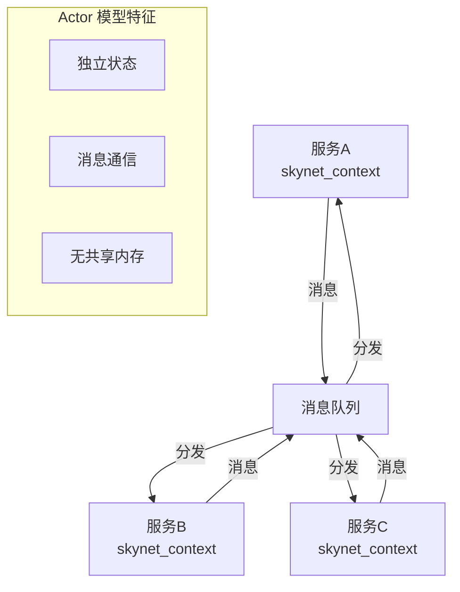
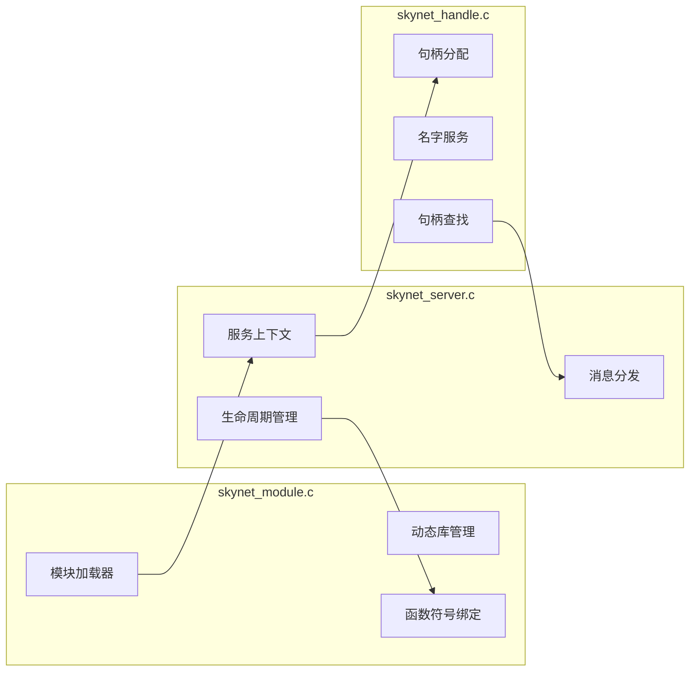
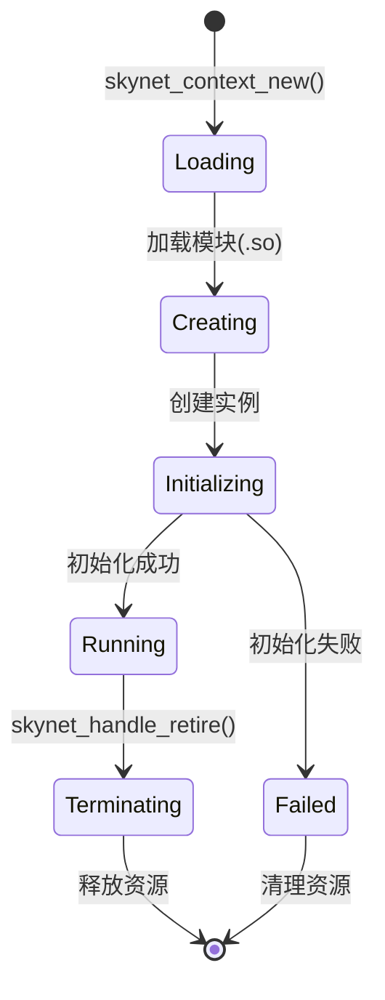
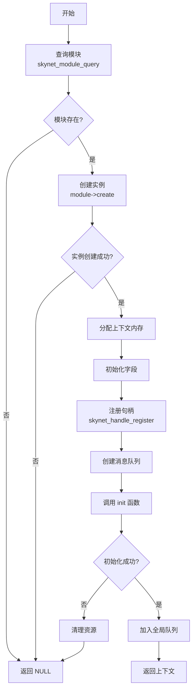
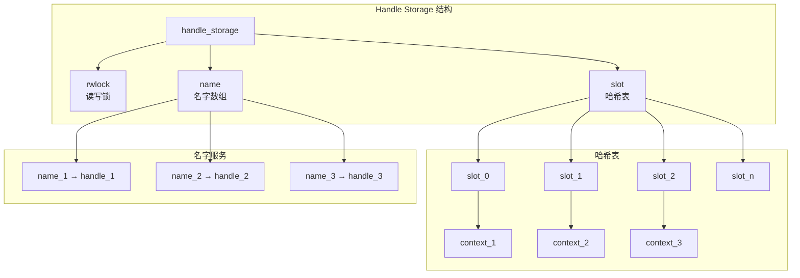
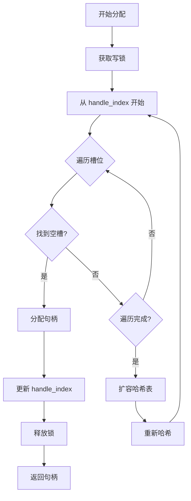
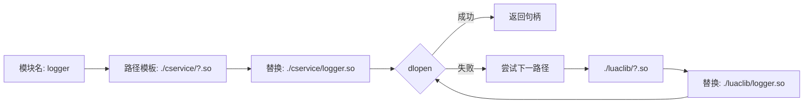
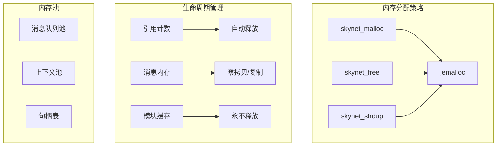

# Skynet 服务管理模块技术文档

## 目录

1. [模块概述](#1-模块概述)
2. [skynet_server.c 深度分析](#2-skynet_serverc-深度分析)
3. [skynet_handle.c 深度分析](#3-skynet_handlec-深度分析)
4. [skynet_module.c 深度分析](#4-skynet_modulec-深度分析)
5. [设计要点](#5-设计要点)

## 1. 模块概述

### 1.1 Actor 模型在 Skynet 中的实现

Skynet 的服务管理模块是整个框架的核心，它实现了 Actor 并发模型。每个服务（Actor）具有以下特征：

- **独立状态**：每个服务拥有独立的内存空间和状态（`skynet_context`）
- **消息驱动**：服务之间通过异步消息传递进行通信
- **并发安全**：无共享内存，避免了传统多线程编程的竞态条件
- **位置透明**：通过句柄系统，服务可以透明地进行本地或远程通信



### 1.2 三个子模块的协作机制



**协作流程**：
1. `skynet_module.c` 负责加载动态库（.so 文件），获取服务的创建、初始化、释放和信号处理函数
2. `skynet_server.c` 调用模块接口创建服务实例，管理服务上下文和消息分发
3. `skynet_handle.c` 为每个服务分配唯一标识符（handle），并提供名字服务功能

### 1.3 服务的概念和生命周期



### 1.4 与其他模块的交互

```c
// 与消息队列模块的交互
#include "skynet_mq.h"         // 消息队列管理
// 与定时器模块的交互  
#include "skynet_timer.h"      // 定时服务
// 与网络模块的交互
#include "skynet_harbor.h"     // 分布式节点通信
// 与监控模块的交互
#include "skynet_monitor.h"    // 服务监控
```

## 2. skynet_server.c 深度分析

### 2.1 struct skynet_context 数据结构详解

```c
struct skynet_context {
    void * instance;                 // 服务实例指针（由 module->create() 创建）
    struct skynet_module * mod;      // 指向服务模块的指针
    void * cb_ud;                    // 回调函数的用户数据
    skynet_cb cb;                    // 消息回调函数
    struct message_queue *queue;     // 服务专属的消息队列
    ATOM_POINTER logfile;           // 日志文件句柄（原子指针）
    uint64_t cpu_cost;              // CPU 消耗时间（微秒）
    uint64_t cpu_start;             // CPU 开始时间（微秒）
    char result[32];                // 命令执行结果缓冲区
    uint32_t handle;                // 服务的唯一标识符
    int session_id;                 // 会话 ID 生成器
    ATOM_INT ref;                   // 引用计数（原子操作）
    size_t message_count;           // 已处理消息计数
    bool init;                      // 初始化标志
    bool endless;                   // 消息阻塞标志
    bool profile;                   // 性能分析开关
    CHECKCALLING_DECL              // 调用检查（调试用）
};
```

**字段含义详解**：

| 字段 | 类型 | 说明 |
|------|------|------|
| `instance` | `void*` | 存储服务的实际数据，每个服务类型可以有多个实例 |
| `mod` | `skynet_module*` | 指向模块结构，包含 create/init/release/signal 函数指针 |
| `cb` / `cb_ud` | 函数指针/数据 | 消息处理回调函数及其用户数据 |
| `queue` | `message_queue*` | 服务独占的次级消息队列 |
| `handle` | `uint32_t` | 全局唯一的服务标识符 |
| `ref` | `ATOM_INT` | 原子引用计数，为 0 时释放内存 |
| `session_id` | `int` | 用于匹配请求和响应的会话标识 |

### 2.2 服务创建：skynet_context_new 完整流程

```c
struct skynet_context * 
skynet_context_new(const char * name, const char *param) {
    // 第一步：查询模块
    struct skynet_module * mod = skynet_module_query(name);
    if (mod == NULL) return NULL;

    // 第二步：创建服务实例
    void *inst = skynet_module_instance_create(mod);
    if (inst == NULL) return NULL;
    
    // 第三步：分配上下文内存
    struct skynet_context * ctx = skynet_malloc(sizeof(*ctx));
    
    // 第四步：初始化上下文字段
    ctx->mod = mod;
    ctx->instance = inst;
    ATOM_INIT(&ctx->ref , 2);      // 引用计数初始为 2
    ctx->cb = NULL;
    ctx->cb_ud = NULL;
    ctx->session_id = 0;
    ctx->init = false;
    ctx->endless = false;
    // ... 其他字段初始化

    // 第五步：注册句柄
    ctx->handle = 0;  // 先设为 0，避免未初始化访问
    ctx->handle = skynet_handle_register(ctx);
    
    // 第六步：创建消息队列
    struct message_queue * queue = ctx->queue = skynet_mq_create(ctx->handle);
    
    // 第七步：增加全局服务计数
    context_inc();

    // 第八步：调用服务初始化函数
    int r = skynet_module_instance_init(mod, inst, ctx, param);
    
    // 第九步：处理初始化结果
    if (r == 0) {
        ctx->init = true;
        skynet_globalmq_push(queue);  // 将队列加入全局队列
        skynet_error(ret, "LAUNCH %s %s", name, param ? param : "");
        return ctx;
    } else {
        // 初始化失败，清理资源
        skynet_handle_retire(handle);
        skynet_mq_release(queue, drop_message, &d);
        return NULL;
    }
}
```

**创建流程图**：



### 2.3 消息分发：dispatch_message 机制

```c
static void
dispatch_message(struct skynet_context *ctx, struct skynet_message *msg) {
    assert(ctx->init);  // 确保服务已初始化
    
    // 设置线程局部存储，存储当前服务句柄
    pthread_setspecific(G_NODE.handle_key, (void *)(uintptr_t)(ctx->handle));
    
    // 解析消息类型和大小
    int type = msg->sz >> MESSAGE_TYPE_SHIFT;      // 高位存储类型
    size_t sz = msg->sz & MESSAGE_TYPE_MASK;       // 低位存储大小
    
    // 日志记录
    FILE *f = (FILE *)ATOM_LOAD(&ctx->logfile);
    if (f) {
        skynet_log_output(f, msg->source, type, msg->session, msg->data, sz);
    }
    
    ++ctx->message_count;
    
    // 性能分析
    int reserve_msg;
    if (ctx->profile) {
        ctx->cpu_start = skynet_thread_time();
        reserve_msg = ctx->cb(ctx, ctx->cb_ud, type, msg->session, 
                             msg->source, msg->data, sz);
        uint64_t cost_time = skynet_thread_time() - ctx->cpu_start;
        ctx->cpu_cost += cost_time;
    } else {
        reserve_msg = ctx->cb(ctx, ctx->cb_ud, type, msg->session,
                             msg->source, msg->data, sz);
    }
    
    // 如果回调返回 0，释放消息数据
    if (!reserve_msg) {
        skynet_free(msg->data);
    }
}
```

**消息分发流程**：

1. **类型解析**：从 `msg->sz` 中提取消息类型和实际大小
2. **日志记录**：如果开启日志，记录消息详情
3. **性能统计**：如果开启性能分析，记录处理时间
4. **回调处理**：调用服务注册的回调函数处理消息
5. **内存管理**：根据回调返回值决定是否释放消息数据

### 2.4 命令系统：command_func 数组和各命令实现

```c
static struct command_func cmd_funcs[] = {
    { "TIMEOUT", cmd_timeout },      // 设置定时器
    { "REG", cmd_reg },              // 注册服务名
    { "QUERY", cmd_query },          // 查询服务
    { "NAME", cmd_name },            // 命名服务
    { "EXIT", cmd_exit },            // 退出服务
    { "KILL", cmd_kill },            // 强制终止服务
    { "LAUNCH", cmd_launch },        // 启动新服务
    { "GETENV", cmd_getenv },        // 获取环境变量
    { "SETENV", cmd_setenv },        // 设置环境变量
    { "STARTTIME", cmd_starttime },  // 获取启动时间
    { "ABORT", cmd_abort },          // 终止所有服务
    { "MONITOR", cmd_monitor },      // 设置监控服务
    { "STAT", cmd_stat },            // 获取统计信息
    { "LOGON", cmd_logon },          // 开启日志
    { "LOGOFF", cmd_logoff },        // 关闭日志
    { "SIGNAL", cmd_signal },        // 发送信号
    { NULL, NULL },
};
```

**重要命令详解**：

```c
// LAUNCH 命令：创建新服务
static const char *
cmd_launch(struct skynet_context * context, const char * param) {
    // 解析参数：模块名 + 初始化参数
    char * mod = strsep(&args, " \t\r\n");
    args = strsep(&args, "\r\n");
    
    // 创建新服务
    struct skynet_context * inst = skynet_context_new(mod, args);
    if (inst == NULL) {
        return NULL;
    } else {
        // 返回新服务的句柄（十六进制格式）
        id_to_hex(context->result, inst->handle);
        return context->result;
    }
}

// REG 命令：注册服务名
static const char *
cmd_reg(struct skynet_context * context, const char * param) {
    if (param == NULL || param[0] == '\0') {
        // 返回当前服务的句柄
        sprintf(context->result, ":%x", context->handle);
        return context->result;
    } else if (param[0] == '.') {
        // 注册本地名字
        return skynet_handle_namehandle(context->handle, param + 1);
    }
    // 不支持在 C 层注册全局名字
    return NULL;
}
```

### 2.5 服务间通信：skynet_send 系列函数

```c
int
skynet_send(struct skynet_context * context, uint32_t source, 
            uint32_t destination, int type, int session, 
            void * data, size_t sz) {
    // 第一步：检查消息大小
    if ((sz & MESSAGE_TYPE_MASK) != sz) {
        skynet_error(context, "error: The message to %x is too large", destination);
        return -2;
    }
    
    // 第二步：处理消息参数（复制、分配会话等）
    _filter_args(context, type, &session, (void **)&data, &sz);
    
    // 第三步：设置源地址
    if (source == 0) {
        source = context->handle;
    }
    
    // 第四步：检查目标地址
    if (destination == 0) {
        return -1;
    }
    
    // 第五步：判断本地或远程
    if (skynet_harbor_message_isremote(destination)) {
        // 远程消息，通过 harbor 发送
        struct remote_message * rmsg = skynet_malloc(sizeof(*rmsg));
        rmsg->destination.handle = destination;
        rmsg->message = data;
        rmsg->sz = sz & MESSAGE_TYPE_MASK;
        rmsg->type = sz >> MESSAGE_TYPE_SHIFT;
        skynet_harbor_send(rmsg, source, session);
    } else {
        // 本地消息，直接入队
        struct skynet_message smsg;
        smsg.source = source;
        smsg.session = session;
        smsg.data = data;
        smsg.sz = sz;
        
        if (skynet_context_push(destination, &smsg)) {
            skynet_free(data);
            return -1;
        }
    }
    return session;
}
```

**消息发送特性**：

| 特性 | 说明 |
|------|------|
| **消息大小限制** | 使用 24 位存储大小，最大 16MB |
| **消息类型编码** | 高 8 位存储类型，低 24 位存储大小 |
| **会话管理** | 支持自动分配会话 ID |
| **内存管理** | 支持零拷贝（PTYPE_TAG_DONTCOPY）|
| **分布式支持** | 自动识别远程句柄，透明转发 |

### 2.6 引用计数和内存管理

```c
// 增加引用计数
void 
skynet_context_grab(struct skynet_context *ctx) {
    ATOM_FINC(&ctx->ref);
}

// 减少引用计数，为 0 时删除
struct skynet_context * 
skynet_context_release(struct skynet_context *ctx) {
    if (ATOM_FDEC(&ctx->ref) == 1) {
        delete_context(ctx);
        return NULL;
    }
    return ctx;
}

// 删除上下文
static void 
delete_context(struct skynet_context *ctx) {
    // 关闭日志文件
    FILE *f = (FILE *)ATOM_LOAD(&ctx->logfile);
    if (f) {
        fclose(f);
    }
    
    // 释放服务实例
    skynet_module_instance_release(ctx->mod, ctx->instance);
    
    // 标记消息队列待释放
    skynet_mq_mark_release(ctx->queue);
    
    // 释放上下文内存
    skynet_free(ctx);
    
    // 减少全局服务计数
    context_dec();
}
```

**引用计数策略**：
- 初始引用计数为 2（创建时的引用 + 句柄表的引用）
- 每次 `grab` 操作增加引用
- 每次 `release` 操作减少引用
- 引用计数归零时自动释放所有资源

## 3. skynet_handle.c 深度分析

### 3.1 handle 编码方案

```c
// handle 的位域布局
// |<- 8 bits ->|<--- 24 bits --->|
// |  harbor_id |   local_handle  |

#define HANDLE_MASK 0xffffff          // 低 24 位掩码
#define HANDLE_REMOTE_SHIFT 24         // harbor 位移

struct handle_storage {
    struct rwlock lock;                // 读写锁
    uint32_t harbor;                   // harbor id（高 8 位）
    uint32_t handle_index;             // 下一个分配的句柄序号
    int slot_size;                     // 哈希表大小（2 的幂）
    struct skynet_context ** slot;     // 哈希表数组
    int name_cap;                      // 名字数组容量
    int name_count;                    // 已注册名字数量
    struct handle_name *name;          // 名字数组（有序）
};
```

**Handle 编码特点**：
- **本地句柄**：24 位，支持 16M 个本地服务
- **Harbor ID**：8 位，支持 256 个分布式节点
- **零值保留**：handle 0 被系统保留，表示无效句柄

### 3.2 struct handle_storage 哈希表设计



**哈希表特性**：
- **开放定址法**：使用线性探测解决哈希冲突
- **动态扩容**：当槽位用满时，容量翻倍
- **快速定位**：`hash = handle & (slot_size - 1)`
- **缓存友好**：连续内存布局，提高缓存命中率

### 3.3 句柄分配算法和扩容机制

```c
uint32_t
skynet_handle_register(struct skynet_context *ctx) {
    struct handle_storage *s = H;
    rwlock_wlock(&s->lock);

    for (;;) {
        int i;
        uint32_t handle = s->handle_index;
        
        // 线性探测，寻找空槽
        for (i=0; i<s->slot_size; i++, handle++) {
            if (handle > HANDLE_MASK) {
                handle = 1;  // 回绕，跳过 0
            }
            
            int hash = handle & (s->slot_size-1);
            if (s->slot[hash] == NULL) {
                // 找到空槽，分配
                s->slot[hash] = ctx;
                s->handle_index = handle + 1;
                rwlock_wunlock(&s->lock);
                
                // 加上 harbor id
                handle |= s->harbor;
                return handle;
            }
        }
        
        // 所有槽位已满，需要扩容
        assert((s->slot_size*2 - 1) <= HANDLE_MASK);
        
        // 分配新的哈希表（容量翻倍）
        struct skynet_context ** new_slot = 
            skynet_malloc(s->slot_size * 2 * sizeof(struct skynet_context *));
        memset(new_slot, 0, s->slot_size * 2 * sizeof(struct skynet_context *));
        
        // 重新哈希所有元素
        for (i=0; i<s->slot_size; i++) {
            if (s->slot[i]) {
                int hash = skynet_context_handle(s->slot[i]) & (s->slot_size * 2 - 1);
                assert(new_slot[hash] == NULL);
                new_slot[hash] = s->slot[i];
            }
        }
        
        // 替换旧表
        skynet_free(s->slot);
        s->slot = new_slot;
        s->slot_size *= 2;
    }
}
```

**分配算法流程**：



### 3.4 名字服务实现

```c
// 查找名字（二分查找）
uint32_t
skynet_handle_findname(const char * name) {
    struct handle_storage *s = H;
    rwlock_rlock(&s->lock);
    
    uint32_t handle = 0;
    int begin = 0;
    int end = s->name_count - 1;
    
    // 二分查找（名字数组有序）
    while (begin <= end) {
        int mid = (begin + end) / 2;
        struct handle_name *n = &s->name[mid];
        int c = strcmp(n->name, name);
        if (c == 0) {
            handle = n->handle;
            break;
        }
        if (c < 0) {
            begin = mid + 1;
        } else {
            end = mid - 1;
        }
    }
    
    rwlock_runlock(&s->lock);
    return handle;
}

// 插入名字（保持有序）
static const char *
_insert_name(struct handle_storage *s, const char * name, uint32_t handle) {
    // 二分查找插入位置
    int begin = 0;
    int end = s->name_count - 1;
    while (begin <= end) {
        int mid = (begin + end) / 2;
        struct handle_name *n = &s->name[mid];
        int c = strcmp(n->name, name);
        if (c == 0) {
            return NULL;  // 名字已存在
        }
        if (c < 0) {
            begin = mid + 1;
        } else {
            end = mid - 1;
        }
    }
    
    // 复制名字
    char * result = skynet_strdup(name);
    
    // 在 begin 位置插入
    _insert_name_before(s, result, handle, begin);
    
    return result;
}
```

**名字服务特性**：
- **有序存储**：名字按字典序排列
- **二分查找**：O(log n) 时间复杂度
- **动态扩容**：名字数组容量不足时自动翻倍
- **原子操作**：通过读写锁保证线程安全

### 3.5 线程安全保证（rwlock）

```c
struct rwlock {
    int write;
    int read;
};

// 使用模式
// 1. 写操作（独占）
rwlock_wlock(&s->lock);
// ... 修改操作 ...
rwlock_wunlock(&s->lock);

// 2. 读操作（共享）
rwlock_rlock(&s->lock);
// ... 只读操作 ...
rwlock_runlock(&s->lock);
```

**并发控制策略**：
- **读写分离**：多个读操作可并发，写操作独占
- **写优先**：有写请求时，新的读请求会等待
- **最小化锁粒度**：操作完成立即释放锁
- **避免死锁**：释放上下文时先解锁再调用可能加锁的函数

## 4. skynet_module.c 深度分析

### 4.1 模块接口规范

```c
// 模块必须实现的四个接口
typedef void * (*skynet_dl_create)(void);
typedef int (*skynet_dl_init)(void * inst, struct skynet_context *, const char * parm);
typedef void (*skynet_dl_release)(void * inst);
typedef void (*skynet_dl_signal)(void * inst, int signal);

struct skynet_module {
    const char * name;          // 模块名（通常是文件名）
    void * module;              // dlopen 返回的句柄
    skynet_dl_create create;    // 创建实例
    skynet_dl_init init;        // 初始化实例
    skynet_dl_release release;  // 释放实例
    skynet_dl_signal signal;    // 处理信号
};
```

**接口命名规范**：
```c
// 假设模块名为 "logger"
// 则对应的函数名必须为：
logger_create    // 创建函数
logger_init      // 初始化函数  
logger_release   // 释放函数
logger_signal    // 信号函数
```

### 4.2 dlopen 动态加载实现

```c
static void *
_try_open(struct modules *m, const char * name) {
    const char *l;
    const char * path = m->path;  // 例如: "./cservice/?.so"
    size_t path_size = strlen(path);
    size_t name_size = strlen(name);
    
    void * dl = NULL;
    char tmp[path_size + name_size];
    
    // 遍历路径列表（分号分隔）
    do {
        memset(tmp, 0, sizeof(tmp));
        while (*path == ';') path++;
        if (*path == '\0') break;
        
        // 查找下一个分号
        l = strchr(path, ';');
        if (l == NULL) l = path + strlen(path);
        
        // 构建实际路径，将 ? 替换为模块名
        int len = l - path;
        int i;
        for (i=0; path[i]!='?' && i < len; i++) {
            tmp[i] = path[i];
        }
        memcpy(tmp+i, name, name_size);
        if (path[i] == '?') {
            strncpy(tmp+i+name_size, path+i+1, len - i - 1);
        }
        
        // 尝试加载动态库
        dl = dlopen(tmp, RTLD_NOW | RTLD_GLOBAL);
        path = l;
    } while(dl == NULL);
    
    return dl;
}
```

**加载过程**：
1. **路径解析**：将配置的路径模板中的 `?` 替换为模块名
2. **动态链接**：使用 `dlopen` 加载 .so 文件
3. **符号可见性**：`RTLD_GLOBAL` 使符号全局可见
4. **即时绑定**：`RTLD_NOW` 立即解析所有符号

### 4.3 模块查询和缓存

```c
struct modules {
    int count;                              // 已加载模块数量
    struct spinlock lock;                   // 自旋锁
    const char * path;                      // 模块搜索路径
    struct skynet_module m[MAX_MODULE_TYPE]; // 模块缓存（最多 32 个）
};

struct skynet_module *
skynet_module_query(const char * name) {
    // 第一次查询（无锁）
    struct skynet_module * result = _query(name);
    if (result)
        return result;
    
    SPIN_LOCK(M)
    
    // 双重检查（加锁后再查一次）
    result = _query(name);
    
    if (result == NULL && M->count < MAX_MODULE_TYPE) {
        // 尝试加载新模块
        int index = M->count;
        void * dl = _try_open(M, name);
        if (dl) {
            M->m[index].name = name;
            M->m[index].module = dl;
            
            // 绑定函数符号
            if (open_sym(&M->m[index]) == 0) {
                M->m[index].name = skynet_strdup(name);
                M->count++;
                result = &M->m[index];
            }
        }
    }
    
    SPIN_UNLOCK(M)
    
    return result;
}
```

**缓存机制**：
- **一次加载**：模块只在首次使用时加载
- **永久缓存**：加载后的模块不会被卸载
- **双重检查**：避免并发加载同一模块
- **容量限制**：最多缓存 32 种不同的模块类型

### 4.4 模块路径解析

```c
// 路径配置示例
// cpath = "./cservice/?.so;./luaclib/?.so"

// 解析过程：
// 1. 分割路径（按分号）
// 2. 替换占位符（? → 模块名）
// 3. 尝试加载每个路径
// 4. 返回第一个成功加载的模块
```

**路径解析流程图**：



## 5. 设计要点

### 5.1 并发控制

**多层次的并发控制机制**：

| 层次 | 机制 | 应用场景 | 特点 |
|------|------|----------|------|
| **原子操作** | `ATOM_INT`, `ATOM_POINTER` | 引用计数、简单标志 | 无锁、高性能 |
| **自旋锁** | `spinlock` | 模块加载、短临界区 | 忙等待、适合短时操作 |
| **读写锁** | `rwlock` | 句柄表访问 | 读写分离、提高并发度 |
| **消息队列** | 无锁队列 | 服务间通信 | 异步、解耦 |

```c
// 原子操作示例
ATOM_FINC(&ctx->ref);  // 原子增加
ATOM_FDEC(&ctx->ref);  // 原子减少
ATOM_LOAD(&ctx->logfile);  // 原子读取
ATOM_CAS_POINTER(&ctx->logfile, old, new);  // CAS 操作

// 自旋锁使用模式
SPIN_LOCK(M)
// 临界区代码
SPIN_UNLOCK(M)

// 读写锁使用
rwlock_rlock(&lock);  // 读锁（共享）
rwlock_wlock(&lock);  // 写锁（独占）
```

### 5.2 内存管理策略

**层次化的内存管理**：



**关键策略**：
1. **引用计数**：自动管理服务生命周期
2. **延迟释放**：避免使用中的内存被释放
3. **内存池**：减少频繁分配/释放开销
4. **零拷贝**：大消息传递时避免复制

### 5.3 性能优化技巧

**1. 缓存优化**
```c
// 使用 2 的幂作为哈希表大小，用位运算代替取模
int hash = handle & (s->slot_size - 1);  // 而不是 handle % s->slot_size
```

**2. 减少锁竞争**
```c
// 双重检查锁定
result = _query(name);  // 第一次检查（无锁）
if (result) return result;
SPIN_LOCK(M)
result = _query(name);  // 第二次检查（有锁）
```

**3. 批量操作**
```c
// 消息批量处理
for (i=0; i<n; i++) {
    if (skynet_mq_pop(q, &msg)) break;
    // 处理多条消息，减少调度开销
}
```

**4. 内存局部性**
```c
// 连续内存布局，提高缓存命中率
struct skynet_context ** slot;  // 数组形式
struct handle_name *name;       // 有序数组
```

### 5.4 最佳实践

#### 服务设计原则

1. **无状态共享**：服务间不共享内存，只通过消息通信
2. **异步处理**：避免阻塞操作，使用回调或协程
3. **错误隔离**：单个服务崩溃不影响其他服务
4. **资源管理**：正确处理引用计数，避免内存泄漏

#### 消息处理模式

```c
// 推荐的消息处理模式
int message_handler(struct skynet_context * ctx, void *ud, 
                    int type, int session, uint32_t source,
                    const void * msg, size_t sz) {
    switch(type) {
    case PTYPE_CLIENT:
        // 处理客户端消息
        handle_client_message(ctx, msg, sz);
        break;
    case PTYPE_RESPONSE:
        // 处理响应消息
        handle_response(ctx, session, msg, sz);
        break;
    default:
        // 未知消息类型
        skynet_error(ctx, "Unknown message type %d", type);
    }
    return 0;  // 返回 0 表示消息内存由框架释放
}
```

#### 性能监控

```c
// 开启性能分析
skynet_profile_enable(1);

// 获取统计信息
skynet_command(ctx, "STAT", "cpu");      // CPU 使用时间
skynet_command(ctx, "STAT", "mqlen");    // 消息队列长度
skynet_command(ctx, "STAT", "message");  // 处理消息数量
```

## 总结

Skynet 的服务管理模块通过精心设计的三层架构实现了高效的 Actor 模型：

1. **skynet_module.c** 提供动态模块加载能力，支持热插拔
2. **skynet_server.c** 实现服务生命周期管理和消息分发
3. **skynet_handle.c** 提供高效的服务定位和名字服务

整个系统通过以下特性保证了高性能和高可靠性：

- **无锁设计**：大量使用原子操作和无锁数据结构
- **内存管理**：引用计数自动管理生命周期
- **并发控制**：多层次的锁机制，最小化竞争
- **缓存友好**：数据结构设计考虑 CPU 缓存
- **错误隔离**：服务间相互独立，故障不扩散

这种设计使得 Skynet 能够在单机支撑数千个服务同时运行，成为游戏服务器开发的优秀框架。