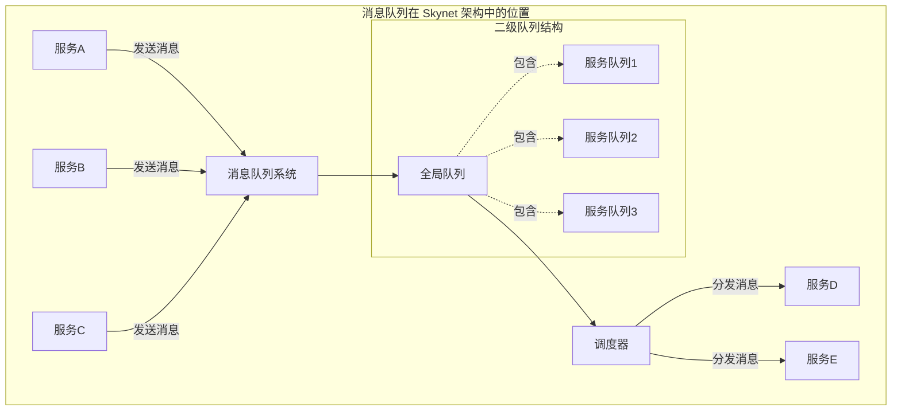
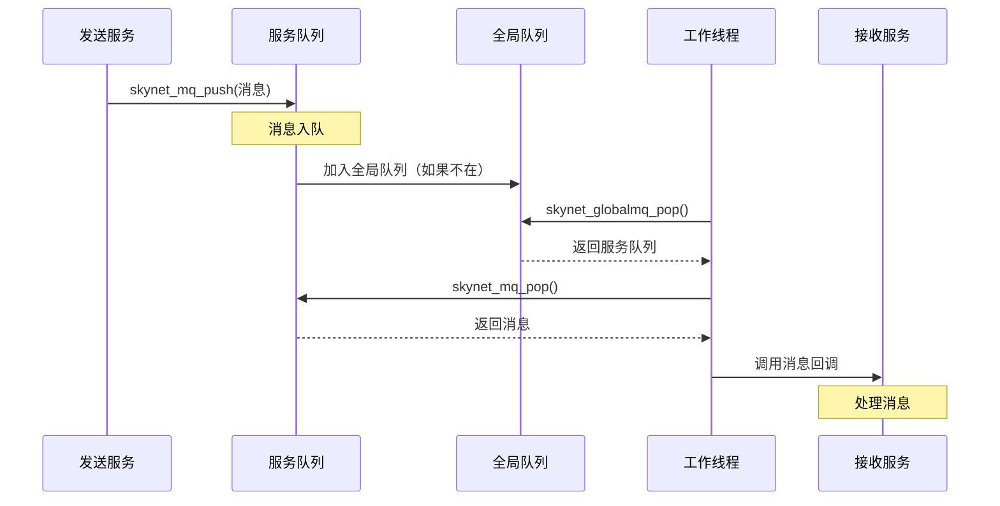
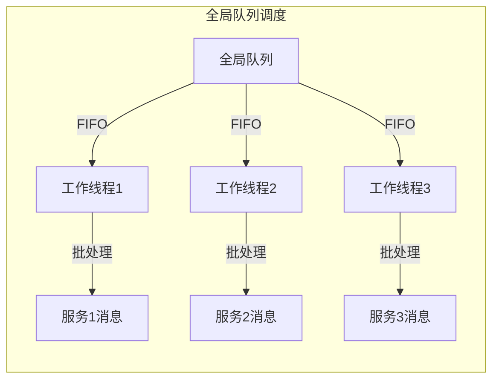
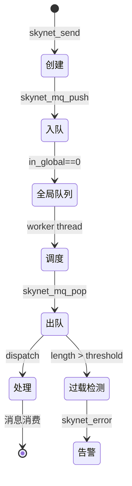

# Skynet 消息队列系统详解 (skynet_mq.c)

## 目录

1. [模块概述](#1-模块概述)
2. [设计架构](#2-设计架构)
3. [核心数据结构](#3-核心数据结构)
4. [关键函数深度分析](#4-关键函数深度分析)
5. [并发控制](#5-并发控制)
6. [性能优化](#6-性能优化)
7. [消息生命周期](#7-消息生命周期)
8. [调试与监控](#8-调试与监控)
9. [使用示例和最佳实践](#9-使用示例和最佳实践)
10. [总结](#10-总结)

## 1. 模块概述

### 1.1 消息驱动架构的核心地位

Skynet 的消息队列系统是整个框架的心脏，它实现了 Actor 模型中最关键的消息传递机制。每个服务（Actor）通过消息队列与其他服务通信，实现了完全的解耦和并发执行。



### 1.2 二级队列设计理念

Skynet 采用了独特的**二级队列**设计：

1. **第一级：服务私有队列（Message Queue）**
   - 每个服务拥有独立的消息队列
   - 使用环形缓冲区实现，高效且内存友好
   - 支持动态扩容，初始大小为 64 个消息

2. **第二级：全局队列（Global Queue）**
   - 包含所有有消息待处理的服务队列
   - 使用链表结构，便于动态增删
   - 工作线程从全局队列获取服务队列进行处理

### 1.3 设计优势

```c
// 二级队列的核心优势体现
/*
 * 1. 负载均衡：工作线程可以均匀地从全局队列获取任务
 * 2. 公平调度：每个服务都有机会被处理，避免饥饿
 * 3. 批量处理：一次可以处理一个服务的多条消息
 * 4. 减少锁竞争：服务队列的锁粒度更小
 */
```

### 1.4 与其他模块的协作

消息队列系统与 Skynet 其他核心模块紧密协作：

- **skynet_server.c**：创建服务时创建对应的消息队列
- **skynet_start.c**：工作线程从全局队列获取任务
- **skynet_handle.c**：通过服务句柄定位消息队列
- **skynet_socket.c**：网络消息通过队列传递给服务

## 2. 设计架构

### 2.1 二级队列模型详解



### 2.2 消息流转的完整路径

```c
// 消息从产生到消费的生命周期
// 1. 消息产生
skynet_send(ctx, source, dest, type, session, data, sz)
    ↓
// 2. 构造 skynet_message
struct skynet_message msg = {
    .source = source,
    .session = session,
    .data = data,
    .sz = sz | (type << MESSAGE_TYPE_SHIFT)
};
    ↓
// 3. 获取目标服务的消息队列
struct message_queue *q = skynet_handle_query(dest);
    ↓
// 4. 消息入队
skynet_mq_push(q, &msg);
    ↓
// 5. 队列加入全局队列（如果需要）
if (q->in_global == 0) {
    skynet_globalmq_push(q);
}
    ↓
// 6. 工作线程获取队列
struct message_queue *q = skynet_globalmq_pop();
    ↓
// 7. 从队列弹出消息
skynet_mq_pop(q, &msg);
    ↓
// 8. 分发消息到服务
dispatch_message(ctx, &msg);
```

### 2.3 队列调度策略



调度策略的核心原则：

1. **FIFO（先进先出）**：全局队列按照加入顺序处理
2. **批量处理**：一个服务的消息会连续处理一批（默认处理 n 条）
3. **公平性**：处理完一批后，服务队列重新加入全局队列尾部
4. **避免饥饿**：每个服务都有机会被调度

## 3. 核心数据结构

### 3.1 struct skynet_message - 消息结构

```c
// skynet.h 中定义
struct skynet_message {
    uint32_t source;    // 消息源服务的句柄（发送者）
    int session;        // 会话ID，用于请求-响应匹配
    void * data;        // 消息数据指针
    size_t sz;          // 数据大小 | (消息类型 << MESSAGE_TYPE_SHIFT)
};

// 消息类型定义 (PTYPE_*)
#define PTYPE_TEXT      0   // 文本消息（调试用）
#define PTYPE_RESPONSE  1   // 响应消息
#define PTYPE_MULTICAST 2   // 组播消息
#define PTYPE_CLIENT    3   // 客户端消息
#define PTYPE_SYSTEM    4   // 系统消息
#define PTYPE_HARBOR    5   // 跨节点消息
#define PTYPE_SOCKET    6   // 网络消息
#define PTYPE_ERROR     7   // 错误消息
#define PTYPE_RESERVED_QUEUE 8  // 保留
#define PTYPE_RESERVED_DEBUG 9  // 调试
#define PTYPE_RESERVED_LUA   10 // Lua消息
#define PTYPE_RESERVED_SNAX  11 // SNAX框架消息
```

消息结构设计要点：

- **source**：32位句柄编码，包含 harbor 和本地 ID
- **session**：支持 RPC 调用的会话管理
- **data/sz**：灵活的数据承载，支持任意类型
- **类型编码**：通过 sz 的高位编码消息类型

### 3.2 struct message_queue - 服务私有队列

```c
struct message_queue {
    // 并发控制
    struct spinlock lock;           // 自旋锁，保护队列的并发访问
    
    // 队列标识
    uint32_t handle;                // 拥有此队列的服务句柄
    
    // 环形缓冲区
    int cap;                        // 队列容量（动态扩容）
    int head;                       // 队头索引
    int tail;                       // 队尾索引
    struct skynet_message *queue;   // 消息数组（环形缓冲区）
    
    // 状态标志
    int release;                    // 释放标志（1表示待释放）
    int in_global;                  // 是否在全局队列中（MQ_IN_GLOBAL=1）
    
    // 过载检测
    int overload;                   // 当前过载消息数
    int overload_threshold;         // 过载阈值（动态调整）
    
    // 链表指针
    struct message_queue *next;     // 全局队列中的下一个队列
};
```

#### 环形缓冲区实现原理

```c
// 环形缓冲区的关键操作
// 入队操作
q->queue[q->tail] = *message;
if (++q->tail >= q->cap) {
    q->tail = 0;  // 回绕
}

// 出队操作
*message = q->queue[q->head++];
if (q->head >= q->cap) {
    q->head = 0;  // 回绕
}

// 队列长度计算
int length;
if (head <= tail) {
    length = tail - head;
} else {
    length = tail + cap - head;  // 考虑回绕
}

// 判断队列满
if (q->head == q->tail) {  // 入队后判断
    expand_queue(q);  // 扩容
}
```

### 3.3 struct global_queue - 全局队列

```c
struct global_queue {
    struct message_queue *head;     // 链表头
    struct message_queue *tail;     // 链表尾
    struct spinlock lock;           // 自旋锁保护
};

static struct global_queue *Q = NULL;  // 全局唯一实例
```

全局队列设计特点：

- **单向链表**：简单高效的 FIFO 实现
- **头尾指针**：O(1) 的入队和出队操作
- **全局单例**：整个系统只有一个全局队列

## 4. 关键函数深度分析

### 4.1 队列创建与销毁

#### skynet_mq_create - 创建消息队列

```c
struct message_queue * 
skynet_mq_create(uint32_t handle) {
    struct message_queue *q = skynet_malloc(sizeof(*q));
    
    // 基本属性初始化
    q->handle = handle;                      // 绑定服务句柄
    q->cap = DEFAULT_QUEUE_SIZE;            // 初始容量 64
    q->head = 0;
    q->tail = 0;
    
    // 自旋锁初始化
    SPIN_INIT(q)
    
    // 关键：初始设置 in_global 为 1
    // 原因：队列创建时服务还未初始化完成，避免过早加入全局队列
    // 服务初始化成功后，会调用 skynet_mq_push 真正激活队列
    q->in_global = MQ_IN_GLOBAL;
    
    // 释放标志和过载检测
    q->release = 0;
    q->overload = 0;
    q->overload_threshold = MQ_OVERLOAD;    // 初始阈值 1024
    
    // 分配消息数组
    q->queue = skynet_malloc(sizeof(struct skynet_message) * q->cap);
    q->next = NULL;
    
    return q;
}
```

#### skynet_mq_release - 释放消息队列

```c
void 
skynet_mq_release(struct message_queue *q, message_drop drop_func, void *ud) {
    SPIN_LOCK(q)
    
    if (q->release) {
        // 如果已标记释放，执行真正的释放
        SPIN_UNLOCK(q)
        _drop_queue(q, drop_func, ud);  // 清理剩余消息并释放内存
    } else {
        // 否则加入全局队列，等待处理完剩余消息
        skynet_globalmq_push(q);
        SPIN_UNLOCK(q)
    }
}

static void
_drop_queue(struct message_queue *q, message_drop drop_func, void *ud) {
    struct skynet_message msg;
    // 处理所有剩余消息
    while(!skynet_mq_pop(q, &msg)) {
        drop_func(&msg, ud);  // 调用回调清理消息
    }
    _release(q);  // 释放队列内存
}
```

### 4.2 消息入队操作

#### skynet_mq_push - 核心入队函数

```c
void 
skynet_mq_push(struct message_queue *q, struct skynet_message *message) {
    assert(message);
    SPIN_LOCK(q)
    
    // 1. 消息入队到环形缓冲区
    q->queue[q->tail] = *message;
    if (++ q->tail >= q->cap) {
        q->tail = 0;  // 环形回绕
    }
    
    // 2. 检查是否需要扩容（队列满）
    if (q->head == q->tail) {
        expand_queue(q);
    }
    
    // 3. 如果队列不在全局队列中，加入全局队列
    if (q->in_global == 0) {
        q->in_global = MQ_IN_GLOBAL;
        skynet_globalmq_push(q);  // 关键：激活队列调度
    }
    
    SPIN_UNLOCK(q)
}
```

#### expand_queue - 队列扩容机制

```c
static void
expand_queue(struct message_queue *q) {
    // 1. 分配双倍容量的新数组
    struct skynet_message *new_queue = 
        skynet_malloc(sizeof(struct skynet_message) * q->cap * 2);
    
    // 2. 将旧数据按顺序复制到新数组
    // 关键：需要处理环形缓冲区的回绕情况
    int i;
    for (i=0; i<q->cap; i++) {
        new_queue[i] = q->queue[(q->head + i) % q->cap];
    }
    
    // 3. 重置索引
    q->head = 0;
    q->tail = q->cap;  // 原有元素数量
    q->cap *= 2;       // 容量翻倍
    
    // 4. 释放旧数组，使用新数组
    skynet_free(q->queue);
    q->queue = new_queue;
}
```

扩容策略分析：

1. **触发时机**：队列满时（head == tail after push）
2. **扩容倍数**：每次翻倍（64 → 128 → 256 → ...）
3. **数据迁移**：保持消息顺序，处理环形回绕
4. **平摊复杂度**：虽然扩容是 O(n)，但平摊后入队仍是 O(1)

### 4.3 消息出队操作

#### skynet_mq_pop - 服务队列出队

```c
int
skynet_mq_pop(struct message_queue *q, struct skynet_message *message) {
    int ret = 1;  // 返回值：0成功，1失败（队列空）
    SPIN_LOCK(q)
    
    if (q->head != q->tail) {
        // 1. 取出队头消息
        *message = q->queue[q->head++];
        ret = 0;
        
        // 2. 处理环形回绕
        int head = q->head;
        int tail = q->tail;
        int cap = q->cap;
        
        if (head >= cap) {
            q->head = head = 0;
        }
        
        // 3. 计算队列长度用于过载检测
        int length = tail - head;
        if (length < 0) {
            length += cap;
        }
        
        // 4. 动态调整过载阈值
        while (length > q->overload_threshold) {
            q->overload = length;
            q->overload_threshold *= 2;  // 阈值翻倍
        }
    } else {
        // 队列空时重置过载阈值
        q->overload_threshold = MQ_OVERLOAD;
    }
    
    // 5. 队列空时清除 in_global 标志
    if (ret) {
        q->in_global = 0;
    }
    
    SPIN_UNLOCK(q)
    return ret;
}
```

#### skynet_globalmq_pop - 全局队列出队

```c
struct message_queue * 
skynet_globalmq_pop() {
    struct global_queue *q = Q;
    
    SPIN_LOCK(q)
    struct message_queue *mq = q->head;
    if(mq) {
        // 1. 移除队头
        q->head = mq->next;
        
        // 2. 更新队尾（如果队列变空）
        if(q->head == NULL) {
            assert(mq == q->tail);
            q->tail = NULL;
        }
        
        // 3. 断开链接
        mq->next = NULL;
    }
    SPIN_UNLOCK(q)
    
    return mq;
}
```

### 4.4 全局队列管理

#### skynet_globalmq_push - 加入全局队列

```c
void 
skynet_globalmq_push(struct message_queue * queue) {
    struct global_queue *q = Q;
    
    SPIN_LOCK(q)
    assert(queue->next == NULL);
    
    if(q->tail) {
        // 队列非空，加到尾部
        q->tail->next = queue;
        q->tail = queue;
    } else {
        // 队列为空，成为唯一元素
        q->head = q->tail = queue;
    }
    
    SPIN_UNLOCK(q)
}
```

### 4.5 过载检测机制

```c
// 过载检测的核心逻辑（在 skynet_mq_pop 中）
int length = /* 计算队列长度 */;

// 动态阈值调整
while (length > q->overload_threshold) {
    q->overload = length;          // 记录过载长度
    q->overload_threshold *= 2;    // 阈值翻倍，避免频繁报警
}

// 获取过载信息
int skynet_mq_overload(struct message_queue *q) {
    if (q->overload) {
        int overload = q->overload;
        q->overload = 0;           // 清除标记
        return overload;            // 返回过载数量
    } 
    return 0;
}
```

过载检测设计思想：

1. **动态阈值**：避免频繁报警，阈值随队列增长而增长
2. **延迟报告**：不立即阻塞，而是记录并继续处理
3. **自动恢复**：队列清空时重置阈值
4. **性能优先**：检测逻辑简单，开销极小

## 5. 并发控制

### 5.1 自旋锁的使用策略

```c
// 自旋锁宏定义（spinlock.h）
#define SPIN_INIT(q) spinlock_init(&(q)->lock);
#define SPIN_LOCK(q) spinlock_lock(&(q)->lock);
#define SPIN_UNLOCK(q) spinlock_unlock(&(q)->lock);
#define SPIN_DESTROY(q) spinlock_destroy(&(q)->lock);
```

自旋锁使用场景分析：

| 操作 | 锁保护范围 | 原因 |
|------|-----------|------|
| push | 整个入队过程 | 多个线程可能同时向同一队列发送消息 |
| pop | 整个出队过程 | 工作线程并发访问 |
| length | 读取 head/tail/cap | 保证读取的一致性 |
| global push | 链表操作 | 多个队列可能同时加入全局队列 |
| global pop | 链表操作 | 多个工作线程竞争获取队列 |

### 5.2 锁粒度优化

```c
// 细粒度锁设计
struct message_queue {
    struct spinlock lock;  // 每个服务队列独立的锁
    // ...
};

struct global_queue {
    struct spinlock lock;  // 全局队列独立的锁
    // ...
};
```

优化策略：

1. **队列级锁**：每个服务队列有独立锁，减少竞争
2. **短暂持有**：临界区代码精简，快速释放
3. **避免嵌套**：不在持有锁时调用可能加锁的函数

### 5.3 in_global 标志的原子性

```c
// in_global 标志的关键作用
if (q->in_global == 0) {
    q->in_global = MQ_IN_GLOBAL;
    skynet_globalmq_push(q);
}
```

标志位管理要点：

- **0**：不在全局队列中，队列空闲
- **1**：在全局队列中或正在被处理
- **原子性保证**：通过队列锁保护，避免重复加入

### 5.4 无锁优化思路

虽然当前实现使用了自旋锁，但设计上已考虑未来的无锁优化：

1. **单生产者场景**：如果限制每个队列只有一个生产者，可以去除 push 锁
2. **批量操作**：减少加锁频率
3. **CAS 操作**：可以用原子操作替代部分锁

## 6. 性能优化

### 6.1 环形缓冲区的优势

```c
// 环形缓冲区 vs 链表
// 环形缓冲区优势：
// 1. 内存连续，缓存友好
// 2. 无需频繁分配/释放内存
// 3. 索引计算简单高效

// 性能对比
// 操作      环形缓冲区    链表
// 入队      O(1)*        O(1)
// 出队      O(1)         O(1)
// 扩容      O(n)         -
// 缓存命中率  高           低
// 内存碎片    无           有

// * 平摊复杂度，考虑扩容
```

### 6.2 批量处理优化

```c
// 工作线程的批量处理模式（伪代码）
void thread_worker(struct message_queue *q) {
    int n = 0;
    struct skynet_message msg;
    
    // 连续处理多条消息
    while (n < BATCH_SIZE && !skynet_mq_pop(q, &msg)) {
        dispatch_message(ctx, &msg);
        n++;
    }
    
    // 处理完一批后，重新加入全局队列
    if (!skynet_mq_empty(q)) {
        skynet_globalmq_push(q);
    }
}
```

批量处理的好处：

1. **减少调度开销**：减少队列在全局队列中的进出次数
2. **提高缓存命中**：连续处理同一服务的消息
3. **平衡负载**：避免单个服务垄断 CPU

### 6.3 内存局部性优化

```c
// 数据结构的内存布局优化
struct message_queue {
    // 热数据：频繁访问的字段
    struct spinlock lock;     // 每次操作都需要
    int head;                 // pop 时访问
    int tail;                 // push 时访问
    int cap;                  // 边界检查
    struct skynet_message *queue;  // 消息数组
    
    // 冷数据：不常访问的字段
    uint32_t handle;          // 创建后很少访问
    int release;              // 只在释放时检查
    int in_global;            // 状态标志
    int overload;             // 过载检测
    int overload_threshold;   
    struct message_queue *next;  // 链表指针
};
```

### 6.4 预分配和延迟释放

```c
// 预分配策略
#define DEFAULT_QUEUE_SIZE 64  // 初始分配 64 个消息槽位

// 延迟释放策略
void skynet_mq_mark_release(struct message_queue *q) {
    SPIN_LOCK(q)
    q->release = 1;  // 仅标记，不立即释放
    if (q->in_global != MQ_IN_GLOBAL) {
        skynet_globalmq_push(q);  // 确保剩余消息被处理
    }
    SPIN_UNLOCK(q)
}
```

## 7. 消息生命周期

### 7.1 完整的消息流程



### 7.2 消息的内存管理

```c
// 消息数据的所有权转移
// 1. 发送方创建消息数据
void* data = skynet_malloc(size);

// 2. 消息入队（浅拷贝，只复制指针）
struct skynet_message msg = {
    .data = data,  // 所有权转移
    .sz = size
};
skynet_mq_push(queue, &msg);

// 3. 接收方处理消息
void handle_message(struct skynet_message *msg) {
    // 处理数据
    process(msg->data);
    // 接收方负责释放
    skynet_free(msg->data);
}

// 特殊情况：队列释放时的消息清理
static void
drop_message(struct skynet_message *msg, void *ud) {
    skynet_free(msg->data);  // 确保内存释放
}
```

### 7.3 零拷贝设计

```c
// Skynet 的零拷贝策略
// 1. 消息结构体拷贝（小，固定大小）
q->queue[q->tail] = *message;  // 仅 16 字节

// 2. 消息数据不拷贝（大，变长）
// data 字段只是指针，实际数据不复制
```

## 8. 调试与监控

### 8.1 队列长度监控

```c
int
skynet_mq_length(struct message_queue *q) {
    int head, tail, cap;
    
    SPIN_LOCK(q)
    head = q->head;
    tail = q->tail;
    cap = q->cap;
    SPIN_UNLOCK(q)
    
    if (head <= tail) {
        return tail - head;
    }
    return tail + cap - head;
}
```

使用场景：

- 性能监控：定期检查队列长度
- 负载均衡：根据队列长度分配任务
- 告警：队列过长时发出警告

### 8.2 过载检测和报警

```c
// 在消息分发时检查过载
void
skynet_context_message_dispatch(struct skynet_context *ctx, ...) {
    struct message_queue *q = ctx->queue;
    int overload = skynet_mq_overload(q);
    
    if (overload) {
        skynet_error(ctx, "Message queue overload: %d", overload);
    }
    
    // 继续处理消息...
}
```

### 8.3 性能指标

关键性能指标：

1. **队列长度**：反映服务负载
2. **过载次数**：反映处理能力
3. **扩容次数**：反映消息峰值
4. **全局队列长度**：反映系统整体负载

## 9. 使用示例和最佳实践

本节示例基于实际实现规则修订，重点澄清三点：

- PTYPE_LUA 载荷须为 lua-seri 编码，并非任意 C 结构体。
- 消息内存的释放取决于是否使用 PTYPE_TAG_DONTCOPY 以及回调返回值（0 释放、1 保留）。
- 全局队列 push 只在服务队列从空变非空时发生，勿以“减少全局队列操作”为由盲目合并消息。

### 9.1 高效的消息发送

目标：减少协议封包次数与解析开销（而非错误地以为能显著减少全局队列操作）。

- Lua→Lua：使用内置 `lua` 协议的 `pack/unpack` 批量封装。

```lua
-- 发送端（Lua）
local skynet = require "skynet"

-- 批量发送一组条目（以 lua 协议编码）
local entries = { {id=1}, {id=2}, {id=3} }
skynet.send(dest, "lua", "batch", entries)   -- 将由 lua 协议的 pack 打包

-- 接收端（Lua）
skynet.dispatch("lua", function(session, source, cmd, payload)
    if cmd == "batch" then
        for _, item in ipairs(payload) do
            process(item)
        end
    end
end)
```

- C→Lua：不要把自定义 `struct` 直接当作 `PTYPE_LUA` 发送。若需 C 侧批量消息，使用 lua-seri 进行编码或改为自定义协议（注册独立的 pack/unpack）。

提示：Skynet 调度已做批处理（同一队列按权重连续处理多条），无需因为“全局队列 push 次数”而强行把 100 条消息拼成一个未定义格式的结构体。

### 9.2 避免队列堵塞（零拷贝转发与异步化）

两种常见做法：

1) 直接复制转发（简单但多一次内存复制）：

```c
// 在回调中：转发到 worker，由框架复制一份数据并发送
// 当前消息回调返回 0，框架会在回调后释放“当前这份”消息
int message_handler(struct skynet_context *ctx, void *ud,
                    int type, int session,
                    uint32_t source, const void *msg, size_t sz) {
    if (need_heavy_work(msg)) {
        // 复制一份由框架管理的消息发给 worker
        skynet_send(ctx, 0, worker_service, type, session, (void *)msg, sz);
        return 0; // 当前消息交由框架释放
    }
    async_schedule();
    return 0;
}
```

2) 零拷贝转发（高效，但必须同时“保留当前消息”）：

```c
// 关键点：
// - 发送时加 PTYPE_TAG_DONTCOPY，避免复制
// - 回调返回 1，表示不由框架释放当前消息；由后续链路或最终消费者负责释放
int message_handler(struct skynet_context *ctx, void *ud,
                    int type, int session,
                    uint32_t source, const void *msg, size_t sz) {
    if (need_heavy_work(msg)) {
        skynet_send(ctx, 0, worker_service, type | PTYPE_TAG_DONTCOPY, session, (void *)msg, sz);
        return 1; // 保留当前消息所有权，避免双重释放
    }
    async_schedule();
    return 0;
}
```

说明：是否沿用原 `session` 取决于业务语义——需要 worker 直接回应给最初请求方时应保留，否则可生成新会话。

### 9.3 内存管理最佳实践（发送端/接收端所有权）

区分两种发送语义：

- 复制发送（默认）：

```c
void send_copy(struct skynet_context *ctx, uint32_t dest) {
    char *data = skynet_malloc(1024);
    snprintf(data, 1024, "Hello");
    // 不加 PTYPE_TAG_DONTCOPY：框架会复制一份给接收方
    skynet_send(ctx, 0, dest, PTYPE_LUA, 0, data, 1024);
    // 发送后，仍需释放原 data（因为框架复制了另外一份）
    skynet_free(data);
}
```

- 转移所有权（零拷贝）：

```c
void send_move(struct skynet_context *ctx, uint32_t dest) {
    char *data = skynet_malloc(1024);
    snprintf(data, 1024, "Hello");
    // 加 PTYPE_TAG_DONTCOPY：不复制，所有权随消息转移到接收服务链路
    skynet_send(ctx, 0, dest, PTYPE_LUA | PTYPE_TAG_DONTCOPY, 0, data, 1024);
    // 此时发送端不得再 free(data)
}

// 接收端（C 回调）
// - 回调返回 0：框架在回调后释放消息
// - 回调返回 1：框架不释放，由业务自行释放或继续转发
int handle_message(struct skynet_context *ctx, void *ud,
                   int type, int session, uint32_t source,
                   const void *msg, size_t sz) {
    process(msg, sz);
    return 0;   // 让框架释放本条消息
}
```

Lua 层默认在 `dispatch_message` 中遵循相同语义：非 forward 模式下，消息使用完毕即由框架释放；启用 forward/手动保留时，需自行掌握释放/转发时机。

### 9.4 队列配置与调优（可行做法）

不要直接访问或修改 `struct message_queue` 的内部字段（例如 `overload_threshold`、初始容量等），这些属于内部实现，未通过公开 API 暴露。

推荐做法：

- 监控与告警：

```c
int len = skynet_mq_length(q);
int overload = skynet_mq_overload(q);
if (overload) {
    skynet_error(ctx, "Message queue overload: %d", overload);
}
```

- 限流与分流：
  - 当队列长度超过业务阈值时，在业务层进行丢弃、降级或将消息分流到多个 worker。

- 调度批量权重：
  - 通过进程级调度权重（weight）影响一次批处理的条目数（参考 `skynet_context_message_dispatch` 的批处理策略）；不支持按单服务配置初始队列容量。

如需更改默认容量或过载阈值，属于引擎级参数修改，需改动源码并重新编译，而非运行时可配。

## 10. 总结

### 10.1 设计亮点

1. **二级队列架构**
   - 平衡了公平性和效率
   - 减少了锁竞争
   - 支持批量处理

2. **环形缓冲区**
   - 内存友好
   - 缓存命中率高
   - 动态扩容

3. **轻量级并发控制**
   - 自旋锁而非互斥锁
   - 细粒度锁设计
   - 短暂持有原则

4. **过载保护**
   - 动态阈值调整
   - 延迟报告机制
   - 不影响正常处理

### 10.2 可能的改进方向

1. **无锁队列**
   - 使用 CAS 操作
   - lock-free 算法

2. **优先级支持**
   - 多级队列
   - 优先级反转处理

3. **NUMA 优化**
   - CPU 亲和性
   - 本地内存分配

4. **监控增强**
   - 更详细的性能指标
   - 实时监控面板

### 10.3 核心要点回顾

- 消息队列是 Skynet Actor 模型的基础
- 二级队列设计平衡了多个目标
- 环形缓冲区提供了高效的队列实现
- 自旋锁保证了并发安全
- 过载检测提供了背压机制
- 零拷贝设计减少了内存开销

消息队列系统的优秀设计使得 Skynet 能够高效地支持数十万个并发服务，是整个框架高性能的关键所在。
