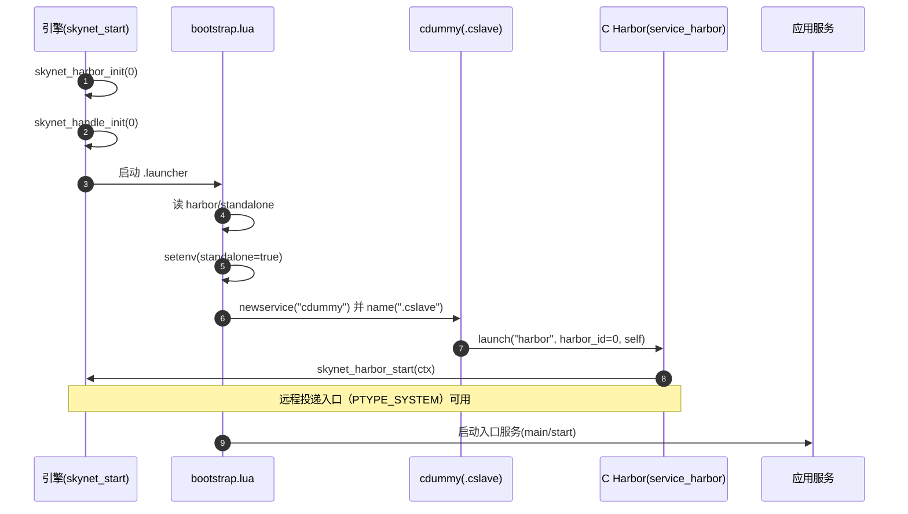
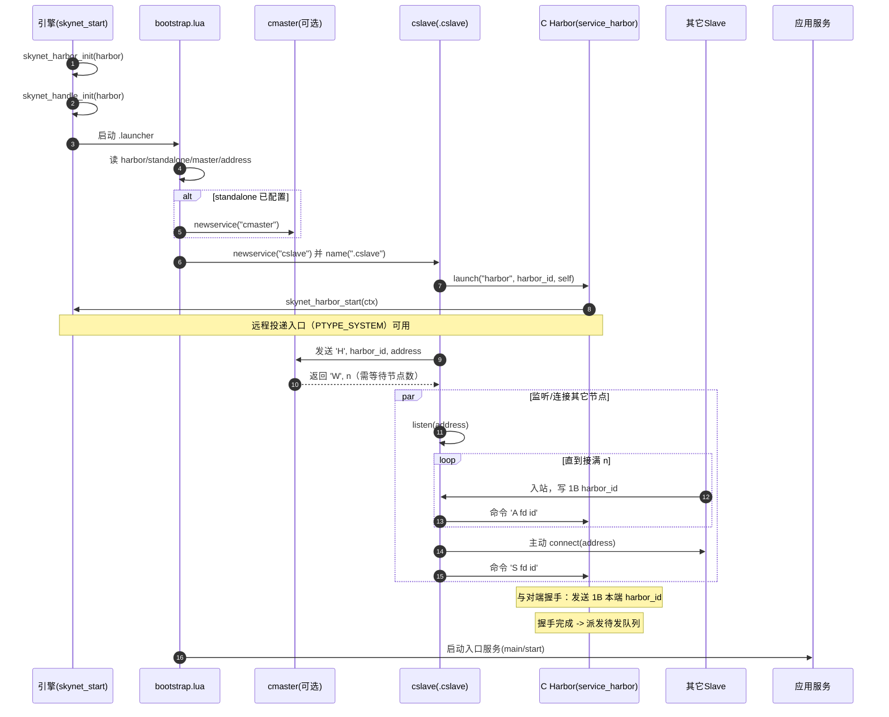
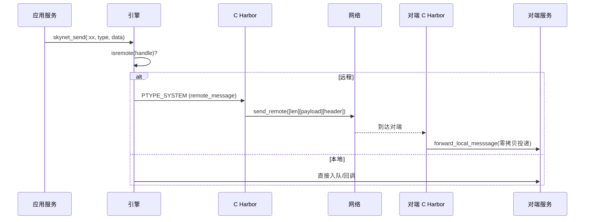

# Harbor 启动机制与引导流程（service/bootstrap.lua）

## 目标

从配置项到生效路径，完整梳理 Harbor 相关模块在启动期的工作机制，基于本仓库实际源码进行讲解：
- 单节点模式（harbor=0）与分布式模式（harbor>0）的分流
- `.cslave` 的职责来源（cdummy/cslave）与 `harbor` C 服务的启动
- Master/Slave 握手、名字服务与跨节点路由的接入时机
- 关键配置项与生命周期

---

## 关键组件与文件
- 引导入口：`service/bootstrap.lua`
- 分布式 Master：`service/cmaster.lua`
- 分布式 Slave：`service/cslave.lua`
- 单节点占位 Slave：`service/cdummy.lua`
- Harbor C 服务：`service-src/service_harbor.c`
- 引擎启动顺序：`skynet-src/skynet_start.c`
- 句柄高位注入：`skynet-src/skynet_handle.c`
- Harbor 内核桥接：`skynet-src/skynet_harbor.c`

---

## 启动期配置解析与引擎初始化

- `skynet-src/skynet_start.c:288`：在任何服务启动之前，调用
  - `skynet_harbor_init(config->harbor)`：设置全局 Harbor ID（高 8 位），0 表示单节点
  - `skynet_handle_init(config->harbor)`：后续分配的服务句柄高位会带入 Harbor ID（`HANDLE_REMOTE_SHIFT`）

该次序确保：随后的 `skynet_context_new()` 创建的服务句柄已经具备 Harbor 语义，对远程/本地判断立即生效。

---

## bootstrap.lua 的分流逻辑

- 读取 `standalone` 环境和 `harbor` 值，并启动 `.launcher`
  - `service/bootstrap.lua:5`
  - `service/bootstrap.lua:7`
- 分支 1：`harbor == 0`（单节点模式）
  - 强制 `standalone = true` 并写回环境：`service/bootstrap.lua:12..14`
  - 启动 `cdummy` 并命名 `.cslave`：`service/bootstrap.lua:16..20`
- 分支 2：`harbor > 0`（分布式模式）
  - 若设置了 `standalone`，在本进程内启动 `cmaster`：`service/bootstrap.lua:23..27`
  - 启动 `cslave` 并命名 `.cslave`：`service/bootstrap.lua:29..33`
- 公共部分
  - 单机模式下启动 `datacenterd` 并命名 `DATACENTER`：`service/bootstrap.lua:36..38`
  - 启动 `service_mgr`：`service/bootstrap.lua:40`
  - 可选启动 `ltls_holder`（SSL）：`service/bootstrap.lua:42..48`
  - 拉起业务入口（`start` 或 `main`）：`service/bootstrap.lua:50`

结论：无论单机/分布式，系统都会提供名为 `.cslave` 的 Lua 服务；它在单机下由 `cdummy` 实现，在分布式下由 `cslave` 实现。所有与 Harbor 交互的 Lua API（如 `skynet.harbor().globalname/queryname`）都会与 `.cslave` 对接。

---

## `.cslave` 内部启动 Harbor C 服务

- 单节点：`service/cdummy.lua:80` 启动 C 服务 `harbor`（Harbor ID 必须为 0）
- 分布式：`service/cslave.lua:243` 启动 C 服务 `harbor`，传入参数：`harbor_id` 与 `.cslave` 的句柄
- Harbor C 服务初始化：`service-src/service_harbor.c`
  - `harbor_init()` 解析 `args`，设置 `h->id` 与 `h->slave`，注册回调 `mainloop`
  - `skynet_harbor_start(ctx)` 将当前 Harbor 上下文保存到全局，以允许引擎向其投递跨节点消息（`PTYPE_SYSTEM`）：`skynet-src/skynet_harbor.c`

---

## Master/Slave 握手与名字服务（分布式）

- Master 监听：`service/cmaster.lua` 从 `standalone` 地址读取连接
- Slave 连接 Master：`service/cslave.lua:229..249`
  - 读取 `master`、`harbor`、`address` 环境
  - 启动 Harbor C 服务
  - 向 Master 写入握手包 `H, harbor_id, slave_address`，等待 `W, N` 等指令
  - 同时在 `slave_address` 监听其他 Slave 的入站连接并完成对端 id 读取
- `.cslave` 与 C 层 Harbor 的桥接
  - 将 `A fd id` 或 `S fd id` 命令转发给 C 层 Harbor：`service/cslave.lua:133, 50`
  - 名字广播/查询通过 `.cslave` 转译到 C 层 Harbor：`service/cslave.lua:57, 157`

---

## Harbor C 服务何时“起作用”

- 引擎侧：
  - `skynet_src/skynet_start.c:288` 之后，`skynet_send()` 会基于句柄高位判断远程/本地（`skynet_harbor_message_isremote`），远程消息会被打包为 `PTYPE_SYSTEM` 投递到 Harbor C 服务。
- Harbor 侧：
  - `mainloop()` 收到 `PTYPE_SYSTEM` 时，区分按句柄或按名字路由（`remote_send_handle/name`），并在连接就绪后 `send_remote`；未就绪则入队，DOWN 状态则回送 `PTYPE_ERROR`。
  - 套接字事件（`PTYPE_SOCKET`）驱动握手完成与队列派发。

因此，一旦 `.cslave` 启动了 Harbor C 服务并（在分布式下）完成与 Master/其他 Slave 的握手，跨节点消息即可在引擎与 Harbor 之间闭环：`skynet_send -> PTYPE_SYSTEM -> harbor -> send_remote/forward_local_messsage`。

---

## 配置项总览与取值建议

- `harbor`：Harbor ID；0=单节点，1-255=分布式节点。分布式下建议全局唯一。
- `standalone`：
  - 单节点：无需配置，`bootstrap.lua` 自动置为 `true`。
  - 分布式：若为 `true`，在本进程内启动 Master；否则由外部 Master 提供。
- `address`：分布式 Slave 的监听地址（`service/cslave.lua:232`），用于其他 Slave 建链。
- `master`：Master 的地址（`service/cslave.lua:230`）。
- `start`：业务入口服务名（`service/bootstrap.lua:50`）。
- 其他：`enablessl` 控制 TLS 相关初始化。

示例（单机）：
```lua
harbor = 0
start = "main"
bootstrap = "snlua bootstrap"
```

示例（分布式 + 内置 Master）：
```lua
harbor = 1
standalone = "0.0.0.0:2013"    -- Master 监听地址
address = "127.0.0.1:2526"     -- 本节点监听地址
master = "127.0.0.1:2013"      -- Master 地址
start = "main"
bootstrap = "snlua bootstrap"
```

---

## 运行流程（时序）

1) 引擎初始化
- `skynet_start.c:288` 设置 Harbor/句柄高位；加载子系统

2) bootstrap 分流
- 启动 `.launcher` -> 判断 `harbor`
- `harbor==0`：启动 `cdummy` -> 命名 `.cslave`
- `harbor>0`：可选启动 `cmaster` -> 启动 `cslave` -> 命名 `.cslave`

3) `.cslave` 启动 Harbor C 服务
- `launch("harbor", harbor_id, self)`，Harbor 进入可接收 `PTYPE_SYSTEM` 状态

4) 分布式握手（仅 `harbor>0`）
- `cslave` 连接 Master，发送 `H`；接收 `W` 与 `N`
- 监听 `address`，接受其他 Slave，读取对端 id -> 通知 C 层 Harbor
- C 层 Harbor 发送 1 字节本端 id 完成握手

5) 路由生效
- 引擎将远程消息投递给 Harbor；Harbor 按连接状态发送或入队；对端收到后转成本地消息 `forward_local_messsage`

6) 关闭阶段
- `skynet_start.c` 退出前调用 `skynet_harbor_exit()`，保证 Harbor 引用释放并关闭网络

---

## 启动时序图（详细）

单节点（harbor=0）：



分布式（harbor>0）：



远程消息投递闭环：



关键时点：
- “远程投递入口可用”出现在 `service-src/service_harbor.c:759..760` 绑定回调并 `skynet_harbor_start(ctx)` 之后。
- 分布式下，即便入口可用，未握手完成的目标连接会入队等待；握手完成后由 `dispatch_queue` 派发。

---
## 常见问题

- 为什么 `.cslave` 在单机也存在？
  - 为了统一 API，Lua 层不必关心单机/分布式差异；单机由 `cdummy` 实现 `.cslave`，仅做本地名服务。
- 未配置 `address/master` 会怎样？
  - 在分布式下，`cslave` 需要两者来完成握手与监听，否则会在启动期报错或无法联通。
- 为什么要先 `skynet_harbor_init` 再启动服务？
  - 句柄高位的 Harbor ID 需要在所有服务创建之前设置，确保远程判断正确。

---

## 参考路径（点击可定位）
- service/bootstrap.lua:5
- service/bootstrap.lua:10
- service/bootstrap.lua:16
- service/bootstrap.lua:23
- service/bootstrap.lua:29
- service/bootstrap.lua:36
- service/cslave.lua:229
- service/cslave.lua:243
- service/cdummy.lua:80
- service/cmaster.lua:111
- skynet-src/skynet_start.c:288
- skynet-src/skynet_handle.c:274
- service-src/service_harbor.c:591
- service-src/service_harbor.c:703
- skynet-src/skynet_harbor.c:33
