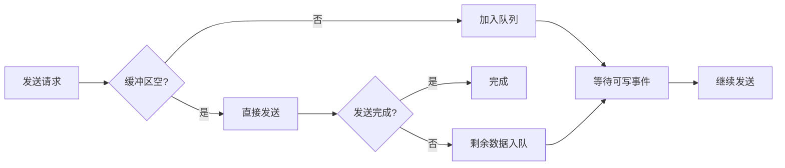
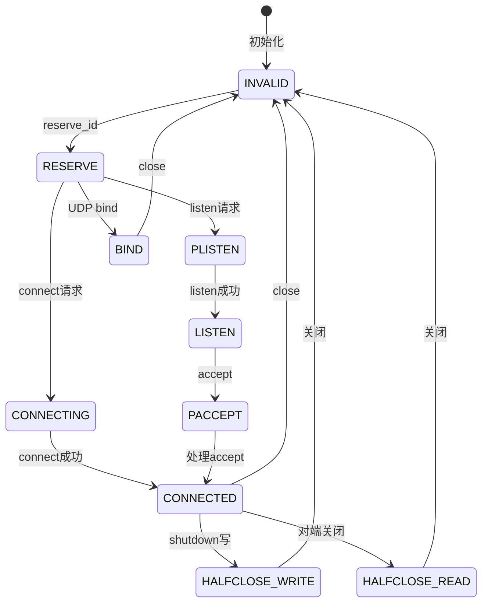

# Skynet Socket Server 底层实现详解

## 目录

1. [模块概述](#1-模块概述)
2. [核心数据结构](#2-核心数据结构)
3. [平台相关实现](#3-平台相关实现)
4. [Socket生命周期](#4-socket生命周期)
5. [事件处理机制](#5-事件处理机制)
6. [缓冲区管理](#6-缓冲区管理)
7. [高级特性](#7-高级特性)
8. [性能优化](#8-性能优化)
9. [错误处理](#9-错误处理)
10. [使用示例](#10-使用示例)

## 1. 模块概述

### 1.1 架构位置

socket_server.c 是 Skynet 网络层的最底层实现，直接与操作系统网络API交互。

```
应用层服务
    ↓
skynet_socket.c (消息封装层)
    ↓
socket_server.c (底层I/O)
    ↓
OS网络接口 (epoll/kqueue)
```

### 1.2 核心职责

- **跨平台网络I/O**：统一封装 epoll、kqueue、poll
- **Socket生命周期管理**：创建、连接、读写、关闭
- **事件驱动**：基于事件循环处理网络事件
- **缓冲区管理**：高效的读写缓冲区
- **协议支持**：TCP、UDP、Unix Domain Socket

### 1.3 设计目标

```c
// 核心设计目标
/*
 * 1. 高性能：单线程处理数万并发连接
 * 2. 低延迟：非阻塞I/O，及时响应
 * 3. 跨平台：统一接口，多平台支持
 * 4. 零拷贝：减少内存复制，提高效率
 * 5. 易集成：清晰的接口，与Skynet无缝配合
 */
```

### 1.4 关键常量定义

```c
// socket_server.c 关键配置
#define MAX_SOCKET_P 16                 // socket池大小指数
#define MAX_SOCKET (1<<MAX_SOCKET_P)    // 最大socket数：65536
#define MAX_EVENT 64                    // 单次处理最大事件数
#define MIN_READ_BUFFER 64              // 最小读缓冲区
#define WARNING_SIZE (1024*1024)        // 写缓冲区警告阈值：1MB

// Socket类型定义
#define SOCKET_TYPE_INVALID 0           // 无效
#define SOCKET_TYPE_RESERVE 1           // 预留
#define SOCKET_TYPE_PLISTEN 2           // 预监听
#define SOCKET_TYPE_LISTEN 3            // 监听中
#define SOCKET_TYPE_CONNECTING 4        // 连接中
#define SOCKET_TYPE_CONNECTED 5         // 已连接
#define SOCKET_TYPE_HALFCLOSE_READ 6    // 半关闭（读）
#define SOCKET_TYPE_HALFCLOSE_WRITE 7   // 半关闭（写）
#define SOCKET_TYPE_PACCEPT 8           // 预接受
#define SOCKET_TYPE_BIND 9              // 绑定（UDP）

// 协议类型
#define PROTOCOL_TCP 0                  // TCP协议
#define PROTOCOL_UDP 1                  // IPv4 UDP
#define PROTOCOL_UDPv6 2                // IPv6 UDP
```

## 2. 核心数据结构

### 2.1 struct socket - Socket抽象

```c
struct socket {
    // 基本属性
    uintptr_t opaque;              // 拥有此socket的服务句柄（回调时使用）
    int fd;                        // 系统文件描述符
    int id;                        // Skynet内部socket ID（唯一标识）
    ATOM_INT type;                 // Socket状态类型（原子变量）
    uint8_t protocol;              // 协议类型（TCP/UDP）
    
    // 写缓冲区（双优先级队列）
    struct wb_list high;           // 高优先级写缓冲区链表
    struct wb_list low;            // 低优先级写缓冲区链表
    int64_t wb_size;               // 写缓冲区总大小
    int64_t warn_size;             // 写缓冲区警告阈值
    
    // 状态标志
    bool reading;                  // 是否启用读事件监听
    bool writing;                  // 是否启用写事件监听
    bool closing;                  // 是否正在关闭
    ATOM_ULONG sending;            // 正在发送标志（防止并发）
    ATOM_INT udpconnecting;        // UDP连接计数
    
    // 统计信息
    struct socket_stat stat;       // 读写字节数和时间统计
    
    // 协议相关数据
    union {
        int size;                  // TCP：下次期望读取的大小
        uint8_t udp_address[19];   // UDP：目标地址
    } p;
    
    // 直写优化（Direct Write）
    struct spinlock dw_lock;       // 直写锁
    int dw_offset;                 // 直写偏移量
    const void * dw_buffer;        // 直写缓冲区
    size_t dw_size;                // 直写大小
};
```

#### Socket ID 设计

```c
// Socket ID = (tag << 16) | slot_index
// - slot_index: 在socket池中的槽位索引（0-65535）
// - tag: 版本号，防止ID重用导致的混乱

#define HASH_ID(id) (((unsigned)id) % MAX_SOCKET)  // 获取槽位索引
#define ID_TAG16(id) ((id>>MAX_SOCKET_P) & 0xffff) // 获取版本号

// ID分配示例
int alloc_id = ATOM_FINC(&ss->alloc_id);
int id = (alloc_id << MAX_SOCKET_P) | slot_index;
```

### 2.2 struct socket_server - 全局管理器

```c
struct socket_server {
    // 时间管理
    volatile uint64_t time;        // 当前时间戳（centisecond，百分之一秒）
    
    // 控制管道（用于异步命令）
    int recvctrl_fd;               // 控制管道读端
    int sendctrl_fd;               // 控制管道写端
    int checkctrl;                 // 是否检查控制命令
    
    // 事件机制
    poll_fd event_fd;              // epoll/kqueue 文件描述符
    int event_n;                   // 当前事件数量
    int event_index;               // 当前处理到的事件索引
    struct event ev[MAX_EVENT];    // 事件数组（一次最多64个）
    
    // Socket池
    struct socket slot[MAX_SOCKET]; // Socket数组（65536个槽位）
    ATOM_INT alloc_id;             // ID分配计数器
    
    // 缓冲区
    char buffer[MAX_INFO];         // 信息缓冲区（128字节）
    uint8_t udpbuffer[MAX_UDP_PACKAGE]; // UDP数据包缓冲区（64KB）
    
    // 接口回调
    struct socket_object_interface soi; // 内存管理回调
    
    // 资源预留
    int reserve_fd;                // 预留fd，用于EMFILE错误恢复
    fd_set rfds;                   // select用的fd集合
};
```

### 2.3 写缓冲区设计

```c
// 写缓冲区节点
struct write_buffer {
    struct write_buffer * next;    // 链表下一个节点
    const void *buffer;            // 数据缓冲区指针
    char *ptr;                     // 当前写位置
    size_t sz;                     // 剩余大小
    bool userobject;               // 是否为用户对象（影响释放方式）
};

// 写缓冲区链表
struct wb_list {
    struct write_buffer * head;    // 链表头
    struct write_buffer * tail;    // 链表尾
};

// UDP写缓冲区（带地址）
struct write_buffer_udp {
    struct write_buffer buffer;    // 继承write_buffer
    uint8_t udp_address[UDP_ADDRESS_SIZE]; // UDP目标地址
};
```

缓冲区管理策略：



### 2.4 Socket 状态机



## 3. 平台相关实现

### 3.1 统一接口抽象

Skynet 通过条件编译支持多个平台的事件机制：

```c
// socket_poll.h
#if defined(__APPLE__) || defined(__FreeBSD__) || defined(__OpenBSD__) || defined (__NetBSD__)
    #include "socket_kqueue.h"      // BSD系统使用kqueue
#elif defined(__linux__)
    #include "socket_epoll.h"       // Linux使用epoll
#else
    #include "socket_select.h"      // 其他系统使用select
#endif

// 统一的接口函数
static bool sp_create(poll_fd *efd);
static void sp_release(poll_fd efd);
static int sp_add(poll_fd efd, int sock, void *ud);
static void sp_del(poll_fd efd, int sock);
static int sp_enable(poll_fd efd, int sock, void *ud, bool read_enable, bool write_enable);
static int sp_wait(poll_fd efd, struct event *e, int max);
```

### 3.2 epoll 实现（Linux）

```c
// socket_epoll.h 核心实现
#include <sys/epoll.h>

typedef int poll_fd;

struct event {
    void * s;        // socket指针
    bool read;       // 可读事件
    bool write;      // 可写事件
    bool error;      // 错误事件
    bool eof;        // EOF事件
};

static bool 
sp_create(poll_fd *efd) {
    *efd = epoll_create(1024);
    return *efd != -1;
}

static int
sp_add(poll_fd efd, int sock, void *ud) {
    struct epoll_event ev;
    ev.events = EPOLLIN;  // 默认监听可读
    ev.data.ptr = ud;     // 关联socket对象
    return epoll_ctl(efd, EPOLL_CTL_ADD, sock, &ev);
}

static int
sp_enable(poll_fd efd, int sock, void *ud, bool read_enable, bool write_enable) {
    struct epoll_event ev;
    ev.events = (read_enable ? EPOLLIN : 0) | (write_enable ? EPOLLOUT : 0);
    ev.data.ptr = ud;
    return epoll_ctl(efd, EPOLL_CTL_MOD, sock, &ev);
}

static int
sp_wait(poll_fd efd, struct event *e, int max) {
    struct epoll_event ev[max];
    int n = epoll_wait(efd, ev, max, -1);
    
    for (int i=0; i<n; i++) {
        e[i].s = ev[i].data.ptr;
        unsigned flag = ev[i].events;
        e[i].write = (flag & EPOLLOUT) != 0;
        e[i].read = (flag & (EPOLLIN | EPOLLHUP)) != 0;
        e[i].error = (flag & EPOLLERR) != 0;
        e[i].eof = false;
    }
    
    return n;
}
```

#### epoll 工作原理

```
应用程序                 内核
   |                      |
   | epoll_create()       |
   |--------------------->| 创建epoll实例
   |                      |
   | epoll_ctl(ADD)       |
   |--------------------->| 注册fd到红黑树
   |                      |
   | epoll_wait()         |
   |--------------------->| 阻塞等待事件
   |                      | （就绪fd加入就绪链表）
   |<---------------------|
   | 返回就绪fd数量        |
   |                      |
   | 处理就绪事件          |
   |                      |
```

#### 边缘触发 vs 水平触发

Skynet 使用**水平触发（LT）**模式：

```c
// 水平触发特点：
// - 只要缓冲区有数据就会触发EPOLLIN
// - 只要缓冲区未满就会触发EPOLLOUT
// - 更安全，不容易漏掉事件

// 边缘触发（ET）：
// - 状态变化时才触发一次
// - 需要一次性读/写完所有数据
// - 性能更高但编程更复杂

// Skynet 选择 LT 的原因：
// 1. 简单可靠，不易出错
// 2. 配合非阻塞I/O已足够高效
// 3. 事件处理逻辑更清晰
```

### 3.3 kqueue 实现（BSD/macOS）

```c
// socket_kqueue.h 核心实现
#include <sys/event.h>

typedef int poll_fd;

static bool 
sp_create(poll_fd *kfd) {
    *kfd = kqueue();
    return *kfd != -1;
}

static int
sp_add(poll_fd kfd, int sock, void *ud) {
    struct kevent ke;
    // 注册可读事件
    EV_SET(&ke, sock, EVFILT_READ, EV_ADD | EV_ENABLE, 0, 0, ud);
    return kevent(kfd, &ke, 1, NULL, 0, NULL);
}

static int
sp_enable(poll_fd kfd, int sock, void *ud, bool read_enable, bool write_enable) {
    struct kevent ke[2];
    int n = 0;
    
    // 设置读事件
    if (read_enable) {
        EV_SET(&ke[n++], sock, EVFILT_READ, EV_ADD | EV_ENABLE, 0, 0, ud);
    } else {
        EV_SET(&ke[n++], sock, EVFILT_READ, EV_ADD | EV_DISABLE, 0, 0, ud);
    }
    
    // 设置写事件
    if (write_enable) {
        EV_SET(&ke[n++], sock, EVFILT_WRITE, EV_ADD | EV_ENABLE, 0, 0, ud);
    } else {
        EV_SET(&ke[n++], sock, EVFILT_WRITE, EV_ADD | EV_DISABLE, 0, 0, ud);
    }
    
    return kevent(kfd, ke, n, NULL, 0, NULL);
}

static int
sp_wait(poll_fd kfd, struct event *e, int max) {
    struct kevent ev[max];
    int n = kevent(kfd, NULL, 0, ev, max, NULL);
    
    for (int i=0; i<n; i++) {
        e[i].s = (void*)ev[i].udata;
        unsigned filter = ev[i].filter;
        unsigned flags = ev[i].flags;
        
        e[i].write = (filter == EVFILT_WRITE);
        e[i].read = (filter == EVFILT_READ);
        e[i].error = (flags & EV_ERROR) != 0;
        e[i].eof = (flags & EV_EOF) != 0;
    }
    
    return n;
}
```

#### epoll vs kqueue 对比

| 特性 | epoll (Linux) | kqueue (BSD) |
|------|---------------|--------------|
| 触发模式 | LT/ET | 边缘触发 |
| 事件类型 | 读、写、错误 | 读、写、信号、定时器等 |
| 性能 | 极高 | 极高 |
| 接口 | epoll_ctl | kevent |
| 数据结构 | 红黑树 | 队列 |

## 4. Socket生命周期

### 4.1 创建和初始化

#### socket_server_create - 创建服务器

```c
struct socket_server * 
socket_server_create(uint64_t time) {
    struct socket_server *ss = skynet_malloc(sizeof(*ss));
    
    // 1. 初始化时间
    ss->time = time;
    
    // 2. 创建事件机制（epoll/kqueue）
    if (!sp_create(&ss->event_fd)) {
        skynet_free(ss);
        return NULL;
    }
    
    // 3. 创建控制管道（用于主线程向网络线程发送命令）
    int fd[2];
    if (pipe(fd)) {
        sp_release(ss->event_fd);
        skynet_free(ss);
        return NULL;
    }
    ss->recvctrl_fd = fd[0];
    ss->sendctrl_fd = fd[1];
    ss->checkctrl = 1;
    
    // 4. 将控制管道读端加入事件监听
    sp_add(ss->event_fd, ss->recvctrl_fd, NULL);
    
    // 5. 初始化socket池
    for (int i=0; i<MAX_SOCKET; i++) {
        struct socket *s = &ss->slot[i];
        ATOM_INIT(&s->type, SOCKET_TYPE_INVALID);
        clear_wb_list(&s->high);
        clear_wb_list(&s->low);
    }
    
    // 6. 初始化ID分配器
    ATOM_INIT(&ss->alloc_id, 0);
    
    // 7. 预留一个fd用于EMFILE错误处理
    ss->reserve_fd = dup(1);
    
    return ss;
}
```

#### reserve_id - 分配Socket ID

```c
static int
reserve_id(struct socket_server *ss) {
    int i;
    // 遍历查找空闲slot
    for (i=0; i<MAX_SOCKET; i++) {
        int id = ATOM_FINC(&ss->alloc_id);  // 原子递增分配器
        if (id < 0) {
            id = ATOM_FAND(&ss->alloc_id, 0x7fffffff);
        }
        struct socket *s = &ss->slot[HASH_ID(id)];
        int type_invalid = SOCKET_TYPE_INVALID;
        // 尝试CAS设置为RESERVE状态
        if (ATOM_CAS(&s->type, &type_invalid, SOCKET_TYPE_RESERVE)) {
            s->id = id;
            s->protocol = PROTOCOL_TCP;
            s->fd = -1;
            s->opaque = 0;
            s->wb_size = 0;
            s->warn_size = WARNING_SIZE;
            s->sending = 0;
            return id;
        }
    }
    return -1;
}
```

### 4.2 TCP连接管理

#### open_socket - 主动连接

```c
static int
open_socket(struct socket_server *ss, struct request_open * request, 
            uintptr_t opaque, char *host, int port) {
    int id = request->id;
    struct socket *ns = &ss->slot[HASH_ID(id)];
    
    // 1. 验证socket状态
    assert(ATOM_LOAD(&ns->type) == SOCKET_TYPE_RESERVE);
    
    // 2. 创建socket
    int sock = socket(AF_INET, SOCK_STREAM, 0);
    if (sock < 0) {
        return -1;
    }
    
    // 3. 设置非阻塞
    sp_nonblocking(sock);
    
    // 4. 发起连接
    struct sockaddr_in addr;
    addr.sin_family = AF_INET;
    addr.sin_port = htons(port);
    addr.sin_addr.s_addr = inet_addr(host);
    
    int status = connect(sock, (struct sockaddr*)&addr, sizeof(addr));
    
    if (status != 0 && errno != EINPROGRESS) {
        close(sock);
        return -1;
    }
    
    // 5. 初始化socket结构
    ns->fd = sock;
    ns->opaque = opaque;
    ns->reading = true;
    ns->writing = false;
    ns->closing = false;
    
    // 6. 加入事件监听
    sp_add(ss->event_fd, sock, ns);
    
    // 7. 更新状态
    if (status == 0) {
        // 立即连接成功（如连接本地）
        ATOM_STORE(&ns->type, SOCKET_TYPE_CONNECTED);
        return SOCKET_OPEN;
    } else {
        // 连接中
        ATOM_STORE(&ns->type, SOCKET_TYPE_CONNECTING);
        sp_enable(ss->event_fd, sock, ns, true, true);
        return -1;
    }
}
```

#### listen_socket - 监听端口

```c
static int
listen_socket(struct socket_server *ss, struct request_listen *request, 
              uintptr_t opaque, const char *host, int port, int backlog) {
    int id = request->id;
    int listen_fd = request->fd;
    struct socket *ns = &ss->slot[HASH_ID(id)];
    
    // 1. 创建监听socket
    if (listen_fd < 0) {
        listen_fd = socket(AF_INET, SOCK_STREAM, 0);
        if (listen_fd < 0) {
            return -1;
        }
        
        // 设置SO_REUSEADDR
        int reuse = 1;
        setsockopt(listen_fd, SOL_SOCKET, SO_REUSEADDR, &reuse, sizeof(reuse));
        
        // 绑定地址
        struct sockaddr_in addr;
        addr.sin_family = AF_INET;
        addr.sin_port = htons(port);
        addr.sin_addr.s_addr = host ? inet_addr(host) : INADDR_ANY;
        
        if (bind(listen_fd, (struct sockaddr*)&addr, sizeof(addr)) < 0) {
            close(listen_fd);
            return -1;
        }
        
        // 开始监听
        if (listen(listen_fd, backlog) < 0) {
            close(listen_fd);
            return -1;
        }
    }
    
    // 2. 设置非阻塞
    sp_nonblocking(listen_fd);
    
    // 3. 初始化socket
    ns->fd = listen_fd;
    ns->opaque = opaque;
    ns->reading = true;
    ns->writing = false;
    ATOM_STORE(&ns->type, SOCKET_TYPE_LISTEN);
    
    // 4. 加入事件监听
    sp_add(ss->event_fd, listen_fd, ns);
    
    return listen_fd;
}
```

#### report_accept - 处理新连接

```c
static void
report_accept(struct socket_server *ss, struct socket *s, 
              struct socket_message *result) {
    struct socket *ns;
    int client_fd;
    struct sockaddr_storage sa;
    socklen_t salen = sizeof(sa);
    
    // 1. accept新连接
    client_fd = accept(s->fd, (struct sockaddr *)&sa, &salen);
    if (client_fd < 0) {
        if (errno == EMFILE || errno == ENFILE) {
            // 文件描述符耗尽，临时关闭预留fd
            result->opaque = s->opaque;
            result->id = s->id;
            result->ud = 0;
            result->data = "reach open file limit";
            return;
        }
        return;
    }
    
    // 2. 分配新socket ID
    int id = reserve_id(ss);
    if (id < 0) {
        close(client_fd);
        return;
    }
    
    // 3. 设置非阻塞
    sp_nonblocking(client_fd);
    
    // 4. 初始化新socket
    ns = &ss->slot[HASH_ID(id)];
    ns->fd = client_fd;
    ns->opaque = s->opaque;
    ns->reading = true;
    ns->writing = false;
    ATOM_STORE(&ns->type, SOCKET_TYPE_CONNECTED);
    
    // 5. 加入事件监听
    sp_add(ss->event_fd, client_fd, ns);
    
    // 6. 返回accept结果
    result->opaque = s->opaque;
    result->id = id;
    result->ud = 0;
    result->data = NULL;
}
```

### 4.3 数据收发

#### forward_message_tcp - TCP数据接收

```c
static int
forward_message_tcp(struct socket_server *ss, struct socket *s, 
                    struct socket_message *result) {
    int sz = s->p.size;  // 期望读取大小
    char * buffer = skynet_malloc(sz);
    
    // 1. 从socket读取数据
    int n = (int)read(s->fd, buffer, sz);
    
    if (n < 0) {
        // 错误处理
        skynet_free(buffer);
        switch (errno) {
        case AGAIN_WOULDBLOCK:  // 数据未就绪，稍后再试
            return -1;
        case EINTR:             // 被中断，继续读
            return -1;
        default:                // 其他错误，关闭连接
            force_close(ss, s, result);
            return SOCKET_CLOSE;
        }
    }
    
    if (n == 0) {
        // 2. 对端关闭连接
        skynet_free(buffer);
        force_close(ss, s, result);
        return SOCKET_CLOSE;
    }
    
    // 3. 调整下次读取大小
    if (n == sz) {
        s->p.size *= 2;  // 缓冲区满，下次读更多
    } else if (sz > MIN_READ_BUFFER && n*2 < sz) {
        s->p.size /= 2;  // 缓冲区过大，下次读更少
    }
    
    // 4. 返回数据给上层
    result->opaque = s->opaque;
    result->id = s->id;
    result->ud = n;
    result->data = buffer;
    
    // 5. 更新统计
    s->stat.read += n;
    s->stat.rtime = ss->time;
    
    return SOCKET_DATA;
}
```

#### send_socket - TCP数据发送

```c
static int
send_socket(struct socket_server *ss, struct request_send * request, 
            struct socket_message *result, int priority, const uint8_t *udp_address) {
    int id = request->id;
    struct socket * s = &ss->slot[HASH_ID(id)];
    
    // 1. 验证socket状态
    if (ATOM_LOAD(&s->type) == SOCKET_TYPE_INVALID || 
        s->id != id || s->closing) {
        skynet_free((void *)request->buffer);
        return -1;
    }
    
    // 2. 尝试直接发送（Direct Write优化）
    if (s->wb_size == 0 && s->sending == 0) {
        ATOM_FINC(&s->sending);
        
        int n = write(s->fd, request->buffer, request->sz);
        ATOM_FDEC(&s->sending);
        
        if (n < 0) {
            switch (errno) {
            case AGAIN_WOULDBLOCK:
                // 缓冲区满，加入队列
                break;
            case EINTR:
                // 被中断，继续
                break;
            default:
                // 发送错误
                skynet_free((void *)request->buffer);
                return -1;
            }
            n = 0;
        }
        
        // 3. 部分发送成功
        if (n == request->sz) {
            // 全部发送完成
            skynet_free((void *)request->buffer);
            s->stat.write += n;
            s->stat.wtime = ss->time;
            return -1;
        }
        
        // 4. 剩余数据加入写缓冲区
        request->buffer = (char *)request->buffer + n;
        request->sz -= n;
        s->stat.write += n;
    }
    
    // 5. 加入写缓冲区队列
    struct write_buffer * buf = skynet_malloc(sizeof(*buf));
    buf->buffer = request->buffer;
    buf->ptr = (char *)request->buffer;
    buf->sz = request->sz;
    buf->userobject = false;
    buf->next = NULL;
    
    if (priority == PRIORITY_HIGH) {
        append_sendbuffer(&s->high, buf);
    } else {
        append_sendbuffer(&s->low, buf);
    }
    s->wb_size += request->sz;
    
    // 6. 启用写事件
    if (!s->writing) {
        s->writing = true;
        sp_enable(ss->event_fd, s->fd, s, true, true);
    }
    
    // 7. 检查写缓冲区过大
    if (s->wb_size >= s->warn_size) {
        result->opaque = s->opaque;
        result->id = s->id;
        result->ud = s->wb_size / 1024;
        result->data = NULL;
        return SOCKET_WARNING;
    }
    
    return -1;
}
```

#### send_buffer - 发送缓冲区数据

```c
static int
send_buffer(struct socket_server *ss, struct socket *s, 
            struct socket_message *result) {
    assert(!list_uncomplete(&s->low));
    
    // 1. 发送高优先级队列
    while (!list_uncomplete(&s->high)) {
        struct write_buffer *tmp = s->high.head;
        
        for (;;) {
            int sz = write(s->fd, tmp->ptr, tmp->sz);
            if (sz < 0) {
                switch (errno) {
                case AGAIN_WOULDBLOCK:
                    return -1;
                case EINTR:
                    continue;
                default:
                    force_close(ss, s, result);
                    return SOCKET_CLOSE;
                }
            }
            
            s->stat.write += sz;
            s->wb_size -= sz;
            
            if (sz != tmp->sz) {
                // 部分发送
                tmp->ptr += sz;
                tmp->sz -= sz;
                return -1;
            }
            
            break;
        }
        
        // 移除已发送的缓冲区
        s->high.head = tmp->next;
        if (s->high.head == NULL) {
            s->high.tail = NULL;
        }
        free_buffer(ss, tmp);
    }
    
    // 2. 发送低优先级队列
    while (!list_uncomplete(&s->low)) {
        // 类似高优先级队列的处理...
    }
    
    // 3. 全部发送完成，关闭写事件
    sp_enable(ss->event_fd, s->fd, s, true, false);
    s->writing = false;
    
    return -1;
}
```

### 4.4 关闭和清理

```c
static void
force_close(struct socket_server *ss, struct socket *s, 
            struct socket_message *result) {
    result->id = s->id;
    result->opaque = s->opaque;
    result->ud = 0;
    result->data = NULL;
    
    // 1. 从事件监听中移除
    if (s->fd >= 0) {
        sp_del(ss->event_fd, s->fd);
        close(s->fd);
        s->fd = -1;
    }
    
    // 2. 清理写缓冲区
    free_wb_list(ss, &s->high);
    free_wb_list(ss, &s->low);
    s->wb_size = 0;
    
    // 3. 重置状态
    ATOM_STORE(&s->type, SOCKET_TYPE_INVALID);
}
```

## 5. 事件处理机制

### 5.1 主事件循环

```c
int
socket_server_poll(struct socket_server *ss, struct socket_message *result, int *more) {
    // 1. 处理上一批事件的剩余
    while (ss->event_index < ss->event_n) {
        struct event *e = &ss->ev[ss->event_index++];
        struct socket *s = e->s;
        
        // 处理错误
        if (e->error) {
            force_close(ss, s, result);
            return SOCKET_ERROR;
        }
        
        // 处理读事件
        if (e->read) {
            int type = ATOM_LOAD(&s->type);
            if (type == SOCKET_TYPE_LISTEN) {
                report_accept(ss, s, result);
                return SOCKET_ACCEPT;
            } else {
                int ret = forward_message_tcp(ss, s, result);
                if (ret >= 0)
                    return ret;
            }
        }
        
        // 处理写事件
        if (e->write) {
            int ret = send_buffer(ss, s, result);
            if (ret >= 0)
                return ret;
        }
    }
    
    // 2. 处理控制命令
    if (ss->checkctrl) {
        if (has_cmd(ss)) {
            int type = ctrl_cmd(ss, result);
            if (type != -1) {
                ss->checkctrl = 0;
                return type;
            }
        }
        ss->checkctrl = 0;
    }
    
    // 3. 等待新事件
    ss->event_n = sp_wait(ss->event_fd, ss->ev, MAX_EVENT);
    ss->event_index = 0;
    ss->checkctrl = 1;
    
    *more = 1;
    return -1;
}
```

### 5.2 控制命令处理

Skynet使用管道实现异步命令传递：

```c
// 发送命令（从主线程）
static int
send_request(struct socket_server *ss, struct request_package *request, 
             char type, int len) {
    request->header[6] = (uint8_t)type;
    request->header[7] = (uint8_t)len;
    
    // 写入管道
    for (;;) {
        ssize_t n = write(ss->sendctrl_fd, &request->header[6], len+2);
        if (n < 0) {
            if (errno != EINTR) {
                return -1;
            }
            continue;
        }
        return 0;
    }
}

// 处理命令（网络线程）
static int
ctrl_cmd(struct socket_server *ss, struct socket_message *result) {
    int fd = ss->recvctrl_fd;
    uint8_t header[2];
    int n = read(fd, header, sizeof(header));
    
    if (n != 2) {
        return -1;
    }
    
    int type = header[0];
    int len = header[1];
    
    char buffer[256];
    n = read(fd, buffer, len);
    
    // 根据命令类型分发
    switch (type) {
    case 'S':  // Send
        return send_socket(...);
    case 'O':  // Open (connect)
        return open_socket(...);
    case 'L':  // Listen
        return listen_socket(...);
    case 'X':  // Exit
        return -1;
    // ... 更多命令类型
    }
}
```

命令类型定义：

```c
// 'S' - 发送数据
// 'O' - 主动连接
// 'L' - 监听端口
// 'B' - 绑定socket
// 'C' - 关闭socket
// 'A' - 启动socket
// 'R' - 恢复读
// 'P' - 暂停读
// 'K' - 关闭socket（shutdown）
// 'T' - 设置选项
// 'U' - UDP相关
// 'D' - UDP设置
// 'X' - 退出
```

## 6. 缓冲区管理

### 6.1 写缓冲区链表操作

```c
// 追加到链表尾部
static void
append_sendbuffer(struct wb_list *s, struct write_buffer *buf) {
    if (s->head == NULL) {
        s->head = s->tail = buf;
    } else {
        assert(s->tail != NULL);
        assert(s->tail->next == NULL);
        s->tail->next = buf;
        s->tail = buf;
    }
}

// 释放缓冲区链表
static void
free_wb_list(struct socket_server *ss, struct wb_list *list) {
    struct write_buffer *wb = list->head;
    while (wb) {
        struct write_buffer *tmp = wb;
        wb = wb->next;
        free_buffer(ss, tmp);
    }
    list->head = NULL;
    list->tail = NULL;
}

// 检查链表是否为空
static bool
list_uncomplete(struct wb_list *s) {
    return s->head == NULL;
}
```

### 6.2 Direct Write 优化

Direct Write是一种优化技术，当写缓冲区为空时，直接发送数据而不经过缓冲区：

```c
// Direct Write 流程
if (s->wb_size == 0 && s->sending == 0) {
    // 1. 设置发送标志（防止并发）
    ATOM_FINC(&s->sending);
    
    // 2. 直接调用write
    int n = write(s->fd, data, size);
    
    // 3. 清除发送标志
    ATOM_FDEC(&s->sending);
    
    if (n == size) {
        // 全部发送成功，无需缓冲
        return;
    }
    
    // 4. 剩余数据加入缓冲区
    // ...
}
```

优势：
- 减少一次内存复制
- 降低延迟
- 减少缓冲区管理开销

### 6.3 优先级队列

Skynet支持两个优先级的写缓冲区：

```c
struct socket {
    struct wb_list high;  // 高优先级
    struct wb_list low;   // 低优先级
    // ...
};

// 发送时先发高优先级，再发低优先级
static int send_buffer(...) {
    // 1. 发送高优先级队列
    while (!list_uncomplete(&s->high)) {
        // ...
    }
    
    // 2. 发送低优先级队列
    while (!list_uncomplete(&s->low)) {
        // ...
    }
}
```

使用场景：
- 高优先级：控制消息、心跳包
- 低优先级：普通数据、大文件

## 7. 高级特性

### 7.1 UDP支持

```c
// 创建UDP socket
static int
do_bind(struct socket_server *ss, struct request_bind *request, 
        struct socket_message *result) {
    int id = request->id;
    int sock = request->fd;
    struct socket *ns = &ss->slot[HASH_ID(id)];
    
    // 设置非阻塞
    sp_nonblocking(sock);
    
    // 初始化
    ns->fd = sock;
    ns->opaque = request->opaque;
    ns->protocol = PROTOCOL_UDP;
    ATOM_STORE(&ns->type, SOCKET_TYPE_BIND);
    
    // 加入事件监听
    sp_add(ss->event_fd, sock, ns);
    
    return 0;
}

// UDP发送
static int
send_socket_udp(struct socket_server *ss, struct request_send_udp *request, 
                struct socket_message *result) {
    struct socket *s = &ss->slot[HASH_ID(request->send.id)];
    
    // 构造UDP地址
    struct sockaddr_storage sa;
    socklen_t sasz = udp_socket_address(s, request->address, &sa);
    
    // 发送数据
    int n = sendto(s->fd, request->send.buffer, request->send.sz, 
                   0, (struct sockaddr *)&sa, sasz);
    
    if (n < 0) {
        return -1;
    }
    
    return 0;
}

// UDP接收
static int
forward_message_udp(struct socket_server *ss, struct socket *s, 
                    struct socket_message *result) {
    struct sockaddr_storage sa;
    socklen_t salen = sizeof(sa);
    
    // 接收数据
    int n = recvfrom(s->fd, ss->udpbuffer, MAX_UDP_PACKAGE, 
                     0, (struct sockaddr *)&sa, &salen);
    
    if (n < 0) {
        return -1;
    }
    
    // 分配内存并复制数据+地址
    char * data = skynet_malloc(n + UDP_ADDRESS_SIZE);
    memcpy(data, ss->udpbuffer, n);
    
    // 编码地址信息
    encode_udp_address(&sa, data + n);
    
    // 返回数据
    result->data = data;
    result->ud = UDP_ADDRESS_SIZE;
    
    return n;
}
```

### 7.2 Socket选项设置

```c
static int
setopt_socket(struct socket_server *ss, struct request_setopt *request) {
    int id = request->id;
    struct socket *s = &ss->slot[HASH_ID(id)];
    
    switch (request->what) {
    case TCP_NODELAY:
        // 禁用Nagle算法
        return setsockopt(s->fd, IPPROTO_TCP, TCP_NODELAY, 
                          &request->value, sizeof(request->value));
    
    case SO_KEEPALIVE:
        // 启用TCP保活
        return setsockopt(s->fd, SOL_SOCKET, SO_KEEPALIVE, 
                          &request->value, sizeof(request->value));
    
    default:
        return -1;
    }
}
```

### 7.3 统计信息

```c
struct socket_stat {
    uint64_t rtime;   // 最后读时间
    uint64_t wtime;   // 最后写时间
    uint64_t read;    // 读取字节数
    uint64_t write;   // 写入字节数
};

// 获取统计信息
void 
socket_server_info(struct socket_server *ss, struct socket_info *si) {
    int i;
    for (i=0; i<MAX_SOCKET; i++) {
        struct socket *s = &ss->slot[i];
        int type = ATOM_LOAD(&s->type);
        if (type != SOCKET_TYPE_INVALID) {
            si[i].id = s->id;
            si[i].opaque = s->opaque;
            si[i].read = s->stat.read;
            si[i].write = s->stat.write;
            si[i].wbuffer = s->wb_size;
            si[i].rtime = s->stat.rtime;
            si[i].wtime = s->stat.wtime;
        }
    }
}
```

## 8. 性能优化

### 8.1 零拷贝策略

```c
// 1. 用户数据直接传递指针
struct write_buffer {
    const void *buffer;  // 直接持有用户数据指针
    bool userobject;     // 标记是否为用户对象
};

// 2. 避免memcpy
// 不好的做法：
char *buf = malloc(size);
memcpy(buf, data, size);

// 好的做法：
buf->buffer = data;  // 直接使用指针
buf->userobject = true;  // 标记由用户管理

// 3. 释放时根据标记处理
static void
free_buffer(struct socket_server *ss, struct write_buffer *wb) {
    if (wb->userobject) {
        ss->soi.free(wb->buffer);  // 调用用户释放函数
    }
    skynet_free(wb);
}
```

### 8.2 批量事件处理

```c
#define MAX_EVENT 64

// 一次最多处理64个事件
int n = sp_wait(ss->event_fd, ss->ev, MAX_EVENT);

// 优势：
// 1. 减少系统调用次数
// 2. 提高CPU缓存命中率
// 3. 摊销处理开销
```

### 8.3 自适应缓冲区

```c
// TCP读缓冲区自动调整大小
if (n == sz) {
    s->p.size *= 2;  // 缓冲区满，增大
} else if (sz > MIN_READ_BUFFER && n*2 < sz) {
    s->p.size /= 2;  // 使用率低，减小
}

// 好处：
// - 小数据包不浪费内存
// - 大数据包不需要多次读取
// - 自动适应流量模式
```

### 8.4 Socket池设计

```c
// 固定大小的socket数组
struct socket slot[MAX_SOCKET];  // 65536个槽位

// 优势：
// 1. O(1)查找：slot[HASH_ID(id)]
// 2. 内存连续，缓存友好
// 3. 无需动态分配

// ID编码防止重用混淆
int id = (tag << 16) | slot_index;
```

### 8.5 原子操作减少锁

```c
// 使用原子变量
ATOM_INT type;        // socket类型
ATOM_ULONG sending;   // 发送标志
ATOM_INT alloc_id;    // ID分配器

// 避免锁的开销
int old_type = SOCKET_TYPE_INVALID;
if (ATOM_CAS(&s->type, &old_type, SOCKET_TYPE_RESERVE)) {
    // 成功预留
}

// 只在必要时使用锁
struct spinlock dw_lock;  // 仅Direct Write使用
```

## 9. 错误处理

### 9.1 EMFILE处理

```c
// 预留一个fd用于错误恢复
int reserve_fd = dup(1);

// 当遇到EMFILE错误时
if (errno == EMFILE || errno == ENFILE) {
    // 1. 关闭预留fd，释放一个描述符
    close(ss->reserve_fd);
    
    // 2. accept连接（为了取出队列中的连接请求）
    int client_fd = accept(listen_fd, NULL, NULL);
    
    // 3. 立即关闭
    close(client_fd);
    
    // 4. 重新创建预留fd
    ss->reserve_fd = dup(1);
    
    // 5. 返回错误给上层
    result->data = "reach open file limit";
    return SOCKET_ERROR;
}
```

### 9.2 半关闭处理

```c
// 支持TCP半关闭
if (shutdown == 1) {
    // 只关闭写端
    shutdown(s->fd, SHUT_WR);
    ATOM_STORE(&s->type, SOCKET_TYPE_HALFCLOSE_WRITE);
} else {
    // 完全关闭
    force_close(ss, s, result);
}
```

### 9.3 错误分类处理

```c
if (n < 0) {
    switch (errno) {
    case AGAIN_WOULDBLOCK:
        // 暂时无数据，稍后再试
        return -1;
        
    case EINTR:
        // 被信号中断，继续
        continue;
        
    case ECONNRESET:
    case EPIPE:
        // 连接被重置或管道破裂
        force_close(ss, s, result);
        return SOCKET_CLOSE;
        
    default:
        // 其他错误
        force_close(ss, s, result);
        return SOCKET_ERROR;
    }
}
```

## 10. 使用示例

### 10.1 TCP服务器示例

```c
// 1. 创建socket_server
struct socket_server *ss = socket_server_create(time(NULL) * 100);

// 2. 监听端口
struct request_listen req;
req.id = reserve_id(ss);
req.fd = -1;
listen_socket(ss, &req, opaque, "0.0.0.0", 8888, 128);

// 3. 事件循环
struct socket_message result;
int more;

for (;;) {
    int type = socket_server_poll(ss, &result, &more);
    
    switch (type) {
    case SOCKET_ACCEPT:
        // 新连接到达
        printf("Accept new connection: id=%d\n", result.id);
        break;
        
    case SOCKET_DATA:
        // 收到数据
        printf("Recv data: id=%d, size=%d\n", 
               result.id, (int)result.ud);
        process_data(result.data, result.ud);
        skynet_free(result.data);
        break;
        
    case SOCKET_CLOSE:
        // 连接关闭
        printf("Connection closed: id=%d\n", result.id);
        break;
        
    case SOCKET_ERROR:
        // 错误
        printf("Socket error: id=%d\n", result.id);
        break;
    }
}
```

### 10.2 TCP客户端示例

```c
// 1. 创建socket_server
struct socket_server *ss = socket_server_create(time(NULL) * 100);

// 2. 发起连接
struct request_open req;
req.id = reserve_id(ss);
req.port = 8888;
req.opaque = opaque;
strcpy(req.host, "127.0.0.1");

send_request_open(ss, &req);

// 3. 事件循环
for (;;) {
    int type = socket_server_poll(ss, &result, &more);
    
    switch (type) {
    case SOCKET_OPEN:
        // 连接成功
        printf("Connected: id=%d\n", result.id);
        
        // 发送数据
        struct request_send send_req;
        send_req.id = result.id;
        send_req.buffer = "Hello Server";
        send_req.sz = 12;
        send_request_send(ss, &send_req);
        break;
        
    case SOCKET_DATA:
        // 收到响应
        printf("Response: %.*s\n", 
               (int)result.ud, (char*)result.data);
        break;
    }
}
```

### 10.3 UDP服务器示例

```c
// 1. 创建UDP socket
int sock = socket(AF_INET, SOCK_DGRAM, 0);

struct sockaddr_in addr;
addr.sin_family = AF_INET;
addr.sin_port = htons(8888);
addr.sin_addr.s_addr = INADDR_ANY;

bind(sock, (struct sockaddr*)&addr, sizeof(addr));

// 2. 绑定到socket_server
struct request_bind req;
req.id = reserve_id(ss);
req.fd = sock;
req.opaque = opaque;

do_bind(ss, &req, &result);

// 3. 接收UDP数据
for (;;) {
    int type = socket_server_poll(ss, &result, &more);
    
    if (type == SOCKET_UDP) {
        // UDP数据格式：[data][address]
        int data_len = result.ud - UDP_ADDRESS_SIZE;
        char *data = result.data;
        uint8_t *address = (uint8_t*)(data + data_len);
        
        printf("UDP recv: %.*s\n", data_len, data);
        
        // 回复
        struct request_send_udp send_req;
        send_req.send.id = result.id;
        send_req.send.buffer = "UDP Reply";
        send_req.send.sz = 9;
        memcpy(send_req.address, address, UDP_ADDRESS_SIZE);
        
        send_request_sendudp(ss, &send_req);
    }
}
```

## 总结

### 核心设计特点

1. **跨平台抽象**：统一的接口支持epoll、kqueue、poll
2. **高性能**：单线程处理数万并发，零拷贝，批量处理
3. **简洁设计**：清晰的状态机，最小化锁使用
4. **内存高效**：固定大小socket池，自适应缓冲区
5. **容错性强**：完善的错误处理，半关闭支持

### 关键技术

- **非阻塞I/O + 事件驱动**：高并发基础
- **Direct Write优化**：减少延迟和内存复制
- **双优先级队列**：灵活的流量控制
- **自适应缓冲区**：平衡内存和性能
- **原子操作**：减少锁竞争

### 性能指标

- 最大并发：65536个socket
- 单次事件：最多64个
- 默认读缓冲：64字节起，自动调整
- 写缓冲告警：1MB

socket_server.c是Skynet网络层的基石，其优秀的设计为Skynet的高性能提供了坚实保障。