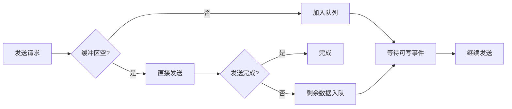
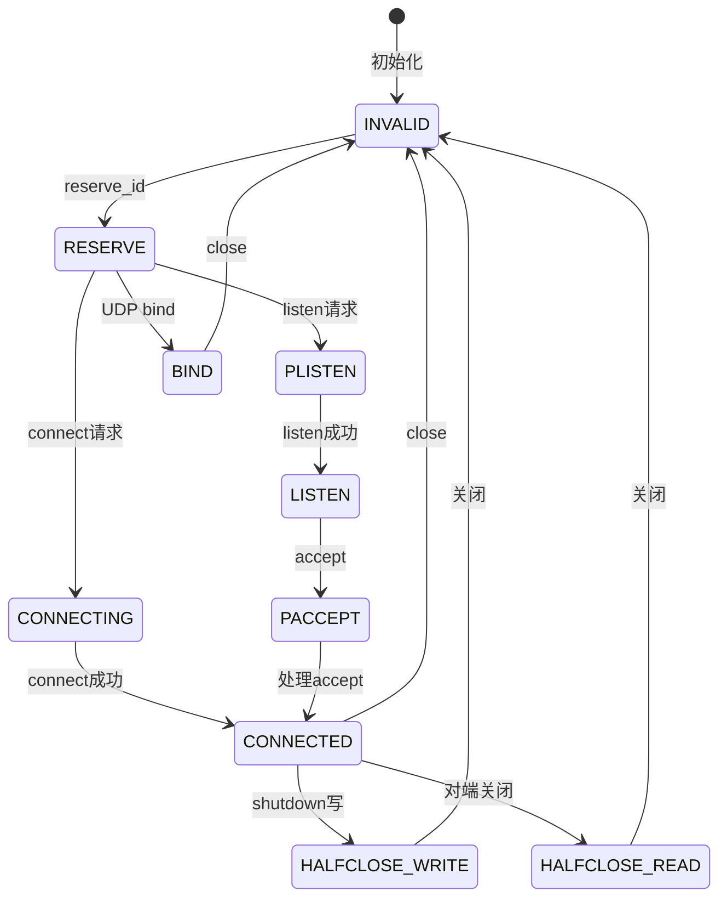

# Skynet Socket Server 底层实现详解

## 目录

1. [模块概述](#1-模块概述)
2. [核心数据结构](#2-核心数据结构)
3. [平台相关实现](#3-平台相关实现)
4. [Socket生命周期](#4-socket生命周期)
5. [事件处理机制](#5-事件处理机制)
6. [缓冲区管理](#6-缓冲区管理)
7. [高级特性](#7-高级特性)
8. [性能优化](#8-性能优化)
9. [错误处理](#9-错误处理)
10. [使用示例](#10-使用示例)

## 1. 模块概述

### 1.1 架构位置

socket_server.c 是 Skynet 网络层的最底层实现，直接与操作系统网络API交互。

```
应用层服务
    ↓
skynet_socket.c (消息封装层)
    ↓
socket_server.c (底层I/O)
    ↓
OS网络接口 (epoll/kqueue)
```

### 1.2 核心职责

- **跨平台网络I/O**：统一封装 Linux 的 epoll 与 BSD/macOS 的 kqueue（控制管道轮询使用 select）
- **Socket 生命周期管理**：创建、连接、监听、接收、关闭
- **事件驱动**：基于非阻塞 I/O 的事件循环调度
- **缓冲区管理**：优先级写队列与自适应读缓冲
- **协议支持**：TCP、UDP（同时覆盖 IPv4/IPv6）

### 1.3 设计目标

```c
// 核心设计目标
/*
 * 1. 高性能：单线程处理数万并发连接
 * 2. 低延迟：非阻塞I/O，及时响应
 * 3. 跨平台：统一接口，多平台支持
 * 4. 零拷贝：减少内存复制，提高效率
 * 5. 易集成：清晰的接口，与Skynet无缝配合
 */
```

### 1.4 关键常量定义

```c
// socket_server.c 关键配置
#define MAX_SOCKET_P 16                 // socket池大小指数
#define MAX_SOCKET (1<<MAX_SOCKET_P)    // 最大socket数：65536
#define MAX_EVENT 64                    // 单次处理最大事件数
#define MIN_READ_BUFFER 64              // 最小读缓冲区
#define WARNING_SIZE (1024*1024)        // 写缓冲区警告阈值：1MB
#define UDP_ADDRESS_SIZE 19             // UDP 地址序列化长度
#define MAX_UDP_PACKAGE 65535           // UDP 单包最大长度

// Socket类型定义
#define SOCKET_TYPE_INVALID 0           // 无效
#define SOCKET_TYPE_RESERVE 1           // 预留
#define SOCKET_TYPE_PLISTEN 2           // 预监听
#define SOCKET_TYPE_LISTEN 3            // 监听中
#define SOCKET_TYPE_CONNECTING 4        // 连接中
#define SOCKET_TYPE_CONNECTED 5         // 已连接
#define SOCKET_TYPE_HALFCLOSE_READ 6    // 半关闭（读）
#define SOCKET_TYPE_HALFCLOSE_WRITE 7   // 半关闭（写）
#define SOCKET_TYPE_PACCEPT 8           // 预接受
#define SOCKET_TYPE_BIND 9              // 绑定（UDP）

// 协议类型
#define PROTOCOL_TCP 0                  // TCP协议
#define PROTOCOL_UDP 1                  // IPv4 UDP
#define PROTOCOL_UDPv6 2                // IPv6 UDP
#define PROTOCOL_UNKNOWN 255            // 初始占位

// 写缓冲优先级
#define PRIORITY_HIGH 0
#define PRIORITY_LOW 1

// 用户对象标记（配合 socket_object_interface 使用）
#define USEROBJECT ((size_t)(-1))
```

## 2. 核心数据结构

### 2.1 struct socket - Socket抽象

```c
struct socket {
    uintptr_t opaque;              // 拥有此 socket 的服务句柄
    struct wb_list high;           // 高优先级写缓冲
    struct wb_list low;            // 低优先级写缓冲
    int64_t wb_size;               // 写缓冲累计字节
    struct socket_stat stat;       // 读写统计
    ATOM_ULONG sending;            // 发送引用计数（高 16 位存储 ID tag）
    int fd;                        // 系统文件描述符
    int id;                        // Skynet 内部 socket ID
    ATOM_INT type;                 // Socket 状态
    uint8_t protocol;              // 协议类型（含 PROTOCOL_UNKNOWN）
    bool reading;                  // 是否监听读事件
    bool writing;                  // 是否监听写事件
    bool closing;                  // 是否处于关闭流程
    ATOM_INT udpconnecting;        // UDP “连接” 计数（用于 dial）
    int64_t warn_size;             // 动态写缓冲告警阈值
    union {
        int size;                  // TCP：下一次读取的缓冲大小
        uint8_t udp_address[UDP_ADDRESS_SIZE]; // UDP：默认目的地址
    } p;
    struct spinlock dw_lock;       // 直写自旋锁
    int dw_offset;                 // 直写偏移
    const void * dw_buffer;        // 直写缓冲指针
    size_t dw_size;                // 直写总长度
};
```

#### Socket ID 设计

```c
// reserve_id 会将 alloc_id 原子 +1，id 递增
int id = ATOM_FINC(&ss->alloc_id) + 1;
if (id < 0) {
    id = ATOM_FAND(&ss->alloc_id, 0x7fffffff) & 0x7fffffff;
}

// 使用 HASH_ID(id) 映射到 slot（取模 65536）
struct socket *s = &ss->slot[HASH_ID(id)];

// 如果槽位空闲，CAS 将状态从 INVALID 置为 RESERVE，并记录 id
if (ATOM_CAS(&s->type, SOCKET_TYPE_INVALID, SOCKET_TYPE_RESERVE)) {
    s->id = id;
    s->protocol = PROTOCOL_UNKNOWN;
    ATOM_INIT(&s->udpconnecting, 0);
    s->fd = -1;
    return id;
}
```

### 2.2 struct socket_server - 全局管理器

```c
struct socket_server {
    volatile uint64_t time;        // 时间戳（centisecond）
    int reserve_fd;                // EMFILE 保护 fd
    int recvctrl_fd;               // 控制管道读端
    int sendctrl_fd;               // 控制管道写端
    int checkctrl;                 // 是否需要检查控制命令
    poll_fd event_fd;              // epoll/kqueue 句柄
    ATOM_INT alloc_id;             // Socket ID 分配器
    int event_n;                   // 本轮事件总数
    int event_index;               // 当前处理位置
    struct socket_object_interface soi; // 用户对象回调
    struct event ev[MAX_EVENT];    // 事件数组
    struct socket slot[MAX_SOCKET]; // socket 槽位
    char buffer[MAX_INFO];         // 临时字符串缓冲
    uint8_t udpbuffer[MAX_UDP_PACKAGE]; // UDP recvfrom 缓冲
    fd_set rfds;                   // select 检测控制管道
};
```

### 2.3 写缓冲区设计

```c
// 写缓冲区节点
struct write_buffer {
    struct write_buffer * next;    // 链表下一个节点
    const void *buffer;            // 数据缓冲区指针
    char *ptr;                     // 当前写位置
    size_t sz;                     // 剩余大小
    bool userobject;               // 是否为用户对象（影响释放方式）
};

// 写缓冲区链表
struct wb_list {
    struct write_buffer * head;    // 链表头
    struct write_buffer * tail;    // 链表尾
};

// UDP写缓冲区（带地址）
struct write_buffer_udp {
    struct write_buffer buffer;    // 继承write_buffer
    uint8_t udp_address[UDP_ADDRESS_SIZE]; // UDP目标地址
};
```

缓冲区管理策略：



### 2.4 Socket 状态机



## 3. 平台相关实现

### 3.1 统一接口抽象

Skynet 通过条件编译支持多个平台的事件机制：

```c
// socket_poll.h
typedef int poll_fd;

struct event {
    void * s;
    bool read;
    bool write;
    bool error;
    bool eof;
};

static bool sp_invalid(poll_fd fd);
static poll_fd sp_create(void);
static void sp_release(poll_fd fd);
static int sp_add(poll_fd fd, int sock, void *ud);
static void sp_del(poll_fd fd, int sock);
static int sp_enable(poll_fd fd, int sock, void *ud, bool read_enable, bool write_enable);
static int sp_wait(poll_fd fd, struct event *e, int max);
static void sp_nonblocking(int sock);

#ifdef __linux__
#include "socket_epoll.h"
#endif

#if defined(__APPLE__) || defined(__FreeBSD__) || defined(__OpenBSD__) || defined (__NetBSD__)
#include "socket_kqueue.h"
#endif
```

### 3.2 epoll 实现（Linux）

```c
// socket_epoll.h 核心实现（摘录）
#include <sys/epoll.h>

static bool 
sp_invalid(int efd) {
    return efd == -1;
}

static poll_fd
sp_create(void) {
    return epoll_create(1024);
}

static void
sp_release(int efd) {
    close(efd);
}

static int
sp_add(int efd, int sock, void *ud) {
    struct epoll_event ev;
    ev.events = EPOLLIN;
    ev.data.ptr = ud;
    return epoll_ctl(efd, EPOLL_CTL_ADD, sock, &ev) == -1 ? 1 : 0;
}

static void
sp_del(int efd, int sock) {
    epoll_ctl(efd, EPOLL_CTL_DEL, sock, NULL);
}

static int
sp_enable(int efd, int sock, void *ud, bool read_enable, bool write_enable) {
    struct epoll_event ev;
    ev.events = (read_enable ? EPOLLIN : 0) | (write_enable ? EPOLLOUT : 0);
    ev.data.ptr = ud;
    return epoll_ctl(efd, EPOLL_CTL_MOD, sock, &ev) == -1 ? 1 : 0;
}

static int
sp_wait(int efd, struct event *e, int max) {
    struct epoll_event ev[max];
    int n = epoll_wait(efd, ev, max, -1);
    
    for (int i=0; i<n; i++) {
        e[i].s = ev[i].data.ptr;
        unsigned flag = ev[i].events;
        e[i].write = (flag & EPOLLOUT) != 0;
        e[i].read  = (flag & EPOLLIN)  != 0;
        e[i].error = (flag & EPOLLERR) != 0;
        e[i].eof   = (flag & EPOLLHUP) != 0;
    }
    
    return n;
}

static void
sp_nonblocking(int fd) {
    int flag = fcntl(fd, F_GETFL, 0);
    if (flag >= 0) {
        fcntl(fd, F_SETFL, flag | O_NONBLOCK);
    }
}
```

#### epoll 工作原理

```
应用程序                 内核
   |                      |
   | epoll_create()       |
   |--------------------->| 创建epoll实例
   |                      |
   | epoll_ctl(ADD)       |
   |--------------------->| 注册fd到红黑树
   |                      |
   | epoll_wait()         |
   |--------------------->| 阻塞等待事件
   |                      | （就绪fd加入就绪链表）
   |<---------------------|
   | 返回就绪fd数量        |
   |                      |
   | 处理就绪事件          |
   |                      |
```

#### 边缘触发 vs 水平触发

Skynet 使用**水平触发（LT）**模式：

```c
// 水平触发特点：
// - 只要缓冲区有数据就会触发EPOLLIN
// - 只要缓冲区未满就会触发EPOLLOUT
// - 更安全，不容易漏掉事件

// 边缘触发（ET）：
// - 状态变化时才触发一次
// - 需要一次性读/写完所有数据
// - 性能更高但编程更复杂

// Skynet 选择 LT 的原因：
// 1. 简单可靠，不易出错
// 2. 配合非阻塞I/O已足够高效
// 3. 事件处理逻辑更清晰
```

### 3.3 kqueue 实现（BSD/macOS）

```c
// socket_kqueue.h 核心实现（摘录）
#include <sys/event.h>

static bool 
sp_invalid(int kfd) {
    return kfd == -1;
}

static poll_fd
sp_create(void) {
    return kqueue();
}

static void
sp_release(int kfd) {
    close(kfd);
}

static void 
sp_del(int kfd, int sock) {
    struct kevent ke;
    EV_SET(&ke, sock, EVFILT_READ, EV_DELETE, 0, 0, NULL);
    kevent(kfd, &ke, 1, NULL, 0, NULL);
    EV_SET(&ke, sock, EVFILT_WRITE, EV_DELETE, 0, 0, NULL);
    kevent(kfd, &ke, 1, NULL, 0, NULL);
}

static int 
sp_add(int kfd, int sock, void *ud) {
    struct kevent ke;
    EV_SET(&ke, sock, EVFILT_READ, EV_ADD, 0, 0, ud);
    if (kevent(kfd, &ke, 1, NULL, 0, NULL) == -1 || (ke.flags & EV_ERROR)) {
        return 1;
    }
    EV_SET(&ke, sock, EVFILT_WRITE, EV_ADD, 0, 0, ud);
    if (kevent(kfd, &ke, 1, NULL, 0, NULL) == -1 || (ke.flags & EV_ERROR)) {
        EV_SET(&ke, sock, EVFILT_READ, EV_DELETE, 0, 0, NULL);
        kevent(kfd, &ke, 1, NULL, 0, NULL);
        return 1;
    }
    EV_SET(&ke, sock, EVFILT_WRITE, EV_DISABLE, 0, 0, ud);
    if (kevent(kfd, &ke, 1, NULL, 0, NULL) == -1 || (ke.flags & EV_ERROR)) {
        sp_del(kfd, sock);
        return 1;
    }
    return 0;
}

static int
sp_enable(int kfd, int sock, void *ud, bool read_enable, bool write_enable) {
    int ret = 0;
    struct kevent ke;
    EV_SET(&ke, sock, EVFILT_READ, read_enable ? EV_ENABLE : EV_DISABLE, 0, 0, ud);
    if (kevent(kfd, &ke, 1, NULL, 0, NULL) == -1 || (ke.flags & EV_ERROR)) {
        ret |= 1;
    }
    EV_SET(&ke, sock, EVFILT_WRITE, write_enable ? EV_ENABLE : EV_DISABLE, 0, 0, ud);
    if (kevent(kfd, &ke, 1, NULL, 0, NULL) == -1 || (ke.flags & EV_ERROR)) {
        ret |= 1;
    }
    return ret;
}

static int 
sp_wait(int kfd, struct event *e, int max) {
    struct kevent ev[max];
    int n = kevent(kfd, NULL, 0, ev, max, NULL);

    for (int i=0; i<n; i++) {
        e[i].s = ev[i].udata;
        unsigned filter = ev[i].filter;
        bool eof = (ev[i].flags & EV_EOF) != 0;
        e[i].write = (filter == EVFILT_WRITE) && !eof;
        e[i].read  = (filter == EVFILT_READ);
        e[i].error = (ev[i].flags & EV_ERROR) != 0;
        e[i].eof   = eof;
    }

    return n;
}

static void
sp_nonblocking(int fd) {
    int flag = fcntl(fd, F_GETFL, 0);
    if (flag >= 0) {
        fcntl(fd, F_SETFL, flag | O_NONBLOCK);
    }
}
```

#### epoll vs kqueue 对比

| 特性 | epoll (Linux) | kqueue (BSD) |
|------|---------------|--------------|
| 触发模式 | 水平/边缘（配置可选） | 水平触发（通过 EV_ENABLE/EV_DISABLE 控制） |
| 事件类型 | 读、写、错误 | 读、写、信号、定时器等 |
| 性能 | 极高 | 极高 |
| 接口 | epoll_ctl | kevent |
| 数据结构 | 红黑树 | 队列 |

## 4. Socket生命周期

### 4.1 创建和初始化

#### socket_server_create - 创建服务器

```c
struct socket_server * 
socket_server_create(uint64_t time) {
    poll_fd efd = sp_create();
    if (sp_invalid(efd)) {
        skynet_error(NULL, "socket-server error: create event pool failed.");
        return NULL;
    }

    int fd[2];
    if (pipe(fd)) {
        sp_release(efd);
        skynet_error(NULL, "socket-server error: create socket pair failed.");
        return NULL;
    }
    if (sp_add(efd, fd[0], NULL)) {
        skynet_error(NULL, "socket-server error: can't add server fd to event pool.");
        close(fd[0]);
        close(fd[1]);
        sp_release(efd);
        return NULL;
    }

    struct socket_server *ss = MALLOC(sizeof(*ss));
    ss->time = time;
    ss->event_fd = efd;
    ss->recvctrl_fd = fd[0];
    ss->sendctrl_fd = fd[1];
    ss->checkctrl = 1;
    ss->reserve_fd = dup(1);

    for (int i=0; i<MAX_SOCKET; i++) {
        struct socket *s = &ss->slot[i];
        ATOM_INIT(&s->type, SOCKET_TYPE_INVALID);
        clear_wb_list(&s->high);
        clear_wb_list(&s->low);
        spinlock_init(&s->dw_lock);
    }

    ATOM_INIT(&ss->alloc_id, 0);
    ss->event_n = 0;
    ss->event_index = 0;
    memset(&ss->soi, 0, sizeof(ss->soi));
    FD_ZERO(&ss->rfds);
    assert(ss->recvctrl_fd < FD_SETSIZE);

    return ss;
}
```

#### reserve_id - 分配Socket ID

该函数的核心流程已在前文 [Socket ID 设计](#socket-id-设计) 中列出：递增分配 `id`，通过 `HASH_ID` 映射槽位，并使用 CAS 把状态从 `INVALID` 切换到 `RESERVE`。

### 4.2 TCP连接管理

#### open_socket - 主动连接

`open_socket`（`skynet-src/socket_server.c:621`）的关键流程如下：

- 通过 `getaddrinfo` 获取目标地址，依次尝试 `socket` 创建，并启用 `SO_KEEPALIVE` 与非阻塞模式。
- 调用 `connect`，若立即成功则返回 `SOCKET_OPEN` 并将对端地址写入 `result->data`；若返回 `EINPROGRESS` 则注册写事件并保持 `SOCKET_TYPE_CONNECTING`。
- 所有失败路径都会关闭临时 fd、释放 `addrinfo`，并将槽位标记回 `SOCKET_TYPE_INVALID`，错误字符串由 `result->data` 返回。

#### listen_socket - 监听端口

`listen_socket`（`skynet-src/socket_server.c:1102`）期望 fd 已绑定并处于监听状态，上层通常通过 `socket_server_listen` 预先完成 `bind`/`listen`。函数内部：

- 调用 `new_fd` 注册到事件循环，初始状态为 `SOCKET_TYPE_PLISTEN`。
- 通过 `getsockname` 查询实际监听地址，将 IP 字符串写入 `result->data`，将端口写入 `result->ud`，并返回 `SOCKET_OPEN`。
- 若 `sp_add` 失败或超过 socket 池容量，会关闭 fd、重置槽位，并返回 `SOCKET_ERR`。

#### report_accept - 处理新连接

`report_accept`（`skynet-src/socket_server.c:1668`）在监听 socket 就绪时被调用：

- 调用 `accept` 获取新连接；若返回 `EMFILE/ENFILE`，会利用预留的 `reserve_fd` 执行“临时 accept + 立即关闭”策略，防止监听 fd 饥饿。
- 成功后申请新的 socket id（`reserve_id`），并通过 `new_fd` 注册，初始类型为 `SOCKET_TYPE_PACCEPT`，随后返回 `SOCKET_ACCEPT`，把客户端地址字符串写入 `result->data`，端口写入 `result->ud`。
- 若申请 id 或注册失败，则关闭新 fd 并放弃该连接。

### 4.3 数据收发

#### forward_message_tcp - TCP数据接收

`forward_message_tcp`（`skynet-src/socket_server.c:1468`）的处理顺序：

- 以 `s->p.size` 分配读取缓冲；`stat_read` 更新读统计。
- `read` 返回 <0 时释放缓冲，对于 `EINTR`/`EAGAIN` 直接忽略，其余错误通过 `report_error` 报告 `SOCKET_ERR`。
- 返回 0 表示对端关闭：若本端仍有待发送数据会等待发送完毕，否则标记半关闭并返回 `SOCKET_CLOSE`（区分 `SOCKET_TYPE_HALFCLOSE_*` 多种情况）。
- 正常读取时将数据传递给上层，若本次读取填满缓冲返回 `SOCKET_MORE` 并将下一次读缓冲翻倍；若低于一半且大于 `MIN_READ_BUFFER`，则减半以节省内存。

#### send_socket - TCP数据发送

`send_socket`（`skynet-src/socket_server.c:1027`）负责将来自主线程的发送请求排队：

- 通过 `send_object_init` 兼容三种缓冲类型（内存块、用户对象、原始指针），并拒绝处于 `HALFCLOSE_WRITE`、`PACCEPT` 或 `closing` 的 socket。
- 对 TCP：若写队列为空，仍然把数据放入高优先级队列并启用写事件，由网络线程统一发送；对于 UDP，若队列为空则尝试一次 `sendto`，失败或部分发送再进入队列。
- 当写队列非空时，根据优先级选择 `high`/`low` 链表；UDP 额外保存目标地址（如果调用者未提供则使用 `s->p.udp_address`）。
- 每次入队后检测 `s->wb_size`，当超过 `WARNING_SIZE` 且达到动态阈值 `warn_size` 时返回 `SOCKET_WARNING`，并将阈值翻倍以避免重复告警。

#### send_buffer - 发送缓冲区数据

`send_buffer`（`skynet-src/socket_server.c:880`）运行在网络线程内：

- 使用 `socket_trylock` 与 `dw_lock` 配合，若存在直写残留 (`dw_buffer`) 会优先拼接到高优先级队列头部。
- 先发送 `high` 队列，再发送 `low` 队列；写入时根据 `EINTR`/`EAGAIN` 继续或暂缓，其他错误则转为 `SOCKET_ERR/ SOCKET_RST`。
- 队列清空后调用 `enable_write(..., false)` 关闭写事件，并在需要时重置 `warn_size`，触发一次 `SOCKET_WARNING`（`ud=0` 表示恢复正常）。
- 若 socket 正处于 `closing` 状态且队列耗尽，会最终调用 `force_close` 完成资源释放。

### 4.4 关闭和清理

`force_close`（`skynet-src/socket_server.c:480`）负责最终清理：

- 解除事件注册并关闭 fd（UDP `BIND` 类型只解除注册，不主动关闭 fd）。
- 释放高/低队列及可能残留的 `dw_buffer`，同时将 `wb_size` 清零。
- 将状态置回 `SOCKET_TYPE_INVALID` 并把结果写入 `result`（`id`、`opaque` 保留供上层识别）。

## 5. 事件处理机制

### 5.1 主事件循环

`socket_server_poll`（`skynet-src/socket_server.c:1700`）是网络线程的核心循环：

- 优先消费上一轮缓存的事件（`ss->event_index < ss->event_n`），按 socket 状态分派到 `report_connect`、`report_accept`、`forward_message_tcp/udp`、`send_buffer` 等分支。
- 当 `SOCKET_MORE` 或 `SOCKET_UDP` 需要继续拉取时，会调整 `event_index` 以便重复处理当前事件。
- 每轮事件处理完毕后检查控制管道：通过 `select` 的零超时快速判断是否有新命令（`has_cmd`），存在则立即执行 `ctrl_cmd`，保证控制指令高优先级。
- 若事件队列耗尽，则调用 `sp_wait` 阻塞等待新事件，同时设置 `*more=0`；如被信号打断则继续循环。
- 返回值为上层消息类型（`SOCKET_DATA`、`SOCKET_ACCEPT`、`SOCKET_WARNING` 等），未产生事件时返回 -1。

### 5.2 控制命令处理

Skynet 使用管道实现主线程与网络线程的命令通信：

- `send_request`（`skynet-src/socket_server.c:1835`）在请求头部写入命令类型和长度，再把 payload 一并写入 `sendctrl_fd`；遇到 `EINTR` 会重试，其余错误会记录日志。
- 网络线程通过 `has_cmd` + `ctrl_cmd`（`skynet-src/socket_server.c:1405`）读取 `recvctrl_fd`：先读取头部，再按类型（`'D'`/`'P'` 发送、`'W'` 触发写、`'K'` 关闭、`'R'/'S'` 控制读、`'O'` 连接、`'L'` 监听、`'U'` 创建 UDP 等）解析 payload，转交给对应函数。
- 命令覆盖发送、连接、监听、暂停/恢复读、设置选项、UDP 操作以及退出网络线程等核心场景，保证框架层操作快速、生效可控。

## 6. 缓冲区管理

### 6.1 写缓冲区链表操作

```c
// 追加到链表尾部
static void
append_sendbuffer(struct wb_list *s, struct write_buffer *buf) {
    if (s->head == NULL) {
        s->head = s->tail = buf;
    } else {
        assert(s->tail != NULL);
        assert(s->tail->next == NULL);
        s->tail->next = buf;
        s->tail = buf;
    }
}

// 释放缓冲区链表
static void
free_wb_list(struct socket_server *ss, struct wb_list *list) {
    struct write_buffer *wb = list->head;
    while (wb) {
        struct write_buffer *tmp = wb;
        wb = wb->next;
        free_buffer(ss, tmp);
    }
    list->head = NULL;
    list->tail = NULL;
}

// 检查链表是否为空
static bool
list_uncomplete(struct wb_list *s) {
    return s->head == NULL;
}
```

### 6.2 Direct Write 优化

Direct Write 逻辑位于 `socket_server_send`（`skynet-src/socket_server.c:1894`）：主线程在将请求写入管道前会尝试直接写 socket。满足条件（队列为空、socket 已连接、无 UDP dial）且加锁成功时，直接调用 `write`/`sendto`。\n+\n+- 完全写入成功：立即返回并由调用方释放缓冲，避免落盘到队列。\n+- 部分写入：将剩余数据克隆到 `dw_buffer`，同时投递一个 `'W'` 控制命令，交由网络线程继续发送。\n+- 写入失败：不报错，转而走常规队列逻辑。\n+\n+这种设计避免了主线程与网络线程之间多一次内存复制，同时确保真正的写操作仍由网络线程统一收尾。

### 6.3 优先级队列

Skynet支持两个优先级的写缓冲区：

```c
struct socket {
    struct wb_list high;  // 高优先级
    struct wb_list low;   // 低优先级
    // ...
};

// 发送时先发高优先级，再发低优先级
static int send_buffer(...) {
    // 1. 发送高优先级队列
    while (!list_uncomplete(&s->high)) {
        // ...
    }
    
    // 2. 发送低优先级队列
    while (!list_uncomplete(&s->low)) {
        // ...
    }
}
```

使用场景：
- 高优先级：控制消息、心跳包
- 低优先级：普通数据、大文件

## 7. 高级特性

### 7.1 UDP支持

- `socket_server_udp`/`socket_server_udp_listen` 通过 `do_bind` 创建或绑定 UDP socket，最终在网络线程侧调用 `add_udp_socket` 将类型设置为 `SOCKET_TYPE_CONNECTED`（UDP）并注册事件。
- 发送路径复用 `send_socket`：当队列为空时优先尝试一次 `sendto`，若失败则把数据连同地址打包进写队列，队列节点类型为 `write_buffer_udp` 并携带 `udp_address`。
- `forward_message_udp`（`skynet-src/socket_server.c:1548`）使用 `recvfrom` 读取数据，随后通过 `gen_udp_address` 将远端地址编码附加在消息尾部，最终返回 `SOCKET_UDP`，其中 `result->ud = n`（实际数据长度），地址信息需由上层解析附加的尾部 19/35 字节。

### 7.2 Socket选项设置

`setopt_socket`（`skynet-src/socket_server.c:1267`）当前仅简单地调用：

```c
int v = request->value;
setsockopt(s->fd, IPPROTO_TCP, request->what, &v, sizeof(v));
```

即默认以 `IPPROTO_TCP` 为层级，适用于 `TCP_NODELAY`、`TCP_QUICKACK` 等 TCP 选项；调用者若需要设置 `SO_KEEPALIVE` 等其他选项，需要在上层扩展实现。

### 7.3 统计信息

```c
struct socket_stat {
    uint64_t rtime;   // 最后读时间
    uint64_t wtime;   // 最后写时间
    uint64_t read;    // 读取字节数
    uint64_t write;   // 写入字节数
};

// 获取统计信息
void 
socket_server_info(struct socket_server *ss, struct socket_info *si) {
    int i;
    for (i=0; i<MAX_SOCKET; i++) {
        struct socket *s = &ss->slot[i];
        int type = ATOM_LOAD(&s->type);
        if (type != SOCKET_TYPE_INVALID) {
            si[i].id = s->id;
            si[i].opaque = s->opaque;
            si[i].read = s->stat.read;
            si[i].write = s->stat.write;
            si[i].wbuffer = s->wb_size;
            si[i].rtime = s->stat.rtime;
            si[i].wtime = s->stat.wtime;
        }
    }
}
```

## 8. 性能优化

### 8.1 零拷贝策略

```c
// 1. 用户数据直接传递指针
struct write_buffer {
    const void *buffer;  // 直接持有用户数据指针
    bool userobject;     // 标记是否为用户对象
};

// 2. 避免memcpy
// 不好的做法：
char *buf = malloc(size);
memcpy(buf, data, size);

// 好的做法：
buf->buffer = data;  // 直接使用指针
buf->userobject = true;  // 标记由用户管理

// 3. 释放时根据标记处理
static void
free_buffer(struct socket_server *ss, struct write_buffer *wb) {
    if (wb->userobject) {
        ss->soi.free(wb->buffer);  // 调用用户释放函数
    }
    skynet_free(wb);
}
```

### 8.2 批量事件处理

```c
#define MAX_EVENT 64

// 一次最多处理64个事件
int n = sp_wait(ss->event_fd, ss->ev, MAX_EVENT);

// 优势：
// 1. 减少系统调用次数
// 2. 提高CPU缓存命中率
// 3. 摊销处理开销
```

### 8.3 自适应缓冲区

```c
// TCP读缓冲区自动调整大小
if (n == sz) {
    s->p.size *= 2;  // 缓冲区满，增大
} else if (sz > MIN_READ_BUFFER && n*2 < sz) {
    s->p.size /= 2;  // 使用率低，减小
}

// 好处：
// - 小数据包不浪费内存
// - 大数据包不需要多次读取
// - 自动适应流量模式
```

### 8.4 Socket池设计

```c
// 固定大小的socket数组
struct socket slot[MAX_SOCKET];  // 65536个槽位

// 优势：
// 1. O(1)查找：slot[HASH_ID(id)]
// 2. 内存连续，缓存友好
// 3. 无需动态分配

// ID编码防止重用混淆
int id = (tag << 16) | slot_index;
```

### 8.5 原子操作减少锁

```c
// 使用原子变量
ATOM_INT type;        // socket类型
ATOM_ULONG sending;   // 发送标志
ATOM_INT alloc_id;    // ID分配器

// 避免锁的开销
int old_type = SOCKET_TYPE_INVALID;
if (ATOM_CAS(&s->type, &old_type, SOCKET_TYPE_RESERVE)) {
    // 成功预留
}

// 只在必要时使用锁
struct spinlock dw_lock;  // 仅Direct Write使用
```

## 9. 错误处理

### 9.1 EMFILE处理

```c
// 预留一个fd用于错误恢复
int reserve_fd = dup(1);

// 当遇到EMFILE错误时
if (errno == EMFILE || errno == ENFILE) {
    // 1. 关闭预留fd，释放一个描述符
    close(ss->reserve_fd);
    
    // 2. accept连接（为了取出队列中的连接请求）
    int client_fd = accept(listen_fd, NULL, NULL);
    
    // 3. 立即关闭
    close(client_fd);
    
    // 4. 重新创建预留fd
    ss->reserve_fd = dup(1);
    
    // 5. 返回错误给上层
    result->data = "reach open file limit";
    return SOCKET_ERROR;
}
```

### 9.2 半关闭处理

```c
// 支持TCP半关闭
if (shutdown == 1) {
    // 只关闭写端
    shutdown(s->fd, SHUT_WR);
    ATOM_STORE(&s->type, SOCKET_TYPE_HALFCLOSE_WRITE);
} else {
    // 完全关闭
    force_close(ss, s, result);
}
```

### 9.3 错误分类处理

```c
if (n < 0) {
    switch (errno) {
    case AGAIN_WOULDBLOCK:
        // 暂时无数据，稍后再试
        return -1;
        
    case EINTR:
        // 被信号中断，继续
        continue;
        
    case ECONNRESET:
    case EPIPE:
        // 连接被重置或管道破裂
        force_close(ss, s, result);
        return SOCKET_CLOSE;
        
    default:
        // 其他错误
        force_close(ss, s, result);
        return SOCKET_ERROR;
    }
}
```

## 10. 使用示例

### 10.1 TCP服务器示例

```c
// 1. 创建socket_server
struct socket_server *ss = socket_server_create(time(NULL) * 100);

// 2. 监听端口
struct request_listen req;
req.id = reserve_id(ss);
req.fd = -1;
listen_socket(ss, &req, opaque, "0.0.0.0", 8888, 128);

// 3. 事件循环
struct socket_message result;
int more;

for (;;) {
    int type = socket_server_poll(ss, &result, &more);
    
    switch (type) {
    case SOCKET_ACCEPT:
        // 新连接到达
        printf("Accept new connection: id=%d\n", result.id);
        break;
        
    case SOCKET_DATA:
        // 收到数据
        printf("Recv data: id=%d, size=%d\n", 
               result.id, (int)result.ud);
        process_data(result.data, result.ud);
        skynet_free(result.data);
        break;
        
    case SOCKET_CLOSE:
        // 连接关闭
        printf("Connection closed: id=%d\n", result.id);
        break;
        
    case SOCKET_ERROR:
        // 错误
        printf("Socket error: id=%d\n", result.id);
        break;
    }
}
```

### 10.2 TCP客户端示例

```c
// 1. 创建socket_server
struct socket_server *ss = socket_server_create(time(NULL) * 100);

// 2. 发起连接
struct request_open req;
req.id = reserve_id(ss);
req.port = 8888;
req.opaque = opaque;
strcpy(req.host, "127.0.0.1");

send_request_open(ss, &req);

// 3. 事件循环
for (;;) {
    int type = socket_server_poll(ss, &result, &more);
    
    switch (type) {
    case SOCKET_OPEN:
        // 连接成功
        printf("Connected: id=%d\n", result.id);
        
        // 发送数据
        struct request_send send_req;
        send_req.id = result.id;
        send_req.buffer = "Hello Server";
        send_req.sz = 12;
        send_request_send(ss, &send_req);
        break;
        
    case SOCKET_DATA:
        // 收到响应
        printf("Response: %.*s\n", 
               (int)result.ud, (char*)result.data);
        break;
    }
}
```

### 10.3 UDP服务器示例

```c
// 1. 创建UDP socket
int sock = socket(AF_INET, SOCK_DGRAM, 0);

struct sockaddr_in addr;
addr.sin_family = AF_INET;
addr.sin_port = htons(8888);
addr.sin_addr.s_addr = INADDR_ANY;

bind(sock, (struct sockaddr*)&addr, sizeof(addr));

// 2. 绑定到socket_server
struct request_bind req;
req.id = reserve_id(ss);
req.fd = sock;
req.opaque = opaque;

do_bind(ss, &req, &result);

// 3. 接收UDP数据
for (;;) {
    int type = socket_server_poll(ss, &result, &more);
    
    if (type == SOCKET_UDP) {
        // UDP数据格式：[data][address]
        int data_len = result.ud - UDP_ADDRESS_SIZE;
        char *data = result.data;
        uint8_t *address = (uint8_t*)(data + data_len);
        
        printf("UDP recv: %.*s\n", data_len, data);
        
        // 回复
        struct request_send_udp send_req;
        send_req.send.id = result.id;
        send_req.send.buffer = "UDP Reply";
        send_req.send.sz = 9;
        memcpy(send_req.address, address, UDP_ADDRESS_SIZE);
        
        send_request_sendudp(ss, &send_req);
    }
}
```

## 总结

### 核心设计特点

1. **跨平台抽象**：统一的接口支持epoll、kqueue、poll
2. **高性能**：单线程处理数万并发，零拷贝，批量处理
3. **简洁设计**：清晰的状态机，最小化锁使用
4. **内存高效**：固定大小socket池，自适应缓冲区
5. **容错性强**：完善的错误处理，半关闭支持

### 关键技术

- **非阻塞I/O + 事件驱动**：高并发基础
- **Direct Write优化**：减少延迟和内存复制
- **双优先级队列**：灵活的流量控制
- **自适应缓冲区**：平衡内存和性能
- **原子操作**：减少锁竞争

### 性能指标

- 最大并发：65536个socket
- 单次事件：最多64个
- 默认读缓冲：64字节起，自动调整
- 写缓冲告警：1MB

socket_server.c是Skynet网络层的基石，其优秀的设计为Skynet的高性能提供了坚实保障。
