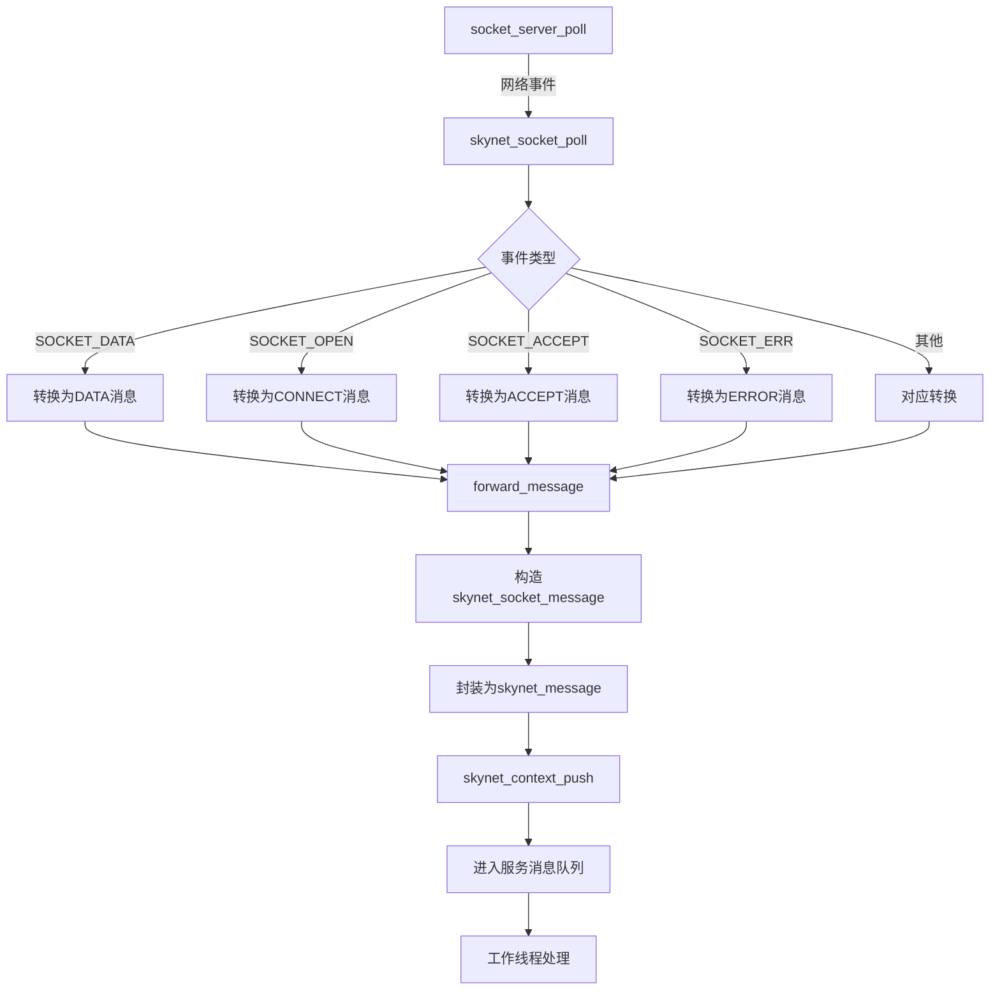
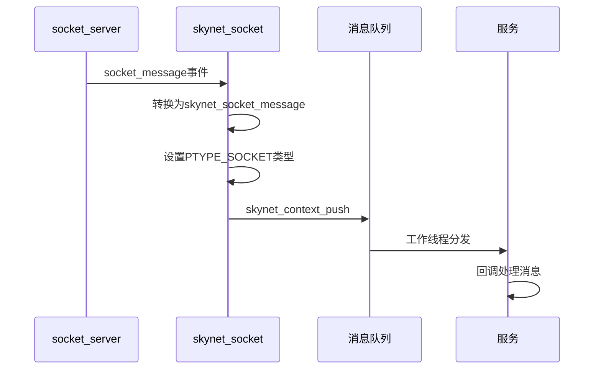
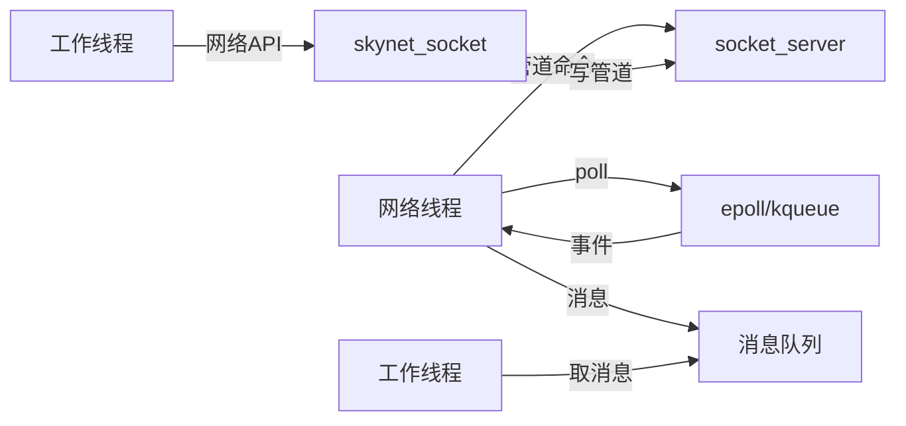
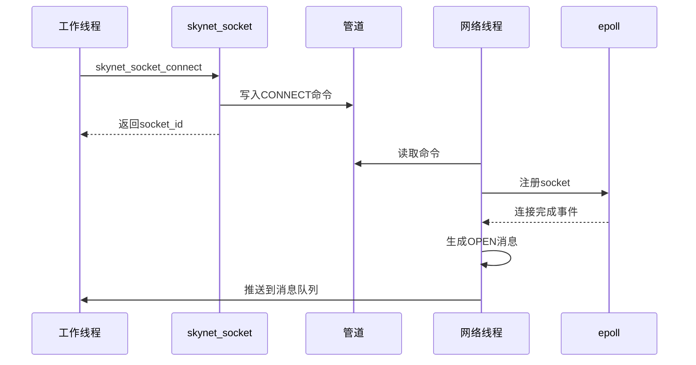

# Skynet Socket封装层技术文档

## 第一部分：模块概述

### 1.1 架构定位

skynet_socket.c是Skynet网络系统中连接底层socket_server和上层服务系统的关键桥梁。它在整个网络架构中扮演着转换器和适配器的角色：

```
[Skynet服务层]
       ↑ skynet_socket_message（消息队列）
[skynet_socket.c] ← 本文档重点
       ↑ socket_message（原始事件）  
[socket_server.c]
       ↑ 系统调用
[OS网络层（epoll/kqueue）]
```

### 1.2 核心职责

1. **消息转换**：将底层socket_server的网络事件转换为Skynet消息
2. **服务关联**：将网络连接与Skynet服务（通过handle）关联
3. **内存管理**：负责消息内存的分配和生命周期管理
4. **异步通信**：实现网络I/O的异步化，避免服务阻塞

### 1.3 与socket_server的关系

- **依赖关系**：skynet_socket完全依赖socket_server提供底层网络功能
- **单例模式**：全局唯一的SOCKET_SERVER实例
- **事件驱动**：通过socket_server_poll获取网络事件
- **命令转发**：将上层API调用转发给socket_server

### 1.4 与消息队列系统的集成

- **消息推送**：使用skynet_context_push将网络消息推送到服务消息队列
- **类型标识**：所有网络消息都标记为PTYPE_SOCKET类型
- **异步处理**：消息进入队列后由工作线程异步处理

## 第二部分：核心数据结构

### 2.1 skynet_socket_message结构

```c
struct skynet_socket_message {
    int type;        // 消息类型（数据/连接/关闭等）
    int id;          // socket ID，唯一标识一个连接
    int ud;          // 附带字段，语义取决于 type
    char * buffer;   // 数据缓冲区指针（或 NULL ）
};
```

**字段说明**：
- `type`：见2.2节，取值范围 1~7（没有 0）。
- `id`：socket_server 分配的句柄，用于定位连接。
- `ud`：
  - `SKYNET_SOCKET_TYPE_DATA/UDP`：有效负载长度。
  - `SKYNET_SOCKET_TYPE_ACCEPT`：新连接的 socket id。
  - `SKYNET_SOCKET_TYPE_WARNING`：当前写缓冲大小（KB）。
  - 其他类型通常为 0 或预留值。
- `buffer`：
  - DATA/UDP 类型沿用 socket_server 的数据指针，由业务在使用后释放。
  - CONNECT/ACCEPT/ERROR 会将字符串内嵌到结构体尾部（padding），此时 `buffer == NULL`，需通过 `(const char *)(sm + 1)` 访问文本。
  - 其他类型可能为 `NULL`。

### 2.2 消息类型定义

```c
#define SKYNET_SOCKET_TYPE_DATA    1  // 收到数据
#define SKYNET_SOCKET_TYPE_CONNECT 2  // 连接建立（主动连接成功）
#define SKYNET_SOCKET_TYPE_CLOSE   3  // 连接关闭
#define SKYNET_SOCKET_TYPE_ACCEPT  4  // 接受新连接（被动连接）
#define SKYNET_SOCKET_TYPE_ERROR   5  // 连接错误
#define SKYNET_SOCKET_TYPE_UDP     6  // UDP数据
#define SKYNET_SOCKET_TYPE_WARNING 7  // 警告信息（如缓冲区溢出）

> `SKYNET_SOCKET_TYPE_CONNECT` 既用于主动连接成功的回调，也用于 `start`/`transfer` 的确认消息；需要结合消息体中的附加字符串判断上下文。
```

### 2.3 与socket_message的映射关系

底层socket_server定义的事件类型与skynet_socket的映射：

```c
SOCKET_DATA   → SKYNET_SOCKET_TYPE_DATA
SOCKET_OPEN   → SKYNET_SOCKET_TYPE_CONNECT  
SOCKET_CLOSE  → SKYNET_SOCKET_TYPE_CLOSE
SOCKET_ACCEPT → SKYNET_SOCKET_TYPE_ACCEPT
SOCKET_ERR    → SKYNET_SOCKET_TYPE_ERROR
SOCKET_UDP    → SKYNET_SOCKET_TYPE_UDP
SOCKET_WARNING→ SKYNET_SOCKET_TYPE_WARNING
SOCKET_EXIT   → 系统退出（特殊处理）
```

### 2.4 socket_sendbuffer结构

```c
struct socket_sendbuffer {
    int id;              // socket ID
    int type;            // 缓冲区类型
    const void *buffer;  // 数据指针
    size_t sz;          // 数据大小
};
```

**缓冲区类型**：
- `SOCKET_BUFFER_MEMORY`：普通内存缓冲区
- `SOCKET_BUFFER_OBJECT`：用户对象（需要特殊接口）
- `SOCKET_BUFFER_RAWPOINTER`：原始指针（不释放）

## 第三部分：关键函数分析

### 3.1 初始化和管理

#### skynet_socket_init
```c
void skynet_socket_init() {
    SOCKET_SERVER = socket_server_create(skynet_now());
}
```
**功能**：初始化网络系统
**时机**：Skynet启动时调用
**作用**：创建全局socket_server实例，初始化时间戳

#### skynet_socket_exit
```c
void skynet_socket_exit() {
    socket_server_exit(SOCKET_SERVER);
}
```
**功能**：通知socket_server退出
**作用**：向管道发送退出命令，触发poll返回SOCKET_EXIT

#### skynet_socket_free
```c
void skynet_socket_free() {
    socket_server_release(SOCKET_SERVER);
    SOCKET_SERVER = NULL;
}
```
**功能**：释放底层 socket_server 资源（在框架关闭阶段调用）。

#### skynet_socket_updatetime
```c
void skynet_socket_updatetime() {
    socket_server_updatetime(SOCKET_SERVER, skynet_now());
}
```
**功能**：更新 socket_server 内部的时间戳（用于统计/超时），由主线程定期调用。

#### skynet_socket_poll
```c
int skynet_socket_poll() {
    struct socket_server *ss = SOCKET_SERVER;
    assert(ss);
    struct socket_message result;
    int more = 1;
    // 从底层获取一个网络事件
    int type = socket_server_poll(ss, &result, &more);
    switch (type) {
    case SOCKET_EXIT:
        return 0;  // 系统退出
    case SOCKET_DATA:
        forward_message(SKYNET_SOCKET_TYPE_DATA, false, &result);
        break;
    case SOCKET_CLOSE:
        forward_message(SKYNET_SOCKET_TYPE_CLOSE, false, &result);
        break;
    case SOCKET_OPEN:
        forward_message(SKYNET_SOCKET_TYPE_CONNECT, true, &result);
        break;
    case SOCKET_ACCEPT:
        forward_message(SKYNET_SOCKET_TYPE_ACCEPT, true, &result);
        break;
    case SOCKET_ERR:
        forward_message(SKYNET_SOCKET_TYPE_ERROR, true, &result);
        break;
    case SOCKET_UDP:
        forward_message(SKYNET_SOCKET_TYPE_UDP, false, &result);
        break;
    case SOCKET_WARNING:
        forward_message(SKYNET_SOCKET_TYPE_WARNING, false, &result);
        break;
    // 其他类型处理
    }
    if (more) {
        return -1;  // 还有更多事件待处理
    }
    return 1;  // 处理完成
}
```
**功能**：轮询网络事件并转发
**返回值**：
- 0：系统退出
- 1：正常处理完成
- -1：还有更多事件待处理

**注意**：当 `padding` 为 `true` 时（CONNECT/ACCEPT/ERROR），字符串内容被复制到 `sm + 1` 的内存区域，读取时需自行转换指针。

### 3.2 TCP操作

#### skynet_socket_listen
```c
int skynet_socket_listen(struct skynet_context *ctx, 
                        const char *host, int port, int backlog) {
    uint32_t source = skynet_context_handle(ctx);
    return socket_server_listen(SOCKET_SERVER, source, host, port, backlog);
}
```
**功能**：监听TCP端口
**参数**：
- `ctx`：发起监听的服务上下文
- `host`：监听地址（NULL表示0.0.0.0）
- `port`：端口号
- `backlog`：连接队列长度
**返回**：socket id（失败返回-1）

#### skynet_socket_connect
```c
int skynet_socket_connect(struct skynet_context *ctx, 
                         const char *host, int port) {
    uint32_t source = skynet_context_handle(ctx);
    return socket_server_connect(SOCKET_SERVER, source, host, port);
}
```
**功能**：主动建立TCP连接
**特点**：异步操作，立即返回socket id，连接结果通过消息通知

#### skynet_socket_bind
```c
int skynet_socket_bind(struct skynet_context *ctx, int fd) {
    uint32_t source = skynet_context_handle(ctx);
    return socket_server_bind(SOCKET_SERVER, source, fd);
}
```
**功能**：将已有的 fd 纳入 Skynet 管理（常见于 accept 在 C 层完成的场景）。

#### skynet_socket_start
```c
void skynet_socket_start(struct skynet_context *ctx, int id) {
    uint32_t source = skynet_context_handle(ctx);
    socket_server_start(SOCKET_SERVER, source, id);
}
```
**功能**：开启 socket 的读事件。
**重要**：
- 监听 socket 与新接入的连接（`SKYNET_SOCKET_TYPE_ACCEPT`）默认处于暂停状态，必须调用 `start` 才能收到数据。
- 主动连接在收到 `CONNECT` 事件后也需调用 `start`，否则不会继续读取数据。

#### skynet_socket_close
```c
void skynet_socket_close(struct skynet_context *ctx, int id) {
    uint32_t source = skynet_context_handle(ctx);
    socket_server_close(SOCKET_SERVER, source, id);
}
```
**功能**：关闭连接
**特点**：强制关闭，会丢弃未发送数据

#### skynet_socket_shutdown
```c
void skynet_socket_shutdown(struct skynet_context *ctx, int id) {
    uint32_t source = skynet_context_handle(ctx);
    socket_server_shutdown(SOCKET_SERVER, source, id);
}
```
**功能**：优雅关闭连接
**特点**：发送完缓冲区数据后关闭

#### skynet_socket_pause / skynet_socket_nodelay
```c
void skynet_socket_pause(struct skynet_context *ctx, int id);
void skynet_socket_nodelay(struct skynet_context *ctx, int id);
```
- `pause`：临时关闭读事件，再次调用 `start` 恢复。
- `nodelay`：在 TCP 连接上设置 `TCP_NODELAY`，关闭 Nagle 算法。

### 3.3 数据传输

#### skynet_socket_send（内联函数）
```c
static inline int skynet_socket_send(struct skynet_context *ctx, 
                                    int id, void *buffer, int sz) {
    struct socket_sendbuffer tmp;
    sendbuffer_init_(&tmp, id, buffer, sz);
    return skynet_socket_sendbuffer(ctx, &tmp);
}
```
**功能**：发送数据
**参数**：
- `id`：socket id
- `buffer`：数据缓冲区
- `sz`：数据大小；若传入负值，表示 `buffer` 指向用户对象，真实大小由 `socket_object_interface` 回调提供

#### skynet_socket_sendbuffer
```c
int skynet_socket_sendbuffer(struct skynet_context *ctx, 
                            struct socket_sendbuffer *buffer) {
    return socket_server_send(SOCKET_SERVER, buffer);
}
```
**功能**：发送缓冲区数据
**特点**：支持多种缓冲区类型（内存、对象、原始指针），其中 RAWPOINTER 模式要求调用方保证数据在发送完成前保持有效

#### skynet_socket_send_lowpriority
```c
int skynet_socket_send_lowpriority(struct skynet_context *ctx, 
                                  int id, void *buffer, int sz) {
    struct socket_sendbuffer tmp;
    sendbuffer_init_(&tmp, id, buffer, sz);
    return skynet_socket_sendbuffer_lowpriority(ctx, &tmp);
}
```
**功能**：低优先级发送
**应用**：适用于大文件传输等非紧急数据

### 3.4 UDP操作

#### skynet_socket_udp
```c
int skynet_socket_udp(struct skynet_context *ctx, 
                     const char * addr, int port) {
    uint32_t source = skynet_context_handle(ctx);
    return socket_server_udp(SOCKET_SERVER, source, addr, port);
}
```
**功能**：创建UDP socket
**参数**：
- `addr`：绑定地址（NULL表示任意地址）
- `port`：绑定端口（0表示不绑定）

#### skynet_socket_udp_dial / skynet_socket_udp_listen
```c
int skynet_socket_udp_dial(struct skynet_context *ctx, const char * addr, int port);
int skynet_socket_udp_listen(struct skynet_context *ctx, const char * addr, int port);
```
- `udp_dial`：创建一个 UDP 句柄并立即连接到目标地址（常用于客户端）。
- `udp_listen`：创建并绑定 UDP 端口（常用于服务端）。

#### skynet_socket_udp_send
```c
static inline int skynet_socket_udp_send(struct skynet_context *ctx, 
                                        int id, const char * address, 
                                        const void *buffer, int sz) {
    struct socket_sendbuffer tmp;
    sendbuffer_init_(&tmp, id, buffer, sz);
    return skynet_socket_udp_sendbuffer(ctx, address, &tmp);
}
```
**功能**：发送UDP数据
**特点**：`address` 参数使用 `skynet_socket_udp_address` 返回的指针（或 `NULL` 表示复用上一次 `udp_connect` 的地址）

#### skynet_socket_udp_address
```c
const char * skynet_socket_udp_address(struct skynet_socket_message *msg, 
                                      int *addrsz) {
    if (msg->type != SKYNET_SOCKET_TYPE_UDP) {
        return NULL;
    }
    struct socket_message sm;
    sm.id = msg->id;
    sm.opaque = 0;
    sm.ud = msg->ud;
    sm.data = msg->buffer;
    return (const char *)socket_server_udp_address(SOCKET_SERVER, &sm, addrsz);
}
```
**功能**：提取UDP消息的源地址
**返回**：指向消息尾部的地址结构指针（不要单独释放；在释放 `msg->buffer` 前使用）

## 第四部分：消息转换机制

### 4.1 forward_message核心函数

```c
static void forward_message(int type, bool padding, 
                           struct socket_message * result) {
    struct skynet_socket_message *sm;
    size_t sz = sizeof(*sm);
    
    // padding用于携带字符串（CONNECT/ACCEPT/ERROR 等），将文本内嵌在消息后面
    if (padding) {
        if (result->data) {
            size_t msg_sz = strlen(result->data);
            if (msg_sz > 128) {
                msg_sz = 128;  // 限制错误消息长度
            }
            sz += msg_sz;
        } else {
            result->data = "";
        }
    }
    
    // 分配消息内存
    sm = (struct skynet_socket_message *)skynet_malloc(sz);
    sm->type = type;
    sm->id = result->id;
    sm->ud = result->ud;
    
    if (padding) {
        sm->buffer = NULL;
        // 将错误描述复制到消息结构后面
        memcpy(sm+1, result->data, sz - sizeof(*sm));
    } else {
        sm->buffer = result->data;  // 直接使用数据指针
    }

    // 构造Skynet消息
    struct skynet_message message;
    message.source = 0;
    message.session = 0;
    message.data = sm;
    // 高位存储消息类型PTYPE_SOCKET
    message.sz = sz | ((size_t)PTYPE_SOCKET << MESSAGE_TYPE_SHIFT);
    
    // 推送到目标服务的消息队列
    if (skynet_context_push((uint32_t)result->opaque, &message)) {
        // 推送失败，释放内存
        skynet_free(sm->buffer);
        skynet_free(sm);
    }
}
```

### 4.2 消息转换流程图



### 4.3 内存管理策略

1. **数据消息（DATA/UDP）**：
   - 数据内存由socket_server分配
   - 直接传递指针，避免复制
   - 服务处理完后负责释放；对 UDP 来说，源地址附加在 `buffer + ud` 处，可通过 `skynet_socket_udp_address` 解析

2. **文本消息（CONNECT/ACCEPT/ERROR）**：
   - 使用 padding 模式
   - 将地址或错误描述内嵌存储在结构体之后，长度上限 128 字节
   - 访问方式：`const char *str = (const char *)(sm + 1);`

3. **告警消息（WARNING）**：
   - 不使用 padding，`buffer == NULL`
   - `ud` 表示当前写缓冲大小（KB），可据此限流

4. **控制消息（CLOSE 等）**：
   - 主要包含状态标识，`buffer` 通常为 `NULL`

### 4.4 消息推送流程



## 第五部分：与Skynet集成

### 5.1 与skynet_context的交互

每个网络操作都需要关联到发起操作的服务：

```c
// 获取服务handle作为opaque
uint32_t source = skynet_context_handle(ctx);

// 传递给socket_server，用于事件回调
socket_server_listen(SOCKET_SERVER, source, host, port, backlog);

// 网络事件发生时，通过opaque找到目标服务
skynet_context_push((uint32_t)result->opaque, &message);
```

### 5.2 消息队列的使用

1. **消息构造**：
```c
struct skynet_message message;
message.source = 0;      // 网络消息没有源服务
message.session = 0;      // 不使用会话
message.data = sm;        // skynet_socket_message指针
message.sz = sz | ((size_t)PTYPE_SOCKET << MESSAGE_TYPE_SHIFT);
```

2. **类型标识**：
- 使用PTYPE_SOCKET标识网络消息
- 服务可以据此注册专门的网络消息处理函数

### 5.3 服务回调触发

服务通过注册回调处理网络消息：

```lua
-- Lua层示例
skynet.register_protocol {
    name = "socket",
    id = skynet.PTYPE_SOCKET,
    unpack = function (msg, sz)
        return netpack.filter(msg, sz)
    end,
    dispatch = function (_, _, q, type, ...)
        -- 处理网络消息
    end
}
```

### 5.4 错误处理和通知

1. **连接错误**：通过ERROR消息通知服务
2. **缓冲区溢出**：通过WARNING消息警告
3. **推送失败**：当服务不存在时，自动清理资源

## 第六部分：线程模型

### 6.1 网络线程的角色



### 6.2 线程间通信

1. **命令管道**：
   - 工作线程通过管道发送命令给网络线程
   - 命令包括：连接、监听、发送等
   - 异步执行，不阻塞工作线程

2. **消息队列**：
   - 网络线程将事件转换为消息
   - 推送到服务的消息队列
   - 工作线程从队列取出处理

### 6.3 同步机制

- **无锁设计**：通过消息传递避免共享状态
- **单向通信**：命令只能从工作线程到网络线程
- **异步回调**：结果通过消息队列返回

### 6.4 异步请求处理流程



## 第七部分：使用示例

### 7.1 服务端监听示例

```c
// C服务中使用
static int launch_listen(struct skynet_context * ctx) {
    // 监听8888端口
    int listen_fd = skynet_socket_listen(ctx, "0.0.0.0", 8888, 32);
    if (listen_fd < 0) {
        skynet_error(ctx, "Listen failed");
        return -1;
    }
    
    // 启动接收（监听 socket 默认暂停，需显式 start）
    skynet_socket_start(ctx, listen_fd);
    
    // 保存listen_fd供后续使用
    return listen_fd;
}

// 消息处理回调
static int socket_cb(struct skynet_context * ctx, void *ud, 
                    int type, int session, uint32_t source, 
                    const void * msg, size_t sz) {
    if (type != PTYPE_SOCKET) {
        return 0;
    }
    
    struct skynet_socket_message * message = (struct skynet_socket_message *)msg;
    switch(message->type) {
    case SKYNET_SOCKET_TYPE_ACCEPT:
        // 新连接到达
        int new_fd = message->ud;  // 新socket id在ud字段
        skynet_socket_start(ctx, new_fd);  // 必须启动才能接收数据
        break;
        
    case SKYNET_SOCKET_TYPE_DATA:
        // 收到数据
        handle_data(message->id, message->buffer, message->ud);
        break;
        
    case SKYNET_SOCKET_TYPE_CLOSE:
        // 连接关闭
        handle_close(message->id);
        break;
    }
    return 0;
}
```

### 7.2 客户端连接示例

```c
// 发起连接
static int connect_to_server(struct skynet_context * ctx) {
    int fd = skynet_socket_connect(ctx, "127.0.0.1", 8888);
    if (fd < 0) {
        return -1;
    }
    // 等待CONNECT消息确认连接成功
    return fd;
}

// 处理连接结果
static void handle_connect(struct skynet_context * ctx, 
                          struct skynet_socket_message * msg) {
    if (msg->type == SKYNET_SOCKET_TYPE_CONNECT) {
        // 连接成功，必须调用start开始接收
        skynet_socket_start(ctx, msg->id);
        
        // 发送数据
        const char * hello = "Hello Server";
        size_t len = strlen(hello) + 1;
        char * payload = skynet_malloc(len);
        memcpy(payload, hello, len);
        skynet_socket_send(ctx, msg->id, payload, (int)(len - 1));
    } else if (msg->type == SKYNET_SOCKET_TYPE_ERROR) {
        // 连接失败
        skynet_error(ctx, "Connect failed: %s", (char*)(msg+1));
    }
}
```

### 7.3 数据收发示例

```c
// 发送数据（多种方式）
static void send_examples(struct skynet_context * ctx, int fd) {
    // 方式1：简单发送（底层会使用 skynet_free 释放 data）
    const char * payload = "test data";
    size_t len = strlen(payload) + 1;
    char * data1 = skynet_malloc(len);
    memcpy(data1, payload, len);
    skynet_socket_send(ctx, fd, data1, (int)(len - 1));

    // 方式2：低优先级发送（适合大数据）
    size_t bigsz = 1024 * 1024;
    char * bigdata = skynet_malloc(bigsz);
    // ... fill bigdata
    skynet_socket_send_lowpriority(ctx, fd, bigdata, (int)bigsz);

    // 方式3：使用 sendbuffer 指定类型（例如 RAWPOINTER，数据由调用方维护）
    static const char keepalive[] = "ping";
    struct socket_sendbuffer buffer;
    buffer.id = fd;
    buffer.type = SOCKET_BUFFER_RAWPOINTER;
    buffer.buffer = keepalive;
    buffer.sz = sizeof(keepalive) - 1;
    skynet_socket_sendbuffer(ctx, &buffer);
}

// 接收数据处理
static void handle_socket_data(struct skynet_socket_message * msg) {
    int fd = msg->id;
    char * data = msg->buffer;
    int size = msg->ud;  // ud字段存储数据大小
    
    // 处理数据
    process_data(fd, data, size);
    
    // 重要：必须释放数据内存
    skynet_free(data);
}
```

### 7.4 UDP通信示例

```c
// 创建UDP socket
static int create_udp(struct skynet_context * ctx) {
    // 绑定到9999端口
    int udp_fd = skynet_socket_udp(ctx, "0.0.0.0", 9999);
    // UDP socket自动启动，无需调用start
    return udp_fd;
}

// 发送UDP数据
static void send_udp(struct skynet_context * ctx, int udp_fd) {
    const char * data = "UDP message";
    size_t len = strlen(data) + 1;
    char * payload = skynet_malloc(len);
    memcpy(payload, data, len);
    // 需要先连接或使用地址
    skynet_socket_udp_connect(ctx, udp_fd, "127.0.0.1", 8888);
    skynet_socket_udp_send(ctx, udp_fd, NULL, payload, (int)(len - 1));
}

// 处理UDP消息
static void handle_udp(struct skynet_context * ctx, 
                      struct skynet_socket_message * msg) {
    if (msg->type != SKYNET_SOCKET_TYPE_UDP) {
        return;
    }
    
    // 获取发送方地址
    int addrsz = 0;
    const char * addr = skynet_socket_udp_address(msg, &addrsz);
    
    // 处理数据
    process_udp_data(msg->buffer, msg->ud, addr, addrsz);
    
    // 回复（使用获取的地址）
    const char * reply = "UDP reply";
    size_t rlen = strlen(reply) + 1;
    char * payload = skynet_malloc(rlen);
    memcpy(payload, reply, rlen);
    skynet_socket_udp_send(ctx, msg->id, addr, payload, (int)(rlen - 1));
    
    skynet_free(msg->buffer);
}
```

## 第八部分：最佳实践

### 8.1 API使用规范

1. **启动接收**：
   - 监听 socket 在 `skynet_socket_listen` 之后仍需调用 `skynet_socket_start`
   - 新连接（ACCEPT 消息）必须调用 `skynet_socket_start`
   - 主动连接在 `CONNECT` 消息后调用 `start`
   - UDP socket 自动开启读事件，无需调用 `start`

2. **内存管理**：
   - 默认发送的数据应使用 `skynet_malloc` 分配（便于底层 `skynet_free`）
   - 若需要复用自定义对象，可通过 `SOCKET_BUFFER_OBJECT` + `socket_server_userobject` 提供释放回调
   - 接收的数据处理完后必须`skynet_free`
   - 错误消息的buffer不需要释放（内嵌存储）

3. **错误处理**：
   - 检查所有返回值（-1表示失败）
   - 处理ERROR和WARNING消息
   - 连接断开要清理相关资源

### 8.2 内存管理注意事项

```c
// 正确的发送方式
char * data = skynet_malloc(size);
memcpy(data, source, size);
skynet_socket_send(ctx, fd, data, size);
// skynet会负责释放data

// 错误的方式
char data[100];  // 栈上数据
skynet_socket_send(ctx, fd, data, 100);  // 错误！

// 正确的接收处理
case SKYNET_SOCKET_TYPE_DATA:
    process(msg->buffer, msg->ud);
    skynet_free(msg->buffer);  // 必须释放
    break;
```

### 8.3 错误处理建议

1. **连接失败处理**：
```c
case SKYNET_SOCKET_TYPE_ERROR:
    {
        const char * err = (const char *)(msg + 1);
        skynet_error(ctx, "Socket %d error: %s", msg->id, err);
        // 清理该连接相关资源
        cleanup_connection(msg->id);
    }
    break;
```

2. **异常断开处理**：
```c
case SKYNET_SOCKET_TYPE_CLOSE:
    // 可能是对方主动关闭或网络异常
    if (is_active_connection(msg->id)) {
        // 尝试重连或通知上层
        handle_unexpected_close(msg->id);
    }
    break;
```

3. **缓冲区溢出处理**：
```c
case SKYNET_SOCKET_TYPE_WARNING:
    {
        skynet_error(ctx, "Socket %d warning: wbuffer=%dKB", msg->id, msg->ud);
        // 可能需要限流或暂停发送
    }
    break;
```

### 8.4 性能优化技巧

1. **批量发送**：
   - 小数据包合并发送
   - 使用sendbuffer接口批量提交

2. **优先级控制**：
   - 大文件使用`send_lowpriority`
   - 控制消息使用普通send

3. **连接池**：
   - 复用连接避免频繁建立/断开
   - 预先建立连接池

4. **内存池**：
   - 频繁收发可以实现内存池
   - 减少malloc/free开销

5. **消息合并**：
   - 应用层实现消息合并
   - 减少系统调用次数

### 8.5 线程安全注意事项

1. **API调用**：
   - 所有API必须在工作线程中调用
   - 不要在网络线程回调中调用

2. **数据竞争**：
   - 不同服务的网络操作互不影响
   - 同一服务内部需要自行同步

3. **消息顺序**：
   - 同一连接的消息保证顺序
   - 不同连接的消息可能乱序

## 总结

skynet_socket.c作为Skynet网络系统的封装层，完美地将底层的socket_server与上层的服务系统连接起来。它的主要贡献包括：

1. **消息转换**：将网络事件转换为统一的Skynet消息格式
2. **服务集成**：通过handle机制将网络连接与服务关联
3. **异步模型**：实现了完全异步的网络I/O模型
4. **内存管理**：提供了清晰的内存管理策略
5. **简化接口**：为上层提供了简洁易用的网络API

理解skynet_socket的设计和实现，对于开发高性能的Skynet网络服务至关重要。它展示了如何在保持简洁API的同时，实现高效的网络通信机制。

## 附录：API快速参考

| 函数 | 功能 | 返回值 |
|-----|------|--------|
| skynet_socket_init | 初始化网络系统 | void |
| skynet_socket_poll | 轮询网络事件 | 0/1/-1 |
| skynet_socket_listen | 监听TCP端口 | socket_id/-1 |
| skynet_socket_connect | 连接TCP服务器 | socket_id/-1 |
| skynet_socket_start | 启动socket接收 | void |
| skynet_socket_close | 关闭连接 | void |
| skynet_socket_shutdown | 优雅关闭 | void |
| skynet_socket_send | 发送数据 | 0/-1 |
| skynet_socket_udp | 创建UDP socket | socket_id/-1 |
| skynet_socket_udp_send | 发送UDP数据 | 0/-1 |

## 参考文档

- [Skynet官方Wiki](https://github.com/cloudwu/skynet/wiki)
- [socket_server.c详细文档](./04-01-socket-server.md)
- [消息队列系统文档](./03-01-message-queue.md)
- [服务管理系统文档](./02-service-management.md)
