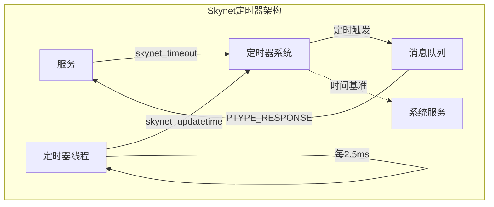
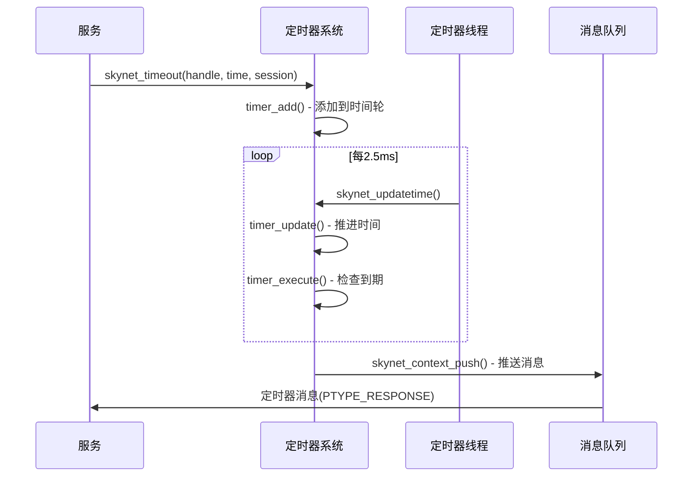

# Skynet 定时器系统详解 (skynet_timer.c)

## 目录

1. [模块概述](#1-模块概述)
2. [分层时间轮算法](#2-分层时间轮算法)
3. [核心数据结构](#3-核心数据结构)
4. [关键函数分析](#4-关键函数分析)
5. [定时器生命周期](#5-定时器生命周期)
6. [时间精度与性能](#6-时间精度与性能)
7. [与服务系统集成](#7-与服务系统集成)
8. [算法实现细节](#8-算法实现细节)
9. [使用示例](#9-使用示例)
10. [性能分析](#10-性能分析)

## 1. 模块概述

### 1.1 定时器系统的作用

Skynet的定时器系统是整个框架时间管理的核心，提供以下功能：

- **定时触发**：支持服务设置定时任务
- **超时管理**：为协程阻塞提供超时打断能力（sleep / wait，可在业务层组合实现 RPC 超时）
- **时间服务**：提供统一的时间基准
- **延迟执行**：支持延迟消息投递

### 1.2 设计目标

```c
// 核心设计目标
/*
 * 1. 高性能：支持百万级定时器
 * 2. 高精度：百分之一秒精度（10ms）
 * 3. O(1)操作：添加和触发都是常数时间
 * 4. 内存高效：分层管理，按需分配
 * 5. 线程安全：支持多线程并发访问
 */
```

### 1.3 时间轮算法选择

Skynet选择**分层时间轮（Hierarchical Timing Wheel）**算法，原因如下：

```
算法对比：
┌─────────────────┬──────────┬──────────┬──────────┐
│     特性        │ 时间轮   │  最小堆  │  红黑树  │
├─────────────────┼──────────┼──────────┼──────────┤
│ 插入复杂度      │   O(1)   │ O(log n) │ O(log n) │
│ 删除最小        │   O(1)   │ O(log n) │ O(log n) │
│ 批量触发        │   O(m)   │ O(m·log n)│ O(m·log n)│
│ 内存占用        │   固定   │   动态   │   动态   │
│ 实现复杂度      │   中等   │   简单   │   复杂   │
└─────────────────┴──────────┴──────────┴──────────┘
```

### 1.4 架构位置



## 2. 分层时间轮算法

### 2.1 算法原理

分层时间轮是一种高效的定时器管理算法，将时间划分为多个层级的轮子：

```
5层时间轮结构：
┌──────────────────────────────────────────────┐
│                  总体结构                    │
├──────────────────────────────────────────────┤
│  Near轮: 256个槽位 (2^8)                     │
│    覆盖: 0-255 时间单位                      │
│    精度: 1个时间单位                         │
├──────────────────────────────────────────────┤
│  Level 0: 64个槽位 (2^6)                    │
│    覆盖: 256-16383 时间单位                  │
│    精度: 256个时间单位                       │
├──────────────────────────────────────────────┤
│  Level 1: 64个槽位 (2^6)                    │
│    覆盖: 16384-1048575 时间单位              │
│    精度: 16384个时间单位                     │
├──────────────────────────────────────────────┤
│  Level 2: 64个槽位 (2^6)                    │
│    覆盖: 1048576-67108863 时间单位           │
│    精度: 1048576个时间单位                   │
├──────────────────────────────────────────────┤
│  Level 3: 64个槽位 (2^6)                    │
│    覆盖: 67108864-4294967295 时间单位        │
│    精度: 67108864个时间单位                  │
└──────────────────────────────────────────────┘
```

### 2.2 时间范围计算

```c
// 时间轮参数
#define TIME_NEAR_SHIFT 8          // near轮位移：8位
#define TIME_NEAR (1 << TIME_NEAR_SHIFT)  // 256个槽位
#define TIME_LEVEL_SHIFT 6         // level轮位移：6位
#define TIME_LEVEL (1 << TIME_LEVEL_SHIFT) // 64个槽位

// 各层覆盖的时间范围（单位：centisecond）
// Near轮:   0 ~ 2^8-1        = 0 ~ 255         (0 ~ 2.55秒)
// Level 0:  2^8 ~ 2^14-1     = 256 ~ 16383     (2.56秒 ~ 163.83秒)
// Level 1:  2^14 ~ 2^20-1    = 16384 ~ 1048575 (163.84秒 ~ 2.9小时)
// Level 2:  2^20 ~ 2^26-1                      (2.9小时 ~ 7.7天)
// Level 3:  2^26 ~ 2^32-1                      (7.7天 ~ 497天)
```

### 2.3 算法优势

```c
/*
 * 时间轮算法的优势：
 * 
 * 1. 常数时间操作
 *    - 插入: O(1) - 直接计算槽位
 *    - 触发: O(1) - 直接访问当前槽位
 *    - 删除: 不支持随机删除（无需求）
 * 
 * 2. 内存效率
 *    - 固定大小: 256 + 64*4 = 512个槽位
 *    - 按需分配: 只有定时器节点动态分配
 * 
 * 3. 批量处理
 *    - 同一时间的定时器在同一槽位
 *    - 一次可以处理多个到期定时器
 * 
 * 4. 缓存友好
 *    - 数组结构，内存连续
 *    - 局部性好，缓存命中率高
 */
```

## 3. 核心数据结构

### 3.1 struct timer - 主定时器结构

```c
struct timer {
    // 时间轮数组
    struct link_list near[TIME_NEAR];      // 近期轮：256个槽位
    struct link_list t[4][TIME_LEVEL];     // 4层分级轮：每层64个槽位
    
    // 同步控制
    struct spinlock lock;                  // 自旋锁保护
    
    // 时间管理
    uint32_t time;                         // 当前滴答数（时间轮位置）
    uint32_t starttime;                    // 系统启动时间（秒）
    uint64_t current;                      // 当前时间（centisecond）
    uint64_t current_point;                // 系统时间点（用于计算时间差）
};
```

时间轮的物理结构：

```
         Near轮 (256个槽位)
    ┌───┬───┬───┬───┬───┬───┬───┬───┐
    │ 0 │ 1 │ 2 │...│253│254│255│   │
    └─┬─┴───┴───┴───┴───┴───┴───┴───┘
      │
      └─> 链表：timer_node -> timer_node -> ...

         Level 0 (64个槽位)
    ┌───┬───┬───┬───┬───┬───┬───┬───┐
    │ 0 │ 1 │ 2 │...│ 61│ 62│ 63│   │
    └───┴───┴───┴───┴───┴───┴───┴───┘

    Level 1, 2, 3 结构相同
```

### 3.2 struct timer_node - 定时器节点

```c
struct timer_node {
    struct timer_node *next;    // 链表下一个节点
    uint32_t expire;            // 过期时间（绝对时间）
    // 后面紧跟 timer_event 数据
};

// 内存布局
// [timer_node][timer_event]
//  └─结构体──┘└─事件数据──┘
```

### 3.3 struct timer_event - 定时器事件

```c
struct timer_event {
    uint32_t handle;    // 目标服务句柄（接收定时器消息的服务）
    int session;        // 会话ID（用于识别是哪个定时器）
};
```

### 3.4 struct link_list - 链表结构

```c
struct link_list {
    struct timer_node head;     // 哨兵节点（简化边界处理）
    struct timer_node *tail;    // 尾指针（快速追加）
};

// 链表操作设计：
// - head是哨兵节点，head.next指向第一个真实节点
// - tail指向最后一个节点，便于O(1)追加
// - 空链表时：head.next = NULL, tail = &head
```

## 4. 关键函数分析

### 4.1 定时器初始化

```c
void skynet_timer_init(void) {
    TI = timer_create_timer();
    uint32_t current = 0;
    systime(&TI->starttime, &current);  // 获取系统时间
    TI->current = current;               // 设置当前时间
    TI->current_point = gettime();       // 设置时间基准点
}

static struct timer *timer_create_timer() {
    struct timer *r = skynet_malloc(sizeof(struct timer));
    memset(r, 0, sizeof(*r));
    
    // 初始化所有时间轮槽位为空链表
    for (int i = 0; i < TIME_NEAR; i++) {
        link_clear(&r->near[i]);
    }
    
    for (int i = 0; i < 4; i++) {
        for (int j = 0; j < TIME_LEVEL; j++) {
            link_clear(&r->t[i][j]);
        }
    }
    
    SPIN_INIT(r);  // 初始化自旋锁
    r->current = 0;
    
    return r;
}
```

### 4.2 添加定时器 - skynet_timeout

```c
int skynet_timeout(uint32_t handle, int time, int session) {
    if (time <= 0) {
        // 立即触发
        struct skynet_message message;
        message.source = 0;
        message.session = session;
        message.data = NULL;
        message.sz = (size_t)PTYPE_RESPONSE << MESSAGE_TYPE_SHIFT;
        
        if (skynet_context_push(handle, &message)) {
            return -1;
        }
    } else {
        // 添加到定时器
        struct timer_event event;
        event.handle = handle;
        event.session = session;
        timer_add(TI, &event, sizeof(event), time);
    }
    
    return session;
}
```

### 4.3 核心算法 - add_node

```c
static void add_node(struct timer *T, struct timer_node *node) {
    uint32_t time = node->expire;
    uint32_t current_time = T->time;
    
    // 判断应该放入哪一层
    if ((time|TIME_NEAR_MASK) == (current_time|TIME_NEAR_MASK)) {
        // 在near轮范围内（高24位相同）
        link(&T->near[time & TIME_NEAR_MASK], node);
    } else {
        // 在level轮中
        int i;
        uint32_t mask = TIME_NEAR << TIME_LEVEL_SHIFT;
        
        // 找到合适的层级
        for (i = 0; i < 3; i++) {
            if ((time|(mask-1)) == (current_time|(mask-1))) {
                break;
            }
            mask <<= TIME_LEVEL_SHIFT;
        }
        
        // 计算在该层的槽位索引
        int shift = TIME_NEAR_SHIFT + i * TIME_LEVEL_SHIFT;
        int idx = (time >> shift) & TIME_LEVEL_MASK;
        link(&T->t[i][idx], node);
    }
}
```

算法解析：

```
判断定时器应该放入哪一层：

假设 current_time = 0x00000100 (256)
     expire_time = 0x00000300 (768)

1. Near轮判断：
   expire|0xFF = 0x3FF
   current|0xFF = 0x1FF
   不相等，不在near轮

2. Level 0判断：
   expire|0x3FFF = 0x3FF
   current|0x3FFF = 0x1FF
   高18位相同，放入Level 0

3. 计算槽位：
   shift = 8 + 0*6 = 8
   idx = (0x300 >> 8) & 0x3F = 3
   放入 t[0][3]
```

### 4.4 时间推进 - timer_shift

```c
static void timer_shift(struct timer *T) {
    int mask = TIME_NEAR;
    uint32_t ct = ++T->time;
    
    if (ct == 0) {
        // 时间回绕（约497天后）
        move_list(T, 3, 0);
    } else {
        uint32_t time = ct >> TIME_NEAR_SHIFT;
        int i = 0;
        
        // 检查是否需要从高层移动定时器
        while ((ct & (mask-1)) == 0) {
            int idx = time & TIME_LEVEL_MASK;
            if (idx != 0) {
                move_list(T, i, idx);
                break;
            }
            mask <<= TIME_LEVEL_SHIFT;
            time >>= TIME_LEVEL_SHIFT;
            ++i;
        }
    }
}
```

时间推进逻辑：

```
时间推进示例：

T->time = 255 -> 256:
  - ct = 256 (0x100)
  - Near轮回绕到0
  - 需要从Level 0移动定时器
  - idx = (256>>8) & 0x3F = 1
  - move_list(T, 0, 1)

T->time = 16383 -> 16384:
  - ct = 16384 (0x4000)  
  - Level 0回绕
  - 需要从Level 1移动定时器
  - idx = (16384>>14) & 0x3F = 1
  - move_list(T, 1, 1)
```

### 4.5 定时器触发 - timer_execute

```c
static inline void timer_execute(struct timer *T) {
    int idx = T->time & TIME_NEAR_MASK;
    
    while (T->near[idx].head.next) {
        // 取出当前槽位的所有定时器
        struct timer_node *current = link_clear(&T->near[idx]);
        
        SPIN_UNLOCK(T);  // 解锁，避免阻塞其他操作
        dispatch_list(current);  // 分发定时器消息
        SPIN_LOCK(T);    // 重新加锁
    }
}

static inline void dispatch_list(struct timer_node *current) {
    do {
        // 获取事件数据
        struct timer_event *event = (struct timer_event *)(current+1);
        
        // 构造定时器消息
        struct skynet_message message;
        message.source = 0;
        message.session = event->session;
        message.data = NULL;
        message.sz = (size_t)PTYPE_RESPONSE << MESSAGE_TYPE_SHIFT;
        
        // 推送到目标服务的消息队列
        skynet_context_push(event->handle, &message);
        
        // 释放定时器节点
        struct timer_node *temp = current;
        current = current->next;
        skynet_free(temp);
    } while (current);
}
```

### 4.6 时间更新 - skynet_updatetime

```c
void skynet_updatetime(void) {
    uint64_t cp = gettime();  // 获取当前时间点
    
    if (cp < TI->current_point) {
        // 时间倒退（系统时间调整）
        skynet_error(NULL, "time diff error: change from %lld to %lld", 
                     cp, TI->current_point);
        TI->current_point = cp;
    } else if (cp != TI->current_point) {
        // 计算时间差
        uint32_t diff = (uint32_t)(cp - TI->current_point);
        TI->current_point = cp;
        TI->current += diff;
        
        // 推进diff个时间单位
        for (int i = 0; i < diff; i++) {
            timer_update(TI);
        }
    }
}

static void timer_update(struct timer *T) {
    SPIN_LOCK(T);
    
    timer_execute(T);    // 执行当前时间的定时器
    timer_shift(T);      // 时间推进
    timer_execute(T);    // 再次执行（处理shift后的定时器）
    
    SPIN_UNLOCK(T);
}
```

## 5. 定时器生命周期

### 5.1 完整流程



### 5.2 状态转换

```
定时器状态：
┌─────────┐      添加      ┌─────────┐
│  创建   │ ──────────────>│ 等待中  │
└─────────┘                └────┬────┘
                                │
                                │ 时间到达
                                ↓
                          ┌─────────┐
                          │ 触发中  │
                          └────┬────┘
                                │
                                │ 消息推送
                                ↓
                          ┌─────────┐
                          │  完成   │
                          └─────────┘
```

## 6. 时间精度与性能

### 6.1 Centisecond设计

```c
// 时间单位：centisecond (1/100秒 = 10ms)
static uint64_t gettime() {
    uint64_t t;
    struct timespec ti;
    clock_gettime(CLOCK_MONOTONIC, &ti);
    t = (uint64_t)ti.tv_sec * 100;
    t += ti.tv_nsec / 10000000;  // 纳秒转centisecond
    return t;
}
```

精度分析：

```
时间精度选择的权衡：

精度    定时器开销    内存占用    适用场景
1ms     很高         很大        实时系统
10ms    中等         适中        游戏服务器 ✓
100ms   低           小          Web服务
1s      很低         很小        批处理

Skynet选择10ms的原因：
1. 游戏逻辑帧率通常10-30fps (33-100ms/帧)
2. 网络延迟通常>10ms
3. 平衡精度和开销
```

### 6.2 性能特征

```c
/*
 * 时间复杂度分析：
 * 
 * 操作          时间复杂度    说明
 * ──────────────────────────────────
 * 添加定时器    O(1)         直接计算槽位
 * 时间推进      O(1)         移动一个槽位
 * 触发定时器    O(k)         k是同时到期的定时器数
 * 批量迁移      O(m)         m是迁移的定时器数
 * 
 * 空间复杂度：
 * 固定部分：512个槽位 = O(1)
 * 动态部分：n个定时器 = O(n)
 */
```

## 7. 与服务系统集成

### 7.1 消息类型

```c
// 定时器消息使用 PTYPE_RESPONSE 类型
message.sz = (size_t)PTYPE_RESPONSE << MESSAGE_TYPE_SHIFT;

// 服务收到后通过session识别是哪个定时器
// session通常用于匹配请求和响应
```

### 7.2 集成流程

```lua
-- Lua层使用示例
local skynet = require "skynet"

-- 设置定时器
skynet.timeout(100, function()
    print("1秒后执行")
end)

-- 底层调用流程：
-- 1. skynet.timeout (Lua)
-- 2. c.intcommand("TIMEOUT") (C API)  
-- 3. skynet_timeout (C)
-- 4. timer_add (定时器系统)
```

### 7.3 RPC超时实现

`skynet.call` 并不会自动设置超时——调用协程会一直挂起，直到收到目标服务的响应或错误消息（例如目标服务退出时发送的 `PTYPE_ERROR`）。如果业务需要超时保护，需要显式配合定时器组件自行实现，例如：

```lua
local skynet = require "skynet"

local function call_with_timeout(addr, typename, timeout_cs, ...)
    -- timeout_cs 以 centisecond 为单位（10ms）
    local token = {}
    local finished = false
    local timeout = false
    local result

    skynet.fork(function()
        result = table.pack(pcall(skynet.call, addr, typename, ...))
        finished = true
        if not timeout then
            skynet.wakeup(token)
        end
    end)

    skynet.timeout(timeout_cs, function()
        if not finished then
            timeout = true
            skynet.wakeup(token)
        end
    end)

    skynet.wait(token)

    if timeout and not finished then
        return nil, "timeout"
    end
    if result[1] then
        return table.unpack(result, 2, result.n or #result)
    end
    error(result[2])
end
```

通过这种组合方式，可以利用定时器提供的协程唤醒能力完成 RPC 调用的超时控制。

## 8. 算法实现细节

### 8.1 槽位计算详解

```c
// 判断定时器放入哪一层的算法
static void add_node(struct timer *T, struct timer_node *node) {
    uint32_t expire = node->expire;
    uint32_t current = T->time;
    
    // 使用位运算判断层级
    // 原理：检查高位是否相同
    
    // Near轮：检查高24位
    if ((expire|0xFF) == (current|0xFF)) {
        // 在256个单位内
        slot = expire & 0xFF;
        layer = NEAR;
    }
    // Level 0：检查高18位
    else if ((expire|0x3FFF) == (current|0x3FFF)) {
        // 在16384个单位内
        slot = (expire >> 8) & 0x3F;
        layer = 0;
    }
    // Level 1：检查高12位
    else if ((expire|0xFFFFF) == (current|0xFFFFF)) {
        // 在1048576个单位内
        slot = (expire >> 14) & 0x3F;
        layer = 1;
    }
    // 继续类推...
}
```

### 8.2 定时器迁移算法

```c
static void move_list(struct timer *T, int level, int idx) {
    // 取出指定层级和槽位的所有定时器
    struct timer_node *current = link_clear(&T->t[level][idx]);
    
    while (current) {
        struct timer_node *temp = current->next;
        // 重新计算应该放入的位置
        add_node(T, current);
        current = temp;
    }
}

// 迁移示例：
// Level 0的定时器迁移到Near轮
// 原来在 t[0][1] 中，expire = 0x180-0x1FF
// 迁移后分散到 near[0x80] - near[0xFF]
```

### 8.3 时间回绕处理

```c
// 32位时间约497天后回绕
if (ct == 0) {
    // 从最高层迁移所有定时器
    move_list(T, 3, 0);
}

// 时间回绕是罕见情况，但必须正确处理
// 否则会导致定时器永远不触发
```

## 9. 使用示例

### 9.1 基本使用

```c
// C层设置定时器
int session = 1;
skynet_timeout(handle, 100, session);  // 1秒后触发

// 服务的消息处理函数
int message_handler(struct skynet_context *ctx, void *ud, 
                   int type, int session, uint32_t source, 
                   const void *msg, size_t sz) {
    if (type == PTYPE_RESPONSE) {
        // 定时器触发
        printf("Timer expired, session=%d\n", session);
    }
    return 0;
}
```

### 9.2 Lua层使用

```lua
local skynet = require "skynet"

-- 简单定时器
skynet.timeout(100, function()
    print("1秒后执行")
end)

-- 循环定时器
local function tick()
    print("每秒执行")
    skynet.timeout(100, tick)
end
skynet.timeout(100, tick)

-- 带取消的定时器
local timer_co = skynet.fork(function()
    skynet.sleep(100)  -- sleep内部使用timeout
    print("执行定时任务")
end)

-- 取消定时器
skynet.killthread(timer_co)
```

### 9.3 高精度需求

```lua
-- 如果需要更高精度，可以：
-- 1. 使用更小的时间单位
skynet.timeout(1, function()  -- 10ms
    -- 高频任务
end)

-- 2. 批量处理减少开销
local tasks = {}
skynet.timeout(10, function()  -- 100ms
    for _, task in ipairs(tasks) do
        task()
    end
    tasks = {}
end)
```

## 10. 性能分析

### 10.1 性能指标

```
定时器系统性能指标：

指标              典型值
────────────────────────────
支持定时器数      百万级
添加定时器        < 1μs
触发延迟          ≈ 10ms
内存占用          约40字节/定时器
CPU开销           < 1%
```

### 10.2 优化建议

```c
/*
 * 性能优化建议：
 * 
 * 1. 批量设置
 *    - 相同时间的定时器合并
 *    - 减少系统调用
 * 
 * 2. 避免短间隔
 *    - 不要设置<10ms的定时器
 *    - 使用批处理替代高频触发
 * 
 * 3. 合理精度
 *    - 不需要精确时间的用较大值
 *    - 如心跳包可以用秒级精度
 * 
 * 4. 复用session
 *    - 使用session池避免分配
 *    - 减少内存碎片
 */
```

### 10.3 性能测试

```lua
-- 性能测试代码
local skynet = require "skynet"

skynet.start(function()
    local count = 0
    local start = skynet.now()
    
    -- 创建100万个定时器
    for i = 1, 1000000 do
        skynet.timeout(math.random(1, 10000), function()
            count = count + 1
            if count == 1000000 then
                local elapsed = skynet.now() - start
                print(string.format("All timers fired, time: %.2fs", 
                      elapsed/100))
            end
        end)
    end
    
    print("Created 1M timers")
end)
```

## 总结

### 核心特点

1. **分层时间轮算法**
   - 5层结构覆盖497天
   - O(1)插入和触发
   - 内存效率高

2. **Centisecond精度**
   - 10ms时间单位
   - 平衡精度和性能
   - 适合游戏服务器

3. **高性能实现**
   - 自旋锁保护 + 短临界区
   - 批量处理
   - 缓存友好

4. **与Skynet深度集成**
   - 消息机制结合
   - 为业务层定制超时提供基础能力
   - 线程安全

### 设计亮点

- **算法选择恰当**：时间轮完美匹配定时器需求
- **精度合理**：10ms满足绝大部分场景
- **实现精简**：代码不到300行但功能完整
- **扩展性好**：可以方便地调整精度和范围

Skynet的定时器系统是一个教科书级的时间轮算法实现，值得深入学习。
