# Skynet 架构图表集合

本文档包含 Skynet 框架的核心架构图表，用于理解系统的设计原理和运行机制。

## 1. 整体架构图

展示 Skynet 的分层架构设计，从底层 C 核心到上层业务逻辑。

## 2. 启动流程图

展示从 main() 函数开始的完整启动序列。

## 3. 消息传递序列图

展示服务间消息传递的完整流程。

## 4. 线程模型和调度图

展示各种线程类型的关系和交互。

## 5. 服务生命周期状态图

展示服务从创建到销毁的完整生命周期。

## 6. 网络架构图

展示 Socket Server、Gate、Agent 的关系和数据流。

## 7. 核心组件关系图

展示核心数据结构之间的关系。

## 8. 消息队列架构图

展示二级队列架构的设计。

```mermaid
graph TB
    subgraph "发送端 - Sender Side"
        Service1[服务1<br/>Service 1]
        Service2[服务2<br/>Service 2]
        ServiceN[服务N<br/>Service N]
    end
    
    subgraph "全局队列层 - Global Queue Layer"
        GlobalQueue[全局消息队列<br/>Global Message Queue]
        
        subgraph "队列操作"
            Push[入队操作<br/>skynet_globalmq_push]
            Pop[出队操作<br/>skynet_globalmq_pop]
            Length[队列长度<br/>skynet_globalmq_length]
        end
        
        QueueLock[全局队列锁<br/>Spinlock]
    end
    
    subgraph "服务队列层 - Service Queue Layer"
        subgraph "目标服务A"
            ServiceQueueA[服务队列A<br/>Message Queue A]
            ServiceLockA[队列锁A<br/>Spinlock A]
        end
        
        subgraph "目标服务B"
            ServiceQueueB[服务队列B<br/>Message Queue B]
            ServiceLockB[队列锁B<br/>Spinlock B]
        end
        
        subgraph "目标服务C"
            ServiceQueueC[服务队列C<br/>Message Queue C]
            ServiceLockC[队列锁C<br/>Spinlock C]
        end
    end
    
    subgraph "调度器 - Scheduler"
        MainScheduler[主调度器<br/>Main Scheduler]
        WorkerPool[工作线程池<br/>Worker Thread Pool]
        
        subgraph "调度策略"
            RoundRobin[轮询调度<br/>Round Robin]
            Priority[优先级调度<br/>Priority Based]
            Weight[权重调度<br/>Weight Based]
        end
    end
    
    subgraph "消息处理 - Message Processing"
        MessageHandler[消息处理器<br/>Message Handler]
        CoroutinePool[协程池<br/>Coroutine Pool]
        
        subgraph "处理类型"
            LuaMsg[Lua消息<br/>PTYPE_LUA]
            ResponseMsg[响应消息<br/>PTYPE_RESPONSE]  
            SystemMsg[系统消息<br/>PTYPE_SYSTEM]
            SocketMsg[Socket消息<br/>PTYPE_SOCKET]
        end
    end
    
    %% 消息流向
    Service1 -->|skynet.send| Push
    Service2 -->|skynet.send| Push  
    ServiceN -->|skynet.send| Push
    
    Push --> QueueLock
    QueueLock --> GlobalQueue
    
    Pop --> GlobalQueue
    GlobalQueue --> Pop
    
    %% 从全局队列到服务队列
    Pop -->|路由到目标服务| ServiceLockA
    Pop -->|路由到目标服务| ServiceLockB
    Pop -->|路由到目标服务| ServiceLockC
    
    ServiceLockA --> ServiceQueueA
    ServiceLockB --> ServiceQueueB
    ServiceLockC --> ServiceQueueC
    
    %% 调度器处理
    MainScheduler --> Pop
    MainScheduler --> RoundRobin
    MainScheduler --> Priority
    MainScheduler --> Weight
    
    RoundRobin --> WorkerPool
    Priority --> WorkerPool
    Weight --> WorkerPool
    
    %% 工作线程处理
    WorkerPool --> ServiceQueueA
    WorkerPool --> ServiceQueueB
    WorkerPool --> ServiceQueueC
    
    ServiceQueueA --> MessageHandler
    ServiceQueueB --> MessageHandler
    ServiceQueueC --> MessageHandler
    
    MessageHandler --> CoroutinePool
    MessageHandler --> LuaMsg
    MessageHandler --> ResponseMsg
    MessageHandler --> SystemMsg
    MessageHandler --> SocketMsg
    
    %% 队列状态监控
    Length -.-> GlobalQueue
    ServiceQueueA -.->|队列统计| MainScheduler
    ServiceQueueB -.->|队列统计| MainScheduler
    ServiceQueueC -.->|队列统计| MainScheduler
    
    %% 样式设置
    classDef sender fill:#ffcdd2,stroke:#d32f2f,stroke-width:2px
    classDef globalQueue fill:#c8e6c9,stroke:#388e3c,stroke-width:2px
    classDef serviceQueue fill:#bbdefb,stroke:#1976d2,stroke-width:2px
    classDef scheduler fill:#f8bbd9,stroke:#e91e63,stroke-width:2px
    classDef processing fill:#fff9c4,stroke:#f57f17,stroke-width:2px
    
    class Service1,Service2,ServiceN sender
    class GlobalQueue,Push,Pop,Length,QueueLock globalQueue
    class ServiceQueueA,ServiceLockA,ServiceQueueB,ServiceLockB,ServiceQueueC,ServiceLockC serviceQueue
    class MainScheduler,WorkerPool,RoundRobin,Priority,Weight scheduler
    class MessageHandler,CoroutinePool,LuaMsg,ResponseMsg,SystemMsg,SocketMsg processing
```

## 9. 定时器系统图

展示分层时间轮算法的实现（Skynet使用的是5级时间轮）。

## 10. 集群架构图

展示 Harbor 系统和多节点通信架构（Skynet的分布式实现）。

## 11. 全组件依赖关系图

展示 Skynet 所有核心组件之间的详细依赖关系。

## 总结

以上10个架构图表从不同维度展示了Skynet框架的设计原理：

1. **整体架构图**：展现了分层设计思想，从底层C核心到上层业务逻辑的完整技术栈
2. **启动流程图**：详细描述了系统初始化的各个阶段和关键步骤
3. **消息传递序列图**：展示了异步/同步消息机制的实现原理
4. **线程模型图**：说明了多线程协作和资源共享的设计
5. **服务生命周期图**：描述了服务状态转换和管理机制
6. **网络架构图**：展现了从网络连接到业务处理的完整数据流
7. **核心组件关系图**：展示了关键数据结构之间的关联关系
8. **消息队列架构图**：详细说明了二级队列系统的设计理念
9. **定时器系统图**：展现了高效的分层时间轮算法实现
10. **集群架构图**：描述了分布式部署和节点间通信机制

这些图表为理解Skynet的架构设计和运行原理提供了可视化的参考资料，有助于开发者深入学习和使用这个优秀的游戏服务器框架。